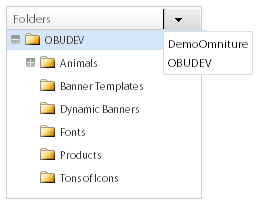
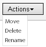
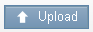
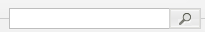
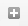
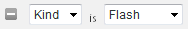
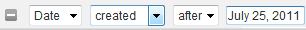
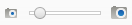

# Over banners {#about-banners}

U kunt Banners gebruiken om de banneradvertenties te beheren die op uw website zijn.

## Banners gebruiken {#concept_5BBE01FEC6134393B43CC917C8CC64DA}

<!-- 

c_about_banners.xml

 -->

Er zijn twee methodes u kunt gebruiken om banneradvertenties aan uw website toe te voegen.

De eerste methode is banners als Doel toe te voegen, zoek&amp;Promote. De banners zijn de codefragmenten van HTML die tegelijkertijd worden getoond dat een klant uw website zoekt. Uw banner kan tekst of een beeld in formaat van GIF, JPEG, of van PNG, of een combinatie allebei omvatten. U kunt uit vooraf ingestelde grootte selecteren of uw eigen douaneafmetingen bepalen om uw pagina te passen. De code van HTML die u gebruikt om de banner te tonen kan dergelijke dingen zoals de te gebruiken doopvontstijl, en de grens ook specificeren. Deze methode om een banner toe te voegen biedt basisfunctionaliteit aan en vereist geen extra software.

De tweede methode is de Dynamische Klassieke Media van Adobe, een dynamisch media beheer en het publiceren de dienst te gebruiken. Een geldige Klassieke rekening van de Media van Adobe Dynamische laat u bannerinhoud leiden en direct leveren aan Doel, Onderzoek&amp;Promote, gebruikend Dynamische Klassieke Media. In plaatsonderzoek/merchandising, vormt u toegang tot uw Dynamische Klassieke rekening van Media. Dan opent u Dynamische Media Klassieke media browser en plukt een dynamische media activa die u als uw banner wilt dienen.

>[!NOTE]
>
>Alvorens u dynamische media activa als banners in plaatsonderzoek/merchandising kunt gebruiken, worden de activa eerst geupload en voorbereid voor het publiceren in het het Publiceren Scene7 Systeem. U kunt activa van binnen plaatsonderzoek/merchandising uploaden en hen hebben automatisch voorbereid voor het publiceren door het Publiceren Scene7 Systeem. Of, kunt u activa allen van binnen het het Publiceren Scene7 Systeem uploaden en publiceren.

## Integratie van Banners met het Publiceren van Adobe Scene7 Systeem {#section_D4D7ADEA6A6348E68EDA138E184FE579}

U kunt de Dynamische Klassieke activatypes van Media als banners in plaatsonderzoek/merchandising met inbegrip van beelden, dynamische banners, en malplaatjes, zoals beeldmalplaatjes of de malplaatjes van de Flits gebruiken.

De malplaatjes worden dynamisch gecreeerd en adresseerbare gelaagde beelddossiers zoals gelaagde dossiers in beeld-uitgevende toepassingen zoals Adobe Photoshop®. In tegenstelling tot een statisch beelddossier, kan een malplaatje parameters omvatten. Door parameters, kunt u veranderlijke beeldeigenschappen en beeldinhoud aanpassen.

>[!NOTE]
>
>U kunt malplaatjes van op lay-out-gebaseerde ontwerpen ook tot stand brengen door het Publiceren van het Malplaatje in het Publiceren Scene7 Systeem en dossiers van de Illustrator van Adobe en Adobe InDesign te gebruiken.

Zie het Publiceren van het [Malplaatje](https://help.adobe.com/en_US/scene7/using/WSFBFBAD30-2694-4b18-B7CE-894F9FC5CDDF.html) in de Dynamische Klassieke Gids van de Gebruiker van Media (Scene7).

Een malplaatje kan om het even welk aantal beeldlagen en tekstlagen bevatten. U kunt een statisch dossier omzetten dat lagen, zoals een gelaagd Psd- dossier bevat, in een malplaatje, of malplaatjes in Dynamische Klassieke Media tot stand brengen. U kunt tekstlagen in malplaatjes tot stand brengen gebruikend doopvonten die u in het Publiceren Scene7 Systeem uploadde. Nadat u tekst aan een malplaatje toevoegt, kunt u het formatteren door zijn rechtvaardiging, doopvonten, doopvontgrootte, en kleur te veranderen.

Gebruikend het scherm van Parameters in Dynamische Klassieke Media, kunt u om het even welk aspect van een malplaatje in een adresseerbare parameter omzetten. Op die manier, kunt u veranderen welk gelaagd beeld aan gebruik of welke tekstwaarde aan gebruik in uw malplaatje veranderen. De parameters worden overgegaan met het koord URL, toestaand u om het even welke parameter te veranderen om het antwoordbeeld dynamisch aan te passen dat van de beeldserver wordt geproduceerd.

U kunt meer over leren hoe te om Dynamische Klassieke Media te gebruiken om malplaatjes tot stand te brengen en van de eigenschappen op de lagen de parameters te bepalen zodat kunt u hen in banners gebruiken.

Zie de Grondbeginselen [van het](https://help.adobe.com/en_US/scene7/using/WS60B68844-9054-4099-BF69-3DC998A04D3C.html) Malplaatje in de Dynamische Klassieke Gids van de Gebruiker van Media (Scene7).

**Uploaden en publiceren van activa**

U moet activa in Dynamische Klassieke Media uploaden en publiceren alvorens u hen voor banners in plaatsonderzoek/merchandising kunt gebruiken. Deze voorwaarde omvat ook om het even welke activa die een beeldmalplaatje of een malplaatje van de Flits gebruiken. Gebruik uw Dynamische Klassieke rekening van Media om digitale activa te uploaden en te publiceren. Of, u kunt plaatsonderzoek/merchandising gebruiken om digitale activa te uploaden en dan de Dynamische Klassieke Media te hebben publiceren het automatisch voor u gebaseerd op uw uploadt montages. Als u probeert om activa te plukken die nog niet worden geupload en gepubliceerd, wordt u op de hoogte gebracht in het gebruikersinterface en gegeven de optie om het te uploaden alvorens te werk te gaan.

U kunt meer leren over het uploaden van en het publiceren van digitale activa gebruikend het Publiceren Scene7 Systeem.

Zie [Activa](https://help.adobe.com/en_US/scene7/using/WS3673AD39-098B-4f08-8A24-CA51261B7366.html) uploaden en publiceren in de Dynamische Klassieke Gids van de Gebruiker van Media (Scene7).

>[!NOTE]
>
>Om te gebruiken upload functionaliteit in de Dynamische Klassieke de activakijker van Media, ben zeker dat de Dynamische Klassieke rekening van Media u gebruikt de rol van &quot;SPS Company Admin&quot;reeds heeft geplaatst.

Zie de Opstelling [van het](https://help.adobe.com/en_US/scene7/using/WS662101DF-D697-47a7-A7D8-B52FD8E94438.html) Beleid in de Dynamische Klassieke Gids van de Gebruiker van Media (Scene7).

**Veranderend de Dynamische Klassieke Parameters van het Malplaatje van Media in een Banner die BedrijfsRegels gebruikt**

Als u een Dynamische Klassieke activa van Media als banner toevoegde, kunt u [!DNL Visual Rule Builder] binnen gebruiken [!DNL Business Rules] om het aan om het even welk bannergebied op uw website toe te voegen. Bijvoorbeeld, voegt u de banner aan uw pagina&#39;s van onderzoeksresultaten toe, enkel zoals u een andere banner. U kunt de standaardparameterwaarden in Dynamische Klassieke malplaatjes van Media ook met voeten treden door hen aan uw specifieke behoeften aan te passen. Dit soort functionaliteit laat u de Dynamische Klassieke malplaatjes van Media met verschillende marketing berichten en hyperlinks aan verschillende eindpunten aanpassen.

Zie ook het [Toevoegen van een nieuwe bedrijfsregel](../c-about-rules-menu/c-about-business-rules.md#task_BD3B31ED48BB4B1B8F1DCD3BFA2528E7).

Zie ook een [bedrijfsregel](../c-about-rules-menu/c-about-business-rules.md#task_375CFA75D1D94D9E92A35DE1228E5087)bewerken.

## Een banner toevoegen {#task_549D02B5F73B4158B105A94E39D937B7}

U kunt de banneradvertenties gebruiken [!DNL Banners] om de banneradvertenties te beheren en waar zij op uw website worden geplaatst. Wanneer u een banner toevoegt, verwijst u uiterlijk van verwijzingen naar het beeld als codefragmenten van HTML die in onderzoekstijd worden getoond.

<!-- 

t_adding_a_new_banner.xml

 -->

Als u een geldige Klassieke rekening van de Media van Adobe Dynamische hebt, kunt u banneradvertenties als het het Publiceren Scene7 Systeem toevoegen.

Zie Een banner [toevoegen met Adobe Dynamic Media Classic](../c-about-design-menu/c-about-banners.md#task_AD1E0C00A9E04B1FA819EB93288786B3).

Zie [het Vormen toegang tot uw Dynamische Klassieke rekening](../c-about-settings-menu/c-about-account-options-menu.md#task_CEFF88C2033D41D0B2FE86C435EDAC6D)van Media van Adobe.

**Om een banner toe te voegen**

1. Klik in het productmenu op **[!UICONTROL Design]** > **[!UICONTROL Banners]**.
1. On the [!DNL Banners] page, in the **[!UICONTROL Add Banner]** drop-down list, select **[!UICONTROL HTML code]**.
1. In de [!DNL Add Banner] dialoogdoos, plaats de opties die u wilt.

   <table> 
    <thead> 
      <tr> 
      <th colname="col1" class="entry"> 
Optie 
 </th> 
      <th colname="col2" class="entry"> 
Beschrijving 
 </th> 
      </tr> 
    </thead>
    <tbody> 
      <tr> 
      <td colname="col1"> 
Naam 
 </td> 
      <td colname="col2"> 
Vereist. Identificeert de naam van uw banner. De naam wordt gebruikt om naar de banner te verwijzen wanneer u het in de Visuele Bouwer van de Regel in BedrijfsRegels toevoegt. De naam verschijnt niet in de banner zelf. 
 
Zie <a href="../c-about-rules-menu/c-about-business-rules.md#task_BD3B31ED48BB4B1B8F1DCD3BFA2528E7" type="task" format="dita" scope="local"> Een nieuwe bedrijfsregel toevoegen.</a> 
 </td> 
      </tr> 
      <tr> 
      <td colname="col1"> 
HTML voor banner 
 </td> 
      <td colname="col2"> 
 Laat u de code van HTML kleven die met de banner wordt geassocieerd. 
 
Om het even welke code van HTML is aanvaardbaar, met inbegrip van CSS code die door wordt omringd 
        <userinput>
          &lt;style&gt; 
        </userinput> markeringen, of code JavaScript die door wordt omringd 
        <userinput>
          &lt;script&gt; 
        </userinput> -tags. Bijvoorbeeld, is het volgende blok van code voor een tekstbanner van de type Horizontale bovenkant: <code> &lt;div&nbsp;style="width:&nbsp;684px;&nbsp;background-image:&nbsp;url('https://www.brough.com/blackb.gif');&nbsp; 
          padding-top:&nbsp;10px;&nbsp;padding-bottom:&nbsp;10px;&nbsp;color:&nbsp;white;&nbsp;font-family:&nbsp;verdana;&nbsp; 
          text-align:&nbsp;center;&nbsp;font-size:&nbsp;20px;"&gt;&nbsp;Sound&nbsp;Study&nbsp;ships&nbsp;free!&nbsp;&lt;/div&gt; </code>In het volgende voorbeeld, is het blok van code voor een volledig welkomstbeeld: <code> &lt;img&amp;nbsp;src='https://geometrixx.com/images/GEOAds/geometrixx-beauty-home-01.jpg'&amp;nbsp;border="0"&amp;nbsp;/&gt; </code> 
 </td> 
      </tr> 
      <tr> 
      <td colname="col1"> 
Type 
 </td> 
      <td colname="col2"> 
Specificeert de volgende types van banners: 
        <ul id="ul_6423AEDB9E664049989EB529D63C4A62"> 
          <li id="li_BF6CD60B3ED748D49CFFB9C5D607661C">  [nieuw type]  
Laat u het type van banner specificeren u, met inbegrip van de afmetingen en de naam wilt. 
 </li> 
          <li id="li_1A29AB22AD644E60A12298187B5E898E">  Volledige splash  
De vastgestelde afmeting van dit type van banner is 680 pixel breed, en 650 hoge pixel. U kunt de naam van het type naar keuze specificeren, of de standaardnaam goedkeuren die de naam van het bannertype zelf is. 
 </li> 
          <li id="li_2BE06D013CB54DDE851051BFC038BB57">  Horizontale bovenkant  
 De banner wordt geplaatst over het hoogste gebied van uw website. Dit type is nuttig als u van plan bent hyperlinks aan de linkerzijde of aan het recht van de banner toe te voegen. De vastgestelde afmeting van dit type van banner is 468 pixel breed, en 60 hoge pixel. U kunt de naam van het type naar keuze specificeren, of de standaardnaam goedkeuren die de naam van het bannertype zelf is. 
 </li> 
          <li id="li_EC35AB92234749F08AA8A9BD26D0EA8D">  Horizontale bovenkant - Volledige breedte  
Dit type is het gebrek wanneer u een nieuwe banner toevoegt. De banner wordt geplaatst over het hoogste gebied van uw website en neemt de volledige breedte van de pagina op. De vastgestelde afmeting van dit type van banner is 670 pixel breed, en 150 hoge pixel. U kunt de naam van het type naar keuze specificeren, of de standaardnaam goedkeuren die de naam van het bannertype zelf is. 
 </li> 
        </ul> 
 </td> 
      </tr> 
      <tr> 
      <td colname="col1"> 
Tags 
 </td> 
      <td colname="col2"> 
Voegt markeringen of "sleutelwoorden"toe die u met de banner wilt associëren. Als u vele banners gebruikt, kan het toevoegen van markeringen u helpen om uw banneronderzoek te raffineren zodat kunt u van enkel de juiste banner voor uw behoeften snel de plaats bepalen. U kunt om het even welke markeringen ook schrappen die u hebt toegevoegd. 
 </td> 
      </tr> 
    </tbody> 
    </table>

1. Klik op **[!UICONTROL Save]**.
1. (Facultatief) doe één van het volgende:

   * Klik **[!UICONTROL History]** om het even welke veranderingen terug te keren die u hebt aangebracht.

      Zie De optie [Historie](../t-using-the-history-option.md#task_70DD3F87A67242BBBD2CB27156F43002)gebruiken.

   * Klik op **[!UICONTROL Live]**.

      Zie live-instellingen [bekijken](../c-about-staging.md#task_401A0EBDB5DB4D4CA933CBA7BECDC10F).

   * Klik op **[!UICONTROL Push Live]**.

      Zie [Stadsmontages van het Pushing leven](../c-about-staging.md#task_44306783B4C0408AAA58B471DAF2D9A4).

## Een banner bewerken {#task_D4081083BE7B40F5A003D1A2F1435AEA}

Gebruik [!DNL Edit Banner] om dergelijke dingen zoals de bannernaam, bannerHTML, het bannertype, en om het even welke bijbehorende markeringen te veranderen.

<!-- 

t_editing_a_banner.xml

 -->

Als u een banner gebruikend plaatsonderzoek/merchandising toevoegde, geeft u ook de banner uit gebruikend de Dynamische Klassieke Media van Adobe.

Zie ook het [Uitgeven van een banner die de Dynamische Klassieke](../c-about-design-menu/c-about-banners.md#task_C3E782477FBF428ABEA220751781ACA9)Media van Adobe gebruikt.

**Om een banner uit te geven**

1. Klik in het productmenu op **[!UICONTROL Design]** > **[!UICONTROL Banners]**.
1. Voor de [!DNL Banners] pagina, klik .

   boven een bannerminiatuur die u wilt bewerken.
1. Voor de [!DNL Edit Banner] pagina, plaats de opties die u wilt.

   Zie de lijst van opties onder het [Toevoegen van een banner](../c-about-design-menu/c-about-banners.md#task_549D02B5F73B4158B105A94E39D937B7).
1. Wanneer u klaar bent met het uitgeven van de banner, klik **[!UICONTROL Save]**.
1. (Facultatief) doe één van het volgende:

   * Klik **[!UICONTROL History]** om het even welke veranderingen terug te keren die u hebt aangebracht.

      Zie De optie [Historie](../t-using-the-history-option.md#task_70DD3F87A67242BBBD2CB27156F43002)gebruiken.

   * Klik op **[!UICONTROL Live]**.

      Zie live-instellingen [bekijken](../c-about-staging.md#task_401A0EBDB5DB4D4CA933CBA7BECDC10F).

   * Klik op **[!UICONTROL Push Live]**.

      Zie [Stadsmontages van het Pushing leven](../c-about-staging.md#task_44306783B4C0408AAA58B471DAF2D9A4).

## Een banner toevoegen met Adobe Dynamic Media Classic {#task_AD1E0C00A9E04B1FA819EB93288786B3}

U kunt de banneradvertenties op uw website gebruiken [!DNL Banners] om te leiden. Wanneer u een banner gebruikend Klassieke de Dynamische Media van Adobe toevoegt, kunt u van om het even welke digitale activa kiezen die u aan het het Publiceren Scene7 Systeem hebt geupload.

<!-- 

t_adding_a_banner_using_adobe_scene7.xml

 -->

Om een banner toe te voegen die Klassieke de Dynamische Media van Adobe gebruikt, ben zeker dat u toegang tot uw geldige Dynamische Klassieke rekening van Media hebt gevormd.

Zie [het Vormen toegang tot uw Dynamische Klassieke rekening](../c-about-settings-menu/c-about-account-options-menu.md#task_CEFF88C2033D41D0B2FE86C435EDAC6D)van Media van Adobe.

**Om een banner toe te voegen die de Dynamische Klassieke Media van Adobe gebruikt**

1. Klik in het productmenu op **[!UICONTROL Design]** > **[!UICONTROL Banners.]**
1. Klik op de pagina [!DNL Banners] in de vervolgkeuzelijst **[!UICONTROL Add Banner]** op **[!UICONTROL Adobe Scene7]**.
1. In de [!DNL Pick an Asset] dialoogdoos, in de linkerruit, gebruik de navigatieopties in het gebruikersinterface om van de omslag de plaats te bepalen die de digitale activa bevat die u voor een banner wilt gebruiken.

   Met uitzondering van de opties van de activanavigatie, zijn alle andere opties afhankelijk van de digitale activa die u selecteerde om toe te voegen of uit te geven.

   Gebruik de opties van de activanavigatie om van activa de plaats te bepalen die u voor een nieuwe banner in plaatsonderzoek/merchandising wilt gebruiken. De navigatieopties zijn op alle soorten geselecteerde digitale activa van toepassing.

   >[!NOTE]
   >
   >De opties van de activanavigatie verschijnen niet wanneer u de banner in de [!DNL Change Parameters] dialoogdoos uitgeeft.

   Zie Een banner [bewerken met Adobe Dynamic Media Classic](../c-about-design-menu/c-about-banners.md#task_C3E782477FBF428ABEA220751781ACA9).

   **Opties voor navigatie van bedrijfsmiddelen**

   <table> 
    <thead> 
      <tr> 
      <th colname="col1" class="entry"> 
Navigatieoptie 
 </th> 
      <th colname="col2" class="entry"> 
Beschrijving 
 </th> 
      </tr> 
    </thead>
    <tbody> 
      <tr> 
      <td colname="col1"> 
  
 </td> 
      <td colname="col2"> 
Laat u de Dynamische Klassieke rekening van Media voor uw bepaald bedrijf van de drop-down lijst selecteren en ook de digitale activaomslagen binnen die rekening navigeren. 
 
Wanneer u een omslag selecteert, toont de juiste ruit van de  Kies een de dialoogdoos van Activa  u alle beschikbare digitale activa die binnen die omslag bevat zijn. 
 </td> 
      </tr> 
      <tr> 
      <td colname="col1"> 
  
 </td> 
      <td colname="col2"> 
Laat u zich vooruit of achteruit door uw geschiedenis van de omslagnavigatie bewegen. 
 </td> 
      </tr> 
      <tr> 
      <td colname="col1"> 
  
 </td> 
      <td colname="col2"> 
Verfrist de lijst van digitale activa die voor een geselecteerde omslag worden getoond. 
 
U kunt deze controle moeten klikken als u beweegt, schrapt, of noemt een geselecteerde activa anders gebruikend de  drop-down lijst van Acties  . 
 </td> 
      </tr> 
      <tr> 
      <td colname="col1"> 
  
 </td> 
      <td colname="col2"> 
De digitale activa van vertoningen in een lijstmening. De lijst toont het bijbehorende pictogram of de duimnagelbeeld van elk van activa, dossier - noem, digitaal activatype, afmetingen, (waar van toepassing), en de datum het het laatst werd uitgegeven. 
 
De netmening toont digitale activa in de geselecteerde omslag als pictogrammen, duimnagels, of allebei. 
 </td> 
      </tr> 
      <tr> 
      <td colname="col1"> 
  
 </td> 
      <td colname="col2"> 
In de lijstmening, kunt u, geselecteerde digitale activa bewegen schrappen of anders noemen. 
 
In de netmening, kunt u één of meerdere geselecteerde digitale activa bewegen of schrappen. 
 </td> 
      </tr> 
      <tr> 
      <td colname="col1"> 
  
 </td> 
      <td colname="col2"> 
Opent de  Upload  dialoogdoos waar u een geselecteerde digitale activa van uw Desktop of van een externe server kunt uploaden zodat u het als banner kunt gebruiken. 
 
Nadat u de activa uploadt, publiceer baan automatisch programma voor u in het Publiceren Scene7 Systeem is. 
 
Zie de lijst van opties in het <a href="../c-about-design-menu/c-about-banners.md#task_AD1E0C00A9E04B1FA819EB93288786B3" type="reference" format="dita" scope="local"> Toevoegen van een banner gebruikend Klassiek de Dynamische Media van Adobe </a>. 
 
U kunt meer leren over het uploaden van en het publiceren van digitale activa gebruikend het Publiceren Scene7 Systeem. 
 
Zie <a href="https://help.adobe.com/en_US/scene7/using/WS3673AD39-098B-4f08-8A24-CA51261B7366.html" scope="external" format="html"> Upload en publiceer Activa </a> in de het Publiceren Scene7 Gids van de Gebruiker van het Systeem. 
 </td> 
      </tr> 
      <tr> 
      <td colname="col1"> 
  
 </td> 
      <td colname="col2"> 
Laat u naar digitale activa door sleutelwoord of onderzoek door dossierplaats binnen de geselecteerde omslag en zijn bijbehorende subfolders zoeken. 
 
Wanneer u het onderzoeksgebied klikt, voegt het automatisch een facultatief filtergebied voor u toe. 
 </td> 
      </tr> 
      <tr> 
      <td colname="col1"> 
  
 </td> 
      <td colname="col2"> 
Voegt een andere activafilter toe zodat kunt u de lijst van getoonde digitale activa door type of door een specifieke datum verder raffineren. 
 </td> 
      </tr> 
      <tr> 
      <td colname="col1"> 
  
 </td> 
      <td colname="col2"> 
Verfijn de lijst van getoonde digitale activa om slechts die door een bepaald type zoals Flits, Beeld, Malplaatje, of om het even welk te tonen. 
 
Klik  om de filter van het onderzoek te schrappen. 
 </td> 
      </tr> 
      <tr> 
      <td colname="col1"> 
  
 </td> 
      <td colname="col2"> 
Verfijn de lijst van getoonde digitale activa om slechts die te tonen die vóór een bepaalde datum of na een bepaalde datum worden gecreeerd of uitgeven. 
 
Klik  om de filter van het onderzoek te schrappen. 
 </td> 
      </tr> 
      <tr> 
      <td colname="col1"> 
  
 </td> 
      <td colname="col2"> 
Laat u de schuif verlaten of net slepen om de volledige mening van de digitale activaruit te verminderen of te vergroten, respectievelijk. 
 </td> 
      </tr> 
    </tbody> 
    </table>

   **Eigenschappen, opties**

   De opties van Eigenschappen verschijnen als u een malplaatje van de Flits, een beeldmalplaatje, of een beeld koos. Afhankelijk van de digitale activa koos u, niet zijn alle opties beschikbaar.

   <table> 
    <thead> 
      <tr> 
      <th colname="col1" class="entry"> 
Eigenschappen, optie 
 </th> 
      <th colname="col2" class="entry"> 
Beschrijving 
 </th> 
      </tr> 
    </thead>
    <tbody> 
      <tr> 
      <td colname="col1"> 
Naam 
 </td> 
      <td colname="col2"> 
De beschrijvende naam van het malplaatje of het beeld, zonder enige lege ruimten. U kunt de beeld-grootte specificatie in de naam naar keuze willen omvatten om gebruikers te helpen de activa verder identificeren. 
 </td> 
      </tr> 
      <tr> 
      <td colname="col1"> 
Formaat 
 </td> 
      <td colname="col2"> 
Identificeert het formaat van het beeld, of beeldmalplaatje. 
 
U kunt van de volgende formaten kiezen: 
 
        <ul id="ul_9A19421BCC424CF585645049DCB87F10"> 
        <li id="li_A4913D783BD547F9AFA1A259C56EC2B3">jpeg </li> 
        <li id="li_66237D7BE8754FB0B0088CE5A02C0214">png </li> 
        <li id="li_4EDDFD7C8AB04677BEC20EFC9AEBBF1F">png-alfa </li> 
        <li id="li_4FCB03C29AE647ACBAF5105016DF7579">gif </li> 
        <li id="li_B884BD7DFF1845FAA9C58EF09B888A77">gif-alfa </li> 
        </ul> 
Deze optie is niet van toepassing op de malplaatjes van de Flits. 
 </td> 
      </tr> 
      <tr> 
      <td colname="col1"> 
Kwaliteit 
 </td> 
      <td colname="col2"> 
Controleert het compressieniveau van JPEG of GIF- formaatbeelden. Dit het plaatsen beïnvloedt zowel dossiergrootte als beeldkwaliteit. De kwaliteitsschaal is 1-100. 
 
Wanneer u de schuif links of juist sleept, wordt het beeld in het voorproefvenster bijgewerkt om op de verandering in kwaliteit te wijzen. 
 
Deze optie is niet van toepassing op de malplaatjes van de Flits. 
 </td> 
      </tr> 
      <tr> 
      <td colname="col1"> 
Breedte 
 </td> 
      <td colname="col2"> 
Specificeert de breedte van de digitale activa, in pixel. Deze dimensie is de breedte waarbij de activa door klanten worden gezien die uw website bezoeken. 
 
Deze optie is niet van toepassing op de malplaatjes van de Flits. 
 </td> 
      </tr> 
      <tr> 
      <td colname="col1"> 
Hoogte 
 </td> 
      <td colname="col2"> 
Specificeert de hoogte van de digitale activa, in pixel. Deze dimensie is de hoogte waarop de activa door klanten worden gezien die uw website bezoeken. 
 
Deze optie is niet van toepassing op de malplaatjes van de Flits. 
 </td> 
      </tr> 
    </tbody> 
    </table>

   **Opties voor bannerkoppeling**

   De opties van de Verbinding van de Banner verschijnen slechts als u een beeld of een beeldmalplaatje voor uw banner koos.

   <table> 
    <thead> 
      <tr> 
      <th colname="col1" class="entry"> 
Link naar banner 
 </th> 
      <th colname="col2" class="entry"> 
Beschrijving 
 </th> 
      </tr> 
    </thead>
    <tbody> 
      <tr> 
      <td colname="col1"> 
Link-URL 
 </td> 
      <td colname="col2"> 
Specificeert het adres URL dat u de banner wilt verbinden met wanneer een klant het beeld klikt. 
 
Als u niet de banner aan om het even wat wilt verbinden, verlaat de het gebiedsspatie van de Verbinding URL. 
 </td> 
      </tr> 
      <tr> 
      <td colname="col1"> 
Doelstelling 
 </td> 
      <td colname="col2"> 
Specificeert waar te om de verbonden banner zoals een nieuw browser venster of een nieuw lusje te openen. 
 </td> 
      </tr> 
    </tbody> 
    </table>

   **Koppelingen wijzigen, optie**

   De Modify optie van Verbindingen verschijnt slechts als u een malplaatje van de Flits voor uw banner koos.

   <table> 
    <thead> 
      <tr> 
      <th colname="col1" class="entry"> 
Koppelingen wijzigen, optie 
 </th> 
      <th colname="col2" class="entry"> 
Beschrijving 
 </th> 
      </tr> 
    </thead>
    <tbody> 
      <tr> 
      <td colname="col1"> 
  
 </td> 
      <td colname="col2"> 
Laat u het URL verbindingsgebied uitgeven dat in het malplaatje van de Flits wordt gebruikt. 
 </td> 
      </tr> 
    </tbody> 
    </table>

   **Tekstopties vervangen**

   De Replace opties van de Tekst verschijnen slechts als u een malplaatje van de Flits voor uw banner koos die editable tekstlagen heeft.

   Om het even welke veranderingen u aan tekst in het malplaatje van de Flits aanbrengt worden weerspiegeld in het venster van de Voorproef.

   >[!NOTE]
   >
   >Als u een onderzoek toevoegt en bevel vervangt om &quot;koe&quot;met &quot;appel&quot;te vervangen, en dan een tweede bevel tot stand te brengen om &quot;appel&quot;met &quot;oranje&quot;te vervangen, beïnvloedt het tweede bevel niet.

   <table> 
    <thead> 
      <tr> 
      <th colname="col1" class="entry"> 
Tekst vervangen, optie 
 </th> 
      <th colname="col2" class="entry"> 
Beschrijving 
 </th> 
      </tr> 
    </thead>
    <tbody> 
      <tr> 
      <td colname="col1"> 
  
 </td> 
      <td colname="col2"> 
Voegt een onderzoek toe en vervang gebied. 
 </td> 
      </tr> 
      <tr> 
      <td colname="col1"> 
  
 </td> 
      <td colname="col2"> 
Schrapt een Onderzoek en vervang gebied en herstelt de eerder gebruikte tekst. 
 </td> 
      </tr> 
      <tr> 
      <td colname="col1"> 
Zoeken 
 </td> 
      <td colname="col2"> 
Laat u een onderzoekstermijn voor niet-verbonden teksten binnen de lagen van het malplaatje van de Flits ingaan. 
 </td> 
      </tr> 
      <tr> 
      <td colname="col1"> 
Vervangen 
 </td> 
      <td colname="col2"> 
Laat u de tekst specificeren die u in plaats van de tekst wilt opnemen u zoekt naar. 
 
Wanneer u op   Enter op dit gebied drukt, wordt het voorproefvenster bijgewerkt met uw vervangingstekst. 
 </td> 
      </tr> 
    </tbody> 
    </table>

   **Parameters, opties**

   De opties van parameters verschijnen slechts als u een beeldmalplaatje of een malplaatje van de Flits voor uw banner koos. De daadwerkelijke parameteropties variëren afhankelijk van hoe het malplaatje werd gecreeerd en in het Publiceren Scene7 Systeem de parameters bepaald. Bijvoorbeeld, kan uw malplaatje de parameters bepalen van gebieden die u zoals tekst, doopvontstijl, prijs, speciale codes laten veranderen die voor het vrije verschepen worden gebruikt, de grootte van het beeld binnen de banner, of zelfs doorbladeren voor een verschillend beeld aan gebruik.

   >[!NOTE]
   >
   >Me ervan bewust ben dat om het even welke veranderingen u aan parameters aanbrengt door bedrijfsregels kunnen worden met voeten getreden. De parameters dienen slechts als gebreken wanneer geen bedrijfsregels worden gecreeerd die anders de parameters zouden veranderen.

   Zie [het Toevoegen van een nieuwe bedrijfsregel](../c-about-rules-menu/c-about-business-rules.md#task_BD3B31ED48BB4B1B8F1DCD3BFA2528E7).

   Zie Een [bedrijfsregel](../c-about-rules-menu/c-about-business-rules.md#task_375CFA75D1D94D9E92A35DE1228E5087)bewerken.

   **Opties voor zichtbaarheid van laag in- en uitschakelen**

   De optie van het Zicht van de Laag van de Knevel is van toepassing slechts als u een malplaatje van de Flits voor uw banner koos.

   <table> 
    <thead> 
      <tr> 
      <th colname="col1" class="entry"> 
Optie voor zichtbaarheid van laag in- en uitschakelen 
 </th> 
      <th colname="col2" class="entry"> 
Beschrijving 
 </th> 
      </tr> 
    </thead>
    <tbody> 
      <tr> 
      <td colname="col1"> 
  
 </td> 
      <td colname="col2"> 
Laat u of van het zicht van de diverse lagen aanzetten die omhoog het het malplaatjedossier van de Flits maken. 
 
Telkens als u het zicht van een laag of weg aanzet, wordt het voorproefvenster verfrist om de vertoning bij te werken. 
 </td> 
      </tr> 
    </tbody> 
    </table>

   (Facultatief) als de digitale activa die u voor een banner wilt gebruiken niet beschikbaar in de geselecteerde omslag is, kunt u het moeten uploaden. Klik **[!UICONTROL Upload]**, en selecteer dan het dossier en de opties die u wilt. Het dossier wordt geupload aan de geselecteerde omslag.

   >[!NOTE]
   >
   >Als u wilt gebruiken upload functionaliteit in de Scene7 activakijker, ben zeker dat de rekening Scene7 u gebruikt de rol van &quot;SPS Company Admin&quot;reeds heeft geplaatst.

   Zie de Opstelling [van het](https://help.adobe.com/en_US/scene7/using/WS662101DF-D697-47a7-A7D8-B52FD8E94438.html) Beleid in de Scene7 het Publiceren Gids van de Gebruiker van het Systeem.

   **Basisopties**

   <table> 
    <thead> 
      <tr> 
      <th colname="col1" class="entry"> 
Optie 
 </th> 
      <th colname="col2" class="entry"> 
Beschrijving 
 </th> 
      </tr> 
    </thead>
    <tbody> 
      <tr> 
      <td colname="col1"> 
Bladeren 
 </td> 
      <td colname="col2"> 
 Laat u aan het dossier doorbladeren dat u, dan voor gebruik als banner wilt uploaden publiceren en selecteren. 
 </td> 
      </tr> 
      <tr> 
      <td colname="col1"> 
 Overschrijven 
 </td> 
      <td colname="col2"> 
De dossiers die u uploadt vervangen bestaande dossiers met zelfde filename, binnen de geselecteerde omslag. 
 </td> 
      </tr> 
      <tr> 
      <td colname="col1"> 
E-mailvoorkeuren 
 </td> 
      <td colname="col2"> 
 Laat u kiezen welk e-mailbericht u voor upload krijgt, of u kunt verkiezen om niet worden meegedeeld voor om het even wat met betrekking tot uploadt baan. 
 </td> 
      </tr> 
    </tbody> 
    </table>

   **Geavanceerde opties**

   Wanneer u PostScript (EPS) of Illustrator (AI) beelddossiers uploadt, kunt u hen op diverse manieren formatteren. U kunt rasterize de dossiers, hen omzetten in FXG voor het Publiceren van het Malplaatje, de transparante achtergrond handhaven, een resolutie kiezen, en een kleurenruimte kiezen.

   PSD (de dossiers van het Document Photoshop) worden het vaakst gebruikt in Dynamische Klassieke Media om malplaatjes tot stand te brengen. Wanneer u een Psd- dossier uploadt, kunt u een Dynamisch Klassiek malplaatje van Media automatisch van het dossier tot stand brengen (selecteer de **[!UICONTROL Create Template]** optie).

   Het het Publiceren Scene7 Systeem leidt tot veelvoudige beelden van een Psd- dossier met lagen als u het dossier gebruikt om een malplaatje tot stand te brengen; het leidt tot één beeld voor elke laag.

   <table> 
    <thead> 
      <tr> 
      <th colname="col1" class="entry"> 
Optie-groepsnaam 
 </th> 
      <th colname="col02" class="entry"> 
Optie 
 </th> 
      <th colname="col2" class="entry"> 
Beschrijving 
 </th> 
      </tr> 
    </thead>
    <tbody> 
      <tr> 
      <td colname="col1"> 
Opties voor kleurenprofiel 
 </td> 
      <td colname="col02"> 
Kleurprofiel 
 </td> 
      <td colname="col2"> 
 Laat u van de volgende opties kiezen: 
 
        <ul id="ul_6927BC08CA2647EDB2C85DAD2B82AE31"> 
        <li id="li_CA3F44FF9C0F4CE987DCB0AF9303C2E4">  Converteren naar SRGB  
Zet in SRGB (Standaard rood Groen Blauw) om. SRGB is de geadviseerde kleurenruimte voor het tonen van beelden op Web-pagina's. 
 </li> 
        <li id="li_FCCEE6B14CCD4246ADA152932010ABF1">  Originele kleurruimte behouden  
Behoudt de originele kleurenruimte. 
 </li> 
        </ul> </td> 
      </tr> 
      <tr> 
      <td colname="col1"> 
Opties voor afbeeldingsbewerking 
 </td> 
      <td colname="col02"> 
Masker maken van knippad 
 </td> 
      <td colname="col2"> 
Creeer een masker voor het beeld dat op zijn het knippen weginformatie wordt gebaseerd. Deze optie is op beelden van toepassing die met beeld-uitgevende toepassingen worden gecreeerd waarin een het knippen weg werd gecreeerd. 
 </td> 
      </tr> 
      <tr> 
      <td colname="col1"> 
PostScript-opties 
 
Illustrator-opties 
 </td> 
      <td colname="col02"> 
Verwerking 
 </td> 
      <td colname="col2"> 
  Rasterize  optie zet vectorgrafiek in het dossier in bitmap formaat om. 
 </td> 
      </tr> 
      <tr> 
      <td colname="col1"> 
 Opties voor postscript 
 
Illustrator-opties 
 </td> 
      <td colname="col02"> 
 Resolutie 
 </td> 
      <td colname="col2"> 
 Bepaalt resolutie het plaatsen. Dit het plaatsen bepaalt hoeveel pixel per duim in het dossier worden getoond. Het gebrek is 150. 
 </td> 
      </tr> 
      <tr> 
      <td colname="col1"> 
 PostScript-opties 
 
Illustrator-opties 
 </td> 
      <td colname="col02"> 
 Kleurenruimte 
 </td> 
      <td colname="col2"> 
Laat u een kleurenruimte voor het dossier van de Illustrator kiezen. De RGB kleurenruimte is verkieslijk voor online het bekijken. 
 
U kunt van de volgende opties van de kleurenruimte kiezen: 
 
        <ul id="ul_0E83E2762A574480B243F963A7FB2ACD"> 
        <li id="li_B9FEC7D220D04CCABACD30839051DAE4">  Automatisch detecteren  
 Behoudt de kleurenruimte van het Pdf- dossier. 
 </li> 
        <li id="li_ED0EB3B12BCF41C7AFC435447010B6FF">  Afdwingen als RGB  
 Zet in de RGB kleurenruimte om. 
 </li> 
        <li id="li_3FB5DD8887C540BC97148A4D63B38F72">  Kracht als CMYK  
 Zet in de CMYK kleurenruimte om. 
 </li> 
        <li id="li_6C018D3A4B254880AD41896E9F4AF3D9">  Kracht als grayscale  
 Zet in de de kleurenruimte van Grayscale om. 
 </li> 
        </ul> </td> 
      </tr> 
      <tr> 
      <td colname="col1"> 
 PostScript-opties 
 
Illustrator-opties 
 </td> 
      <td colname="col02"> 
 Transparante achtergrond behouden 
 </td> 
      <td colname="col2"> 
Handhaaft de achtergrondtransparantie van het dossier. 
 </td> 
      </tr> 
      <tr> 
      <td colname="col1"> 
Photoshop-opties 
 </td> 
      <td colname="col02"> 
 Lagen behouden 
 </td> 
      <td colname="col2"> 
Ript de lagen in PSD, als om het even welk, in individuele activa. De activalagen blijven verbonden aan PSD. 
 </td> 
      </tr> 
      <tr> 
      <td colname="col1"> 
 Photoshop-opties 
 </td> 
      <td colname="col02"> 
Template maken 
 </td> 
      <td colname="col2"> 
 Creeert een malplaatje van de lagen in het Psd- dossier. 
 </td> 
      </tr> 
      <tr> 
      <td colname="col1"> 
 Photoshop-opties 
 </td> 
      <td colname="col02"> 
 Tekst extraheren 
 </td> 
      <td colname="col2"> 
 Trekt de tekst uit zodat de klanten naar sleutelwoorden binnen een banner kunnen zoeken. 
 </td> 
      </tr> 
      <tr> 
      <td colname="col1"> 
Photoshop-opties 
 </td> 
      <td colname="col02"> 
 Lagen uitbreiden 
 </td> 
      <td colname="col2"> 
Breidt de grootte van geknipte beeldlagen tot de grootte van de achtergrondlaag uit. 
 </td> 
      </tr> 
      <tr> 
      <td colname="col1"> 
Photoshop-opties 
 </td> 
      <td colname="col02"> 
 Laagnamen 
 </td> 
      <td colname="col2"> 
De lagen in het Psd- dossier worden geupload als afzonderlijke beelden. U kunt uit de volgende opties selecteren om te beslissen hoe u deze beelden in het het Publiceren Scene7 Systeem wilt noemen: 
 
        <ul id="ul_C2A25177A07740CA90B32C638304D39F"> 
        <li id="li_477D5BFF7238454BBF0E04B22DE378F7">  De laagnaam van het gebruik van Psd- dossier  
Namen de beelden na hun laagnamen in het Psd- dossier. Bijvoorbeeld, wordt een laag genoemd  de Markering van de Prijs  in het oorspronkelijke Psd- dossier een beeld genoemd  Prijsmarkering . Nochtans, als de laagnamen in het Psd- dossier standaardPhotoshop laagnamen (Achtergrond, Laag 1, Laag 2, etc.) zijn, worden de beelden genoemd na hun laagaantallen in het Psd- dossier, niet hun standaardlaagnamen. 
 </li> 
        <li id="li_EB4173B884FC41328CFBDE27DA6D43AA">  PSD-bestandsnaam gebruiken en nummer toevoegen  
Namen de beelden na hun laagaantallen in het Psd- dossier, negerend originele laagnamen. De beelden worden genoemd met filename Photoshop en een toegevoegd laagaantal. Bijvoorbeeld, wordt de tweede laag van een dossier genoemd  Lente Ad.psd.  genoemd  Lente Ad_2  zelfs als het een niet-standaardnaam in Photoshop had. 
 </li> 
        <li id="li_10B2D2DE2FD24BD08DB56D1D95ABA53D">  Gebruik PSD filename en laagnaam of aantal  
Namen de beelden na het Psd- dossier dat door de laagnaam of het laagaantal wordt gevolgd. Het laagaantal wordt gebruikt als de laagnamen in het Psd- dossier standaardPhotoshop laagnamen zijn. Bijvoorbeeld, wordt een laag genoemd  de Markering van de Prijs  in een Psd- dossier genoemd  LenteAd  genoemd  Lente Ad_Price Markering . Een laag met de standaardnaamLaag 2  wordt genoemd  Lente Ad_2  . 
 </li> 
        <li id="li_5E57AC0719D4484B9C9BD14DB42B4455">  Creeer omslag die op filename PSD wordt gebaseerd  
Creeert een omslag voor de laagbeelden gebruikend filename van PSD. 
 </li> 
        </ul> </td> 
      </tr> 
      <tr> 
      <td colname="col1"> 
Photoshop-opties 
 </td> 
      <td colname="col02"> 
Anchor 
 </td> 
      <td colname="col2"> 
Specificeer hoe de beelden in malplaatjes worden verankerd die van de gelaagde samenstelling worden geproduceerd die uit het Psd- dossier wordt geproduceerd. 
 
Door gebrek, is het anker het centrum. Een centrumanker staat vervangingsbeelden toe om de zelfde ruimte, geen kwestie de aspectverhouding van het vervangingsbeeld het best te vullen. De beelden met een verschillend aspect dat dit beeld vervangt, wanneer het van verwijzingen voorzien van het malplaatje en het gebruiken van parametersubstitutie, bezetten effectief de zelfde ruimte. Verandering in het verschillende plaatsen als uw toepassing de vervangingsbeelden vereist om de toegewezen ruimte in het malplaatje te vullen. 
 </td> 
      </tr> 
      <tr> 
      <td colname="col1"> 
PDF-opties 
 </td> 
      <td colname="col02"> 
Verwerking 
 </td> 
      <td colname="col2"> 
  Rasterize de  optie rijpt de pagina's in het Pdf- dossier en zet vectorgrafiek in bitmap beelden om. 
        <!--Choose this option to create an eCatalog. (This option is thedefault.)--> 
 </td> 
      </tr> 
      <tr> 
      <td colname="col1"> 
PDF-opties 
 </td> 
      <td colname="col02"> 
 Resolutie 
 </td> 
      <td colname="col2"> 
Bepaalt resolutie het plaatsen. Dit het plaatsen bepaalt hoeveel pixel per duim in het Pdf- dossier worden getoond. Het gebrek is 150. 
 </td> 
      </tr> 
      <tr> 
      <td colname="col1"> 
PDF-opties 
 </td> 
      <td colname="col02"> 
 Kleurenruimte 
 </td> 
      <td colname="col2"> 
Laat u een kleurenruimte voor het Pdf- dossier kiezen. De meeste Pdf- dossiers hebben zowel RGB als CMYK kleurenbeelden. De RGB kleurenruimte is verkieslijk voor online het bekijken. 
 
U kunt van de volgende opties van de kleurenruimte kiezen: 
 
        <ul id="ul_44A8C39DEB21473F9375E3962F14D3C6"> 
        <li id="li_1046FA0017934C5EB7C0100F8F78507D">  Automatisch detecteren  
 Behoudt de kleurenruimte van het Pdf- dossier. 
 </li> 
        <li id="li_561CCF705EDD451993D2DA2EB33F05F7">  Afdwingen als RGB  
 Zet in de RGB kleurenruimte om. 
 </li> 
        <li id="li_D9E8CF61C40140979484EDEF7DAD2C44">  Kracht als CMYK  
 Zet in de CMYK kleurenruimte om. 
 </li> 
        <li id="li_F3606B45C0F84BA594263EA12243F67A">  Kracht als grayscale  
 Zet in de de kleurenruimte van Grayscale om. 
 </li> 
        </ul> </td> 
      </tr> 
      <tr> 
      <td colname="col1"> 
PDF-opties 
 </td> 
      <td colname="col02"> 
Automatisch eCatalog van veelvoudige pagina PDF produceren 
 </td> 
      <td colname="col2"> 
 Automatisch een eCatalog van het Pdf- dossier tot stand brengen. De eCatalog wordt genoemd na het Pdf- dossier u uploadde. 
 </td> 
      </tr> 
      <tr> 
      <td colname="col1"> 
 PDF-opties 
 </td> 
      <td colname="col02"> 
Trefwoorden extraheren 
 </td> 
      <td colname="col2"> 
Hiermee worden woorden uit het PDF-bestand geëxtraheerd, zodat het bestand met trefwoorden kan worden doorzocht. 
 </td> 
      </tr> 
    </tbody> 
    </table>

1. In de juiste ruit, klik het beeld, het malplaatje, of het dossier van de Flits dat u wilt.

   Het [!DNL Pick An Asset] pop-upvenster wordt weergegeven.
1. (Facultatief) in het [!DNL Pick An Asset] pop-up venster, in [!DNL Actions] drop-down lijst, doe om het even welke volgend:

   * Klik op **[!UICONTROL Move]**. In de [!DNL Select a folder to move to] dialoogdoos, selecteer de omslag waar u de digitale activa wilt bewegen. Klik op **[!UICONTROL Move]**.

      U kunt veelvoudige digitale activa ook selecteren die u naar een andere omslag wilt bewegen.

   * Klik op **[!UICONTROL Delete]**. Klik in het [!DNL Delete Selected Assets] dialoogvenster op **[!UICONTROL Delete]**.

      U kunt veelvoudige digitale activa ook selecteren die u van de omslag wilt schrappen.

   * Klik op **[!UICONTROL Rename]**. In het [!DNL Enter a new name for] dialoogvakje, op het tekstgebied, typ een nieuwe naam voor de digitale activa. Klik op **[!UICONTROL Rename]**.

1. (Facultatief) afhankelijk van de digitale activa die u selecteerde, in de linkerruit van het [!DNL Pick an Asset] pop-up venster, plaats de opties die u wilt.
1. Klik de activa om het voor gebruik als banner te selecteren.
1. (Facultatief) doe één van het volgende:

   * Klik **[!UICONTROL History]** om het even welke veranderingen terug te keren die u hebt aangebracht.

      Zie De optie [Historie](../t-using-the-history-option.md#task_70DD3F87A67242BBBD2CB27156F43002)gebruiken.

   * Klik op **[!UICONTROL Live]**.

      Zie live-instellingen [bekijken](../c-about-staging.md#task_401A0EBDB5DB4D4CA933CBA7BECDC10F).

   * Klik op **[!UICONTROL Push Live]**.

      Zie [Stadsmontages van het Pushing leven](../c-about-staging.md#task_44306783B4C0408AAA58B471DAF2D9A4).

## Een banner bewerken met Adobe Dynamic Media Classic {#task_C3E782477FBF428ABEA220751781ACA9}

Gebruik [!DNL Edit Banner] om de eigenschappen en de parameters van een banner te veranderen die u gebruikend de Dynamische Klassieke Media van Adobe hebt toegevoegd.

<!-- 

t_editing_a_banner_using_adobe_scene7.xml

 -->

Als u een banner door de code van HTML toe te voegen toevoegde, geeft u de banner uit gebruikend plaatsonderzoek/handel in plaats daarvan.

Zie ook Een banner [bewerken](../c-about-design-menu/c-about-banners.md#task_D4081083BE7B40F5A003D1A2F1435AEA).

**Om een banner uit te geven die de Dynamische Klassieke Media van Adobe gebruikt**

1. Klik in het productmenu op **[!UICONTROL Design]** > **[!UICONTROL Banners]**.
1. Voor de [!DNL Banners] pagina, klik  boven een bannerduimnagel die een S7 pictogram in de laag-linkerhoek van het bannervenster heeft.
1. Voor de [!DNL Change Parameter] pagina, plaats de opties die u wilt.
1. Wanneer u klaar bent met het uitgeven van de banner, klik **[!UICONTROL Save]**.
1. (Facultatief) doe één van het volgende:

   * Klik **[!UICONTROL History]** om het even welke veranderingen terug te keren die u hebt aangebracht.

      Zie De optie [Historie](../t-using-the-history-option.md#task_70DD3F87A67242BBBD2CB27156F43002)gebruiken.

   * Klik op **[!UICONTROL Live]**.

      Zie live-instellingen [bekijken](../c-about-staging.md#task_401A0EBDB5DB4D4CA933CBA7BECDC10F).

   * Klik op **[!UICONTROL Push Live]**.

      Zie [Stadsmontages van het Pushing leven](../c-about-staging.md#task_44306783B4C0408AAA58B471DAF2D9A4).

## banners verwijderen {#task_32F3BADC481E4E8984B2AA04B96052EB}

U kunt gefaseerde banners schrappen die u niet meer nodig hebt of wilt gebruiken of tegelijkertijd, of als groep.

<!-- 

t_deleting_banners.xml

 -->

**Om banners te schrappen**

1. Klik in het productmenu op **[!UICONTROL Design]** > **[!UICONTROL Banners]**.
1. (Facultatief) doe één of meer van het volgende:

   * Voor de [!DNL Banners] pagina, selecteer het bannertype u van de **[!UICONTROL Find banner of type]** drop-down lijst wilt vinden. Indien gewenst, specificeer een markeringsnaam op het **[!UICONTROL with tag]** tekstgebied, of een bannertype naam op het **[!UICONTROL with name]** tekstgebied. Klik op **[!UICONTROL Find.]**

   * Voor de **[!UICONTROL Sort]** drop-down lijst, selecteer hoe u de lijst van bevolen banners wilt.
   * Voor de **[!UICONTROL Show]** drop-down lijst, selecteer het aantal banners dat u in de huidige pagina wilt laden die u bekijkt.

1. Doe één van het volgende:

   * In de upper-left hoek van om het even welke bannerdoos, klik checkbox van elke banner die u wilt schrappen.
   * Voor de hoger-bar van de [!DNL Banners] pagina, controleer **[!UICONTROL Select all]** om elke banner te selecteren die op de momenteel getoonde pagina wordt geladen.

1. Voor de **[!UICONTROL Bulk Actions]** drop-down lijst, klik **[!UICONTROL Delete]**.
1. Klik in het [!DNL Confirmation Action] dialoogvenster op **[!UICONTROL OK]**.
1. (Facultatief) doe één van het volgende:

   * Klik **[!UICONTROL History]** om het even welke veranderingen terug te keren die u hebt aangebracht.

      Zie De optie [Historie](../t-using-the-history-option.md#task_70DD3F87A67242BBBD2CB27156F43002)gebruiken.

   * Klik op **[!UICONTROL Live]**.

      Zie live-instellingen [bekijken](../c-about-staging.md#task_401A0EBDB5DB4D4CA933CBA7BECDC10F).

   * Klik op **[!UICONTROL Push Live]**.

      Zie [Stadsmontages van het Pushing leven](../c-about-staging.md#task_44306783B4C0408AAA58B471DAF2D9A4).

## banners voorvertonen {#task_6AB1F81A984A4DC2ACACD1FE030545E2}

U kunt banners doorbladeren die u aan de [!DNL Banners] pagina hebt toegevoegd om hun volledig-grootte te bekijken. Om het even welke CSS in het malplaatje dat de banner beïnvloedt wordt niet getoond.

<!-- 

t_previewing_banners.xml

 -->

**Aan voorproefbanners**

1. Klik in het productmenu op **[!UICONTROL Design]** > **[!UICONTROL Banners]**.
1. (Facultatief) doe één of meer van het volgende:

   * Voor de [!DNL Banners] pagina, selecteer het bannertype u van de **[!UICONTROL Find banner of type]** drop-down lijst wilt vinden. Indien gewenst, specificeer een markeringsnaam op het **[!UICONTROL with tag]** tekstgebied, of een bannertype naam op het **[!UICONTROL with name]** tekstgebied. Klik op **[!UICONTROL Find.]**

   * Voor de **[!UICONTROL Sort]** drop-down lijst, selecteer hoe u de lijst van bevolen banners wilt.
   * Voor de **[!UICONTROL Show]** drop-down lijst, selecteer het aantal banners dat u in de huidige pagina wilt laden die u bekijkt.

1. Voor de [!DNL Banners] pagina, klik een bannerduimnagel om zijn volledige grootte te bekijken.
1. Doe één van het volgende:

   * In de de dialoogdoos van de bannervoorproef, klik de linker of juiste pijl om de volledig-groottebanners te navigeren en te bekijken die u hebt toegevoegd.
   * Klik de dichte knoop om de de dialoogdoos van de bannervoorproef te verwerpen, en aan de [!DNL Banners] pagina terug te keren.

## De banners van het spoelen leven {#task_161F4FEC8362474296A566E64BF05B97}

U kunt één of meerdere geselecteerde banners duwen levend aan uw website.

<!-- 

t_pushing_banners_live.xml

 -->

Of, als u verkiest, kunt u alle veranderingen in om het even welke banner duwen, gebruikend de **[!UICONTROL Push Live]** optie dichtbij de bodem van de [!DNL Banners] pagina.

Zie [Stadsmontages van het Pushing leven](../c-about-staging.md#task_44306783B4C0408AAA58B471DAF2D9A4).

**Om banners levend te duwen**

1. Klik in het productmenu op **[!UICONTROL Design]** > **[!UICONTROL Banners]**.
1. (Facultatief) doe één of meer van het volgende:

   * Voor de [!DNL Banners] pagina, selecteer het bannertype u van de **[!UICONTROL Find banner of type]** drop-down lijst wilt vinden. Indien gewenst, specificeer een markeringsnaam op het **[!UICONTROL with tag]** tekstgebied, of een bannertype naam op het **[!UICONTROL with name]** tekstgebied. Klik op **[!UICONTROL Find]**.

   * Voor de **[!UICONTROL Sort]** drop-down lijst, selecteer hoe u de lijst van bevolen banners wilt.
   * Voor de **[!UICONTROL Show]** drop-down lijst, selecteer het aantal banners dat u in de huidige pagina wilt laden die u bekijkt.

1. Doe één van het volgende:

   * In de upper-left hoek van om het even welke bannerdoos, klik checkbox van elke banner die u wilt schrappen.
   * Voor de hoger-bar van de [!DNL Banner] pagina, controleer **[!UICONTROL Select all]** om elke banner te selecteren die op de momenteel getoonde pagina wordt geladen.

1. Voor de **[!UICONTROL Bulk Actions]** drop-down lijst, klik **[!UICONTROL Push live]**.
1. Klik in het [!DNL Confirmation Action] dialoogvenster op **[!UICONTROL OK]**.
1. (Facultatief) op de [!DNL Banners] pagina, klik **[!UICONTROL History]** om het even welke veranderingen terug te keren u hebt aangebracht.

   Zie De optie [Historie](../t-using-the-history-option.md#task_70DD3F87A67242BBBD2CB27156F43002)gebruiken.
