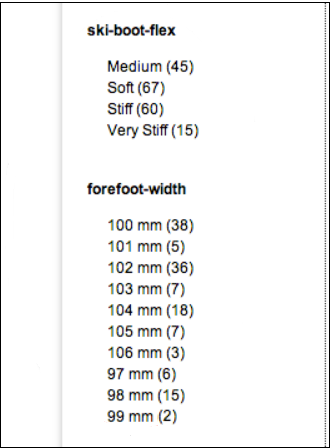
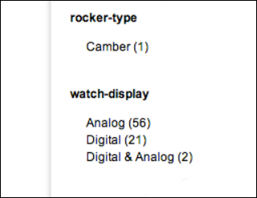
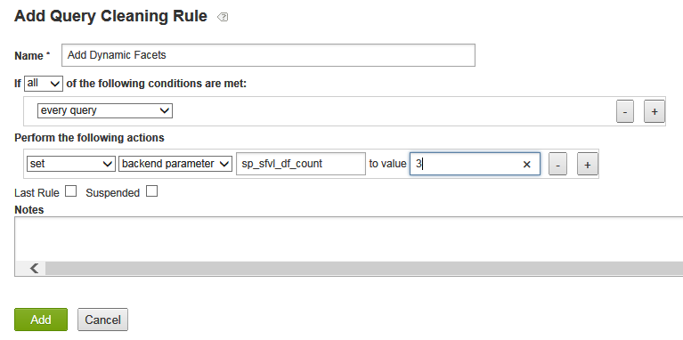
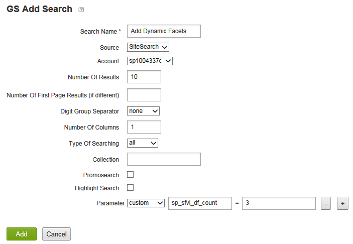
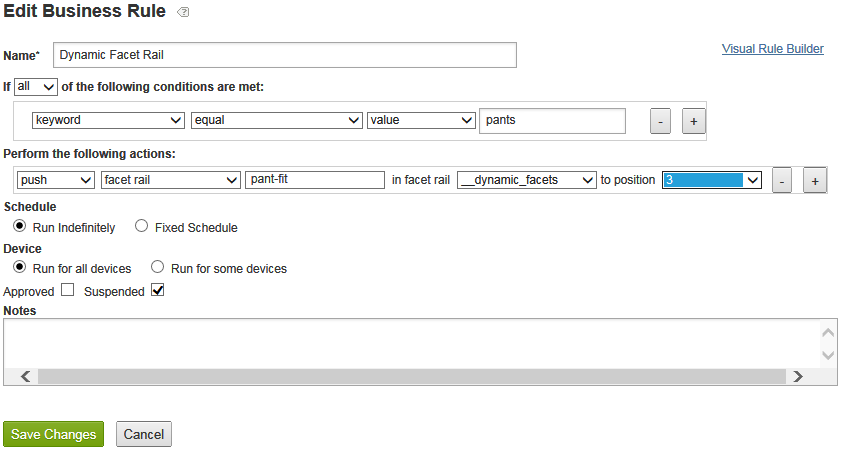

# Info over dynamische factoren{#about-dynamic-facets}

Met Dynamische factoren kunt u automatisch nieuwe bereikselecties maken op het moment van de zoekopdracht. U kunt desgewenst elk dynamisch facetveld koppelen aan maximaal één tabelnaam in uw Adobe Search&amp;Promote-account. U past die tabelrelaties tijdens het zoeken toe op alle dynamische facetvelden die bij de zoekopdracht zijn betrokken.

## Dynamische factoren gebruiken {#concept_E65A70C9C2E04804BF24FBE1B3CAD899}

>[!NOTE]
>
>Deze functie is standaard niet ingeschakeld in [!DNL Adobe Search&Promote]. Neem contact op met Technische ondersteuning om de functie voor uw gebruik te activeren.

Zonder het gebruik van Dynamische Facets, moest u verwante attributen in &quot;groeven&quot;samenvoegen, en slechts de groeven tonen die voor een bepaalde onderzoek homogeen waren. Dat wil zeggen dat ze alleen de waarden van één logisch kenmerk konden bevatten, zoals &quot;schoengrootte&quot; of &quot;ringgrootte&quot;. Deze methode leverde de juiste zoektijdprestaties met een grote set unieke kenmerken.

Wanneer Dynamic Faceting wordt gebruikt, geldt echter geen limiet voor het aantal facetten dat zoekopdrachten in de kern efficiënt kunnen volgen. U kunt honderden dynamische facetten bepalen, waarvan het kernonderzoek de &quot;top `N` dynamische facetten&quot;voor een bepaalde onderzoek kan terugkeren, waar `N` typisch een meer bescheiden waarde van 10-20 of minder is. Met deze methode hoeft u de kenmerken niet meer te plakken. U kunt nu een unieke dynamische facet voor kenmerken op uw website maken.

## Welke facetten moet u dynamisch maken? {#section_254EE034BCAD4250A5D09FBF6158C4A5}

Facetten die dunbevolkt zijn op uw website en alleen worden weergegeven voor een subset zoekopdrachten, zijn goede kandidaten voor een dynamische weergave. Een facet met de naam &quot;breedte voorvoet&quot; mag bijvoorbeeld alleen worden gevuld wanneer u naar schoenen of laarzen zoekt. Terwijl een ander facet met de naam &quot;Gezichtsnummerstijl&quot;, met mogelijke waarden &quot;Romeins&quot; en &quot;Arabisch&quot;, alleen mag worden weergegeven wanneer u zoekt naar stalen of klokken.

Als uw account een groot aantal van dergelijke facetten heeft, worden de zoekprestaties verbeterd zodat dynamische facetten worden gebruikt in plaats van altijd de volledige set mogelijke facetten voor elke zoekopdracht te selecteren. Algemene facetten, zoals &quot;SKU&quot; of &quot;merk&quot;, die normaal gesproken geschikt zijn om met de resultaten van elke zoekactie te worden weergegeven, zijn doorgaans niet geschikt als dynamische facetten.

## Relatie tussen facetten en meta-tagvelden {#section_2869E5FCDA8B431A87BC6E5573F2B0A0}

Facetten worden boven op metatag-tagvelden gebouwd. Een metatag etiketgebied is een laag-vlakke, kernonderzoekslaageigenschap van [!DNL Adobe Search&Promote]. Facetten daarentegen maken deel uit van GS (Guided Search) - de presentatielaag op hoog niveau van Adobe Search&amp;Promote. Facetten hebben echter eigen velden voor metatags, maar velden voor metatags weten niets over facetten. Wanneer u dynamische facetten configureert, voegt u eerst facetten toe en voegt u vervolgens metatag-tagvelden toe met de optie Dynamisch facet geselecteerd om het geïdentificeerde facet in te stellen op dynamisch.

>[!NOTE]
>
>Er is geen instelling Dynamisch facet in **[!UICONTROL Design > Navigation > Facets]**. Wat een facet &#39;dynamisch&#39; maakt, is dat het onderliggende &#39;meta tag field&#39; dynamisch is, zoals ingesteld in **[!UICONTROL Settings > Metadata > Definitions]**.

## Voorbeelden van dynamische facetten in actie {#section_BC699A05E2E742EF94D41679163ACE84}

Voorbeeld van dynamische facetten die worden weergegeven na een zoekopdracht naar &quot;laarzen&quot;:



Een ander voorbeeld van dynamische facetten die na een onderzoek naar &quot;horloges&quot;worden getoond:



Zie ook

* [CGI-parameters voor achtergrondzoekopdrachten](../c-appendices/c-cgiparameters.md#reference_582E85C3886740C98FE88CA9DF7918E8)
* [Presentatiesjablooncodes](../c-appendices/c-templates.md#reference_F1BBF616BCEC4AD7B2548ECD3CA74C64)
* [Labels voor transportsjablonen](../c-appendices/c-templates.md#reference_227D199F5A7248049BE1D405C0584751)

## Dynamische facetten configureren {#task_D17F484130E448258100BAC1EEC53F39}

Dynamische facetten instellen in Zoeken&amp;promoveren.

<!-- 

t_configuring_dynamic_facets.xml

 -->

>[!NOTE]
>
>Deze functie is standaard niet ingeschakeld in Adobe Search&amp;Promote. Neem contact op met Technische ondersteuning om de functie voor uw gebruik te activeren.

Voordat de effecten van uw dynamische facetten zichtbaar zijn voor klanten, moet u de index van uw site opnieuw genereren.

Zie ook

* [CGI-parameters voor achtergrondzoekopdrachten](../c-appendices/c-cgiparameters.md#reference_582E85C3886740C98FE88CA9DF7918E8)
* [Presentatiesjablooncodes](../c-appendices/c-templates.md#reference_F1BBF616BCEC4AD7B2548ECD3CA74C64)
* [Labels voor transportsjablonen](../c-appendices/c-templates.md#reference_227D199F5A7248049BE1D405C0584751)

**Dynamische facetten configureren**

1. Zorg ervoor dat u al facetten hebt toegevoegd.

   Zie [Een nieuw facet toevoegen](../c-about-design-menu/c-about-facets.md#task_FC07BFFA62CA4B718D6CBF4F2855C89B).
1. Nadat u facetten hebt toegevoegd, controleert u of u de facetten hebt toegevoegd aan nieuwe door de gebruiker gedefinieerde metatagvelden.

   Zie [Een nieuw metatag toevoegen gebied](../c-about-settings-menu/c-about-metadata-menu.md#task_6DF188C0FC7F4831A4444CA9AFA615E5).
1. Klik in het productmenu op **[!UICONTROL Settings]** > **[!UICONTROL Metadata]** > **[!UICONTROL Definitions.]**
1. Klik op de pagina [!DNL Definitions] in de tabel [!DNL User-defined fields] in de kolom [!DNL Actions] op het potloodpictogram (Bewerken) in de rij van de veldnaam van de metatag die is gekoppeld aan het facet dat u dynamisch wilt maken.
1. Controleer **[!UICONTROL Dynamic Facet]** op de pagina [!DNL Edit Field].

   Zie de optietabel in [Een nieuw metatag toevoegen gebied](../c-about-settings-menu/c-about-metadata-menu.md#task_6DF188C0FC7F4831A4444CA9AFA615E5).
1. Klik op **[!UICONTROL Save Changes]**.
1. Klik **regenerate your stage site index** in the blue box om uw gefaseerde website-index snel opnieuw samen te stellen.

   Zie ook [De index van een live of gefaseerde website opnieuw genereren](../c-about-index-menu/c-about-regenerate-index.md#task_B28DE40C0E9A475ABCBCBC4FF993AACD).
1. Bepaal het aantal dynamische facetten dat u voor een bepaalde zoekopdracht wilt selecteren. Voer een van de volgende twee handelingen uit om deze taak uit te voeren:

   * Maak een regel voor query-reiniging met de gewenste omstandigheden die de handeling `set`, `backend parameter`, `sp_sfvl_df_count` uitvoert naar waarde `X`, waarbij `X` het gewenste aantal dynamische facetten is dat op het moment van zoekopdracht moet worden aangevraagd, en klik vervolgens op **[!UICONTROL Add]**.

   

   Zie [Een regel voor het schoonmaken van query toevoegen](../c-about-rules-menu/c-about-query-cleaning-rules.md#task_47F43988D3D9485F8AE1DFDA7E00BF54).

   Zie ook [Backend onderzoek CGI parameters](../c-appendices/c-cgiparameters.md#reference_582E85C3886740C98FE88CA9DF7918E8), rij 40 in de lijst voor verdere uitleg van `sp_sfvl_df_count`.

   * Voeg een zoekopdracht toe en stel de parameter &quot;custom&quot; `sp_sfvl_df_count` in op de gewenste waarde en klik op **[!UICONTROL Add]**.

   

   Zie [Een nieuwe zoekdefinitie toevoegen](../c-about-settings-menu/c-about-searching-menu.md#task_98D3A168AB5D4F30A1ADB6E0D48AB648).

   Zie ook [Backend onderzoek CGI parameters](../c-appendices/c-cgiparameters.md#reference_582E85C3886740C98FE88CA9DF7918E8), rij 40 in de lijst voor verdere uitleg van `sp_sfvl_df_count`.

1. Geef het aangewezen vervoermalplaatje uit om de dynamische facetten uit te voeren die het kernonderzoek terugkeert.

   Zie [Een presentatie of een transportsjabloon bewerken](../c-about-design-menu/c-about-templates.md#task_800E0E2265C34C028C92FEB5A1243EC3).

   Stel dat uw transportsjabloon de naam `guided.tpl` heeft. Klik in dat geval in het productmenu op **[!UICONTROL Design > Templates]**. Zoek op de pagina [!DNL Templates] `guided.tpl` in de tabel. en klik vervolgens op **[!UICONTROL Edit]** helemaal rechts van de naam. Voeg op de pagina Bewerken het volgende codeblok toe aan het einde van `</facets>`: JSON-uitvoer:

   ```
   ... 
   }<search-dynamic-facet-fields>, 
           { 
               "name" : "<search-dynamic-facet-field-name>", 
               "dynamic-facet" : 1, 
               "values" : [<search-field-value-list quotes="yes" commas="yes" data="values" sortby="values" encoding="json" />], 
               "counts" : [<search-field-value-list quotes="yes" commas="yes" data="results" sortby="values" />] 
   
           }</search-dynamic-facet-fields> 
   ...
   ```

1. Bewerk de desbetreffende presentatiesjabloon of sjablonen om de dynamische facetten weer te geven.

   Zie [Een presentatie of een transportsjabloon bewerken](../c-about-design-menu/c-about-templates.md#task_800E0E2265C34C028C92FEB5A1243EC3).

   Stel dat u een sjabloon met de naam `sim.tmpl` hebt die wordt gebruikt voor de uitvoer van inhoud in de Simulator. Als u die sjabloon wilt bewerken, klikt u in het productmenu op **[!UICONTROL Design > Templates]**. Zoek op de pagina [!DNL Templates] `sim.tmpl` in de tabel. en klik vervolgens op **[!UICONTROL Edit]** helemaal rechts van de naam. Voeg op de pagina Bewerken het volgende toe in het gebied met facetweergave van de sjabloon:

   ```
   <h6>DF RAIL</h6> 
   <guided-facet-rail gsname="__dynamic_facets"> 
               <guided-facet ><!-- behavior=Normal --> 
               <div class="facet-block" id="facet"> 
               <p><b><guided-facet-display-name /></b></p> 
               <ul> 
                   <guided-facet-values> 
                       <guided-if-facet-value-equals-length-threshold> 
               </ul> 
               <ul id="brand" style="display:none"> 
                       </guided-if-facet-value-equals-length-threshold> 
                       <guided-if-facet-value-selected> 
                           <li><guided-facet-value> [<guided-lt>a href="<guided-facet-value-undo-path />"<guided-gt>X</a>]</li> 
                       <guided-else-facet-value-selected> 
                           <li><guided-facet-link><guided-facet-value></guided-facet-link> (<guided-facet-count>) </li> 
                       </guided-if-facet-value-selected> 
                   </guided-facet-values> 
               </ul> 
               <guided-if-facet-long> 
                 <br /><guided-lt />a href="#" onclick="moreless(this,'brand');return false;" <guided-gt /><button style="font-size:10px;">VIEW MORE</button></a> 
               </guided-if-facet-long> 
               </div> 
               </guided-facet> 
   </guided-facet-rail> 
   <h6>/DF RAIL</h6>
   ```

   U kunt desgewenst ook andere presentatiesjablonen wijzigen, bijvoorbeeld `json.tmpl`.

   Zorg ervoor dat u `__dynamic_facets` voor `gsname` in `guided-facet-rail` markering specificeert. Dit label is een vooraf gedefinieerde facetrails die zijn gereserveerd voor het uitvoeren van alle dynamische facetten die worden geretourneerd voor een bepaalde zoekopdracht.

   U kunt deze speciale facetrails optioneel ook bewerken met **[!UICONTROL Rules > Business Rules]** en de **[!UICONTROL Advanced Rule Builder]** gebruiken, zoals hieronder wordt weergegeven.

   

   Zie ook [Een nieuwe bedrijfsregel toevoegen](../c-about-rules-menu/c-about-business-rules.md#task_BD3B31ED48BB4B1B8F1DCD3BFA2528E7)
