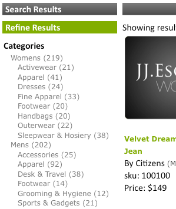

# Informatie over facetten{#about-facets}

U kunt Facets gebruiken om uw presentatielaag aan te passen en uw gebruikers van een Geleid Onderzoek te voorzien dat hen neer in hun onderzoeksresultaten laat boren.

## Facturen gebruiken {#concept_FA912B3B41EE493DB2F492D188457FF5}

Bijvoorbeeld, veronderstel een bezoeker aan een website die hulpmiddelen verkoopt, een onderzoek naar kerken uitvoert. De onderneming kon twee facetten gebruiken: een om alle merken van de gevonden rassen te specificeren, en tweede om alle Franse grootte te specificeren. De klant kan op elk merk of elke grootte in het juiste facet klikken om de resultaten te versmallen en snel de juiste sleutel te vinden die hij nodig heeft.

U kunt een facet op om het even welke bestaande meta-gegevensdefinitie baseren. Als een facet als type van Datum in de meta-gegevens wordt bepaald, wordt het getoond als facet van de datumwaaier.

De lijst op de [!DNL Staged Facets] pagina toont een algemeen overzicht van de montages die omhoog elk toegevoegd facet maken. U kunt nieuwe facetten toevoegen en bestaande facetten uitgeven of schrappen. U kunt om het even welke veranderingen terugkeren die u aan facetten aanbrengt door **[!UICONTROL History]** dichtbij de hoger-juiste hoek van de pagina te gebruiken.

De montages van het gezicht worden gefaseerd door gebrek om u te laten om het even welke veranderingen testen alvorens u hen levend duwt.

Zie [over opvoeren](../c-about-staging.md#concept_08B8F3CA1F4241108F14BA7FC7806CA7).

U kunt gebruiken **[!UICONTROL View Live Settings]** om uw gefaseerde montages met het huidige levende plaatsen te vergelijken. Gebruik **[!UICONTROL View Staged Settings]** om naar het opvoergebied terug te keren. Voor een punt dat wordt gefaseerd, is de levende versie van de montages read-only. Daarom manipuleert u het door de gefaseerde montages levend te duwen. Nadat u tevreden bent met om het even welke veranderingen die u aan het gefaseerde gezicht hebt aangebracht, klik **[!UICONTROL Push Live]** om hen levend te duwen.

## Datumbereik {#section_FEFFF6B5B6534456913189FEF559BA58}

De factoren die als typeDatum in de meta-gegevens worden bepaald worden behandeld verschillend van andere facetten. In plaats van worden behandeld als een reeks waarden, worden zij behandeld als een datumwaaier, met een begindatum, een einddatum, of allebei.

Een facet van de datumwaaier heeft een waarde van de begindatum, die door &quot;btw&quot;wordt gevolgd (voor &quot;tussen&quot;), die door de einddatum wordt gevolgd. De data zijn in de volgende twee formaten:

mm-dd-jjjj

mm/dd/jjjj

Vier-cijferige jaren zijn vereist. Er moet minstens één van de begindata of einddata zijn, maar beide zijn niet vereist. Bijvoorbeeld, &quot;12/1/2007BTW1/4/2009&quot;betekent alle data tussen 1 December, 2007 en 4 Januari, 2009. Onder &quot;1-1-2005BTW&quot; worden echter alle data verstaan sinds 1 januari 2005.

U kunt de markering van het presentatiemalplaatje gebruiken `<guided-facet-value/>` om de waarde van een facet van de datumwaaier, als een normaal facet te krijgen. Momenteel, wordt JavaScript vereist om gebruikers toe te staan om datumwaaiers in te gaan aan onderzoek op. Bijvoorbeeld, kunt u de input van twee ingangsgebieden voor de begin en einddata nemen. Dan kunt u de input bevestigen, en de waarde van het nieuwe facet (die van de twee inputgebieden wordt gebouwd) en facetnaam toevoegen aan bestaande URL.

Zie [de malplaatjemarkeringen](../c-appendices/c-templates.md#reference_F1BBF616BCEC4AD7B2548ECD3CA74C64)van de Presentatie.

De volgende codesteekproef is een voorbeeld op hoe te om een datumwaaier op een pagina voor te stellen. Het toont de bestaande datumwaaier als het wordt geselecteerd; anders is het een eenvoudig invoerformulier . Wanneer de vorm wordt voorgelegd, voert het eenvoudige bevestiging uit. Het verzendt dan browser naar een nieuwe URL die twee nieuwe parameters omvat:

* `q#` - Vertegenwoordigt de geselecteerde datumwaaier die van de twee inputgebieden wordt geassembleerd.
* `x#` - Namen van het facet. In dit voorbeeld, wordt het facet van de datumwaaier genoemd &quot;gewijzigd&quot;.

De `replace(/%2F/ig, '~2F')` delen in de code zijn nodig omdat Apache niet `%2F` in wegen URL om veiligheidsredenen toestaat, en wanneer het gebruiken van SEO URLs is de vraag in de weg URL. Daarom `/` wordt gecodeerd zoals `~2F` in plaats van `%2F`, aangezien het normaal in een URL zou zijn.

```
<div class="date_range"> 
 <p>Date Range</p> 
 <guided-if-facet-selected gsname="modified"> 
  <guided-facet-values gsname="modified"> 
   <script> 
   var modified_daterange= '<guided-facet-value />'.split(/BTW/) ; 
   if (modified_daterange[0]=='') modified_daterange[0]= '--/--/----' ; 
   if (modified_daterange[1]=='') modified_daterange[1]= '--/--/----' ; 
   document.write('From: ' + modified_daterange[0]) ; 
   document.write('<br>To: ' + modified_daterange[1]) ; 
   </script> 
  </guided-facet-values> 
 
 <guided-else-facet-selected> 
  <form action="#"> 
   From: <input name="dateFrom" size=10> 
   <br>To: <input name="dateTo" size=10> 
   <br><input type="button" value="Go" onclick="goClick(this.form)"> 
  </form> 
  <script> 
  function goClick(f) { 
   if (f.dateFrom.value=='' && f.dateTo.value=='') { 
    alert('You must enter either a From: date or a To: date.') ; 
    return ; 
   } 
   if ( f.dateFrom.value!='' && !f.dateFrom.value.match(/^\d+[\/\-]\d+[\/\-]\d\d\d\d$/) ) { 
    alert('From: date must be in "mm/dd/yyyy" or "mm-dd-yyyy" format.') ; 
    return ; 
   } 
   if ( f.dateTo.value!='' && !f.dateTo.value.match(/^\d+[\/\-]\d+[\/\-]\d\d\d\d$/) ) { 
    alert('To: date must be in "mm/dd/yyyy" or "mm-dd-yyyy" format.') ; 
    return ; 
   } 
   // Note that "/" is encoded as "~2F" instead of "%2F" to avoid Apache 404 error. 
   var new_url= '<guided-current-path />&<guided-query-param-name gsname="q#" offset="0" />=' 
    + encodeURIComponent(f.dateFrom.value).replace(/%2F/ig, '~2F') + 'BTW' 
    + encodeURIComponent(f.dateTo  .value).replace(/%2F/ig, '~2F') 
    + '&<guided-query-param-name gsname="x#" offset="0" />=modified' ; 
   location.href= new_url ; 
  } 
  </script> 
 </guided-if-facet-selected> 
</div>
```

## Over geneste facetten {#section_6BC77F38DE9F43D5B6911F8CECB15DFC}

De genestelde facetten zijn facetten die veelvoudige niveaus van categorieën zoals in het volgende tonen:



De categorieën van Womens en van Mens zijn in het hoogste of ouderfacet. De subcategorieën, zoals Accessoires en Schoeisel, bevinden zich in het onderste of het onderste facet.

De huidige gesteunde genestelde facetdiepte is twee, maar het kan overal langs de boor-benedenlijst zijn.

Het volgende is het gedrag van diverse soorten genestelde facetten:

<table> 
 <thead> 
  <tr> 
   <th colname="col1" class="entry"> <p>Gedrag van het geneste type facet </p> </th> 
   <th colname="col2" class="entry"> <p>Gedrag </p> </th> 
  </tr> 
 </thead>
 <tbody> 
  <tr> 
   <td colname="col1"> <p>Normaal </p> </td> 
   <td colname="col2"> <p>Het gedrag van een normaal genesteld facet is dat het krimpt als andere facetten de zoekopdracht versmallen. </p> <p>Als het genestelde facet wordt geselecteerd, krimpt het neer naar zijn selectie. Als een ouderfacet wordt geselecteerd, slechts verschijnt die ouder met elk van zijn resterende kindfacetten. Als een kindfacet wordt geselecteerd, toont het facet slechts het geselecteerde ouderfacet en het geselecteerde kindfacet. </p> </td> 
  </tr> 
  <tr> 
   <td colname="col1"> <p>Sticky </p> </td> 
   <td colname="col2"> <p>Het gedrag van een kleverig genesteld facet is dat het probeert om het facet zo veel mogelijk open te houden gebaseerd op de staat van andere facetten of onderzoekscriteria. Als het kindfacet wordt geselecteerd, telt het naar de kleverige diepte. </p> </td> 
  </tr> 
  <tr> 
   <td colname="col1"> <p>Multi-Select </p> </td> 
   <td colname="col2"> <p>Het gedrag van een multi-select facet is dat het het facet open houdt. Om het even welke nieuwe selecties proberen om alle andere facetselecties uit te wissen tenzij het facet een "ouder"van het genestelde facet van de categorie is. In dit geval, verwijst de "ouder"naar categoriefacetten, niet top-level categorieën van een genesteld facet. </p> </td> 
  </tr> 
  <tr> 
   <td colname="col1"> <p>Categorieën selecteren </p> </td> 
   <td colname="col2"> <p>Als Multi-Select genesteld facettype met de volgende uitzonderingen: </p> 
    <ul id="ul_D5AB6AF3169A483E8F3FC6D2A2EA3A28"> 
     <li id="li_9308156EF2FF43CE9DFB933F13786C58">Om het even welke andere eerder gekozen facetten worden geschrapt als dit facet voor het eerst wordt geselecteerd. </li> 
     <li id="li_DD96D6802A9C479283212A0FD68C6F85">Andere eerder gekozen facetten worden ook geschrapt als de klant direct naar het kindfacet zonder het ouderfacet te klikken of een sibling van een verschillend ouderfacet wordt gekozen. </li> 
     <li id="li_8BF58F10969B4743986D5D0E0086AD6C">Ze kunnen ouders hebben in de zin dat groepsfacetten ouders hebben. Verwar dit gedrag niet met ouder-kind verhoudingen die met alle genestelde facetten worden gevonden. </li> 
    </ul> </td> 
  </tr> 
 </tbody> 
</table>

Zie ook [over de spoorlijn](../c-about-design-menu/c-about-facet-rails.md#concept_1FDC8BCDFFC84A0889DA670F63D5F6DB)Facet.

## Een nieuw facet toevoegen {#task_FC07BFFA62CA4B718D6CBF4F2855C89B}

U kunt facetten toevoegen om uw presentatielaag aan te passen en uw klanten van een Geleid Onderzoek te voorzien dat hen neer in hun onderzoeksresultaten laat boren.

<!-- 

t_adding_a_new_facet.xml

 -->

De facetlijst op de [!DNL Facets] pagina toont een uittreksel van de montages die omhoog één enkel facet maken. U kunt nieuwe facetten toevoegen en bestaande facetten uitgeven of schrappen. Om het even welke veranderingen u aan facetten aanbrengt kunnen worden omgekeerd gebruikend de eigenschap van de Geschiedenis.

>[!NOTE]
>
>Zeker ben dat u het facet in uw presentatiemalplaatje van verwijzingen voorziet zodat het op de website zichtbaar is.

Zie ook [over de spoorlijn](../c-about-design-menu/c-about-facet-rails.md#concept_1FDC8BCDFFC84A0889DA670F63D5F6DB)Facet.

**Om een nieuw facet toe te voegen**

1. Alvorens u een nieuw facet kunt toevoegen, zorg ervoor dat u reeds het volgende hebt gedaan alvorens u aan de volgende stap te werk gaat:

   * Heb sommige reeds bepaalde gebieden van de meta- markering.

      Zie [Een nieuw meta-tagveld](../c-about-settings-menu/c-about-metadata-menu.md#task_6DF188C0FC7F4831A4444CA9AFA615E5)toevoegen.
   * Injecteer de metagegevens in uw index.
Zie [Veldinjectiedefinities](../c-about-settings-menu/c-about-metadata-menu.md#task_E86566FA1FF74CF68115C0ADA05172AE)toevoegen.

1. Klik in het productmenu op **[!UICONTROL Design]** > **[!UICONTROL Navigation]** > **[!UICONTROL Facets.]**
1. Voor de [!DNL Facets] pagina, klik **[!UICONTROL Add New Facet]**.
1. Voor de [!DNL Add Facet] pagina, plaats de opties die u wilt.

   Deze montages beïnvloeden zowel het gedrag als de standaardpresentatie van een facet. U kunt sommige van deze montages als montages van het presentatiemalplaatje met voeten treden.

   Als een facet als type van Datum in de meta-gegevens wordt bepaald, wordt het getoond als datumwaaier.

   Zie [Datumbereik](../c-about-design-menu/c-about-facets.md#section_FEFFF6B5B6534456913189FEF559BA58).

   Afhankelijk van de facetopties die u selecteert, zijn niet alle opties beschikbaar.

   <!-- 
   r_add_facet_options.xml
   -->

   <table> 
    <thead> 
      <tr> 
      <th colname="col1" class="entry"> <p>Optie </p> </th> 
      <th colname="col2" class="entry"> <p>Beschrijving </p> </th> 
      </tr> 
    </thead>
    <tbody> 
      <tr> 
      <td colname="col1"> <p>Naam facet </p> </td> 
      <td colname="col2"> <p>Identificeert de naam van een bepaald facet. </p> <p> <p>Opmerking:  U kunt een facet slechts hebben dat op bestaande user-defined meta-gegevens wordt gebaseerd. Als er geen facetten beschikbaar in de drop-down lijst zijn, dan moet u sommige meta-gegevens eerst bepalen. </p> </p> <p>Zie <a href="../c-about-settings-menu/c-about-metadata-menu.md#task_6DF188C0FC7F4831A4444CA9AFA615E5" type="task" format="dita" scope="local"> Een nieuw meta-tagveld toevoegen </a>. </p> <p>Om een facet te bouwen dat op een gebiedslijst wordt gebaseerd, gebruik de naam van het douanefacet en specificeer uw naam van de gebiedstafel. </p> </td> 
      </tr> 
      <tr> 
      <td colname="col1"> <p>Etiket weergeven </p> </td> 
      <td colname="col2"> <p>Plaatst het etiket van een facet dat dan in een broodkruimel, in plaats van een meta-gegevensveldnaam (met de <span class="codeph"> &lt;geleide-broodkruimeletiket&gt; </span> markering) of een stand-alone waarde (met de <span class="codeph"> &lt;geleide-facet-vertoning-naam&gt; </span> markering) kan worden gebruikt. </p> </td> 
      </tr> 
      <tr> 
      <td colname="col1"> <p>Gedrag </p> </td> 
      <td colname="col2"> <p>Plaatst één van drie facetgedrag. </p> <p> 
      <ul id="ul_67C19E1C16224B9990F04A0D05BD3D05"> 
      <li id="li_6B232C11A61840B68CA59E1F593405A0"> <span class="uicontrol"> Normaal </span> <p>Wanneer een klant een facet klikt het waarvan gedrag aan <span class="uicontrol"> Normaal wordt geplaatst </span>, boort het in de onderzoeksresultaten voor dat punt. Van daar, kan de klant het aantal onderzoeksresultaten verder raffineren en versmallen. </p> </li> 
      <li id="li_7D7C43A7F7AB4B84A9B0FEF34627605A"> <span class="uicontrol"> Categorie </span> <p>De facetten van de categorie doen dienst als navigatie-elementen. Deze facetten zijn top-level facetten die de klanten typisch door alvorens facetten met attributenopties te onthullen boren. De facetten van de categorie smallen niet wanneer andere facetten worden geselecteerd en blijven open. Het klikken van een verschillende waarde binnen een categoriefacet schrapt alle andere facetten op de pagina behalve de ouders van het categoriefacet. </p> </li> 
      <li id="li_01255993D71F40DBA8870AA3FEA7D304"> <span class="uicontrol"> Categorieën selecteren </span> <p>facetten zijn categoriefacetten die de selectie van veelvoudige punten van het facet steunen waar de punten "OFed"samen zijn. </p> </li> 
      </ul> 
      <ul id="ul_683F6D3FC8524E65AF303453ADDB6001"> 
        <li id="li_81F504D1D1294666BBBC5EA43B34B712"> <span class="uicontrol"> Sticky </span> <p>Wanneer een klant een facet klikt het waarvan gedrag aan <span class="uicontrol"> Sticky wordt geplaatst </span>, blijft het facet met de geselecteerde optie open tijdens boor-neer. Deze optie is nuttig wanneer u een klant een vorige keus wilt laten veranderen. </p> </li> 
      </ul> 
      <ul id="ul_8E871D63B09445268C600C8ABC20F6A4"> 
        <li id="li_F88AC5528B0C4751BC4CFE7FA9525857"> <span class="uicontrol"> Multi-Select </span> <p>Staat de selectie van veelvoudige punten van een facet toe, waar de punten binnen het facet "ORed"samen zijn. Deze optie is nuttig voor een facet dat een minder belangrijk attribuut zoals kleuren kan tonen en u wilt de klant de capaciteit laten om een vraag te bouwen die hen "laat tonen schoenen in mijn grootte die rood of zwart zijn". </p> </li> 
      </ul> </p> </td> 
      </tr> 
      <tr> 
      <td colname="col1"> <p>Altijd weergeven </p> </td> 
      <td colname="col2"> <p>Voor een normaal of kleverig facet, plaatst het facet om zichtbaar te blijven voor de klant op elk ogenblik. </p> <p>Deze optie is slechts beschikbaar als u <span class="uicontrol"> Normaal </span>, <span class="uicontrol"> Categorie </span>, of <span class="uicontrol"> Sticky </span> van de drop-down lijst van het <span class="uicontrol"> Gedrag </span> selecteerde. </p> </td> 
      </tr> 
      <tr> 
      <td colname="col1"> <p>Ouders van facet </p> </td> 
      <td colname="col2"> <p>Deze optie is alleen beschikbaar als u <span class="uicontrol"> Categorie </span> - of <span class="uicontrol"> Categorie Multi-Select </span> in de vervolgkeuzelijst <span class="uicontrol"> Gedrag </span> hebt geselecteerd. </p> <p>Geeft aan wat de ouders van de categorie facet zijn. De geselecteerde punten in de facetten van de categorieouder worden gebruikt om de keuzen te versmallen die binnen het huidige categoriegebied beschikbaar zijn. De facetten van de ouder worden niet geschrapt wanneer een klant met het categoriegezicht in wisselwerking staat. U kunt veelvoudige komma-afgebakende ouders specificeren. </p> </td> 
      </tr> 
      <tr> 
      <td colname="col1"> <p>Sticky Diepte </p> </td> 
      <td colname="col2"> <p>Deze optie is slechts beschikbaar als u <span class="uicontrol"> Sticky </span> van de drop-down lijst van het <span class="uicontrol"> Gedrag </span> selecteerde. </p> <p>Plaatst het aantal opties om open tijdens boor-neer te blijven. </p> </td> 
      </tr> 
      <tr> 
      <td colname="col1"> <p>Drempelwaarde lengte </p> </td> 
      <td colname="col2"> <p>Plaatst de verticale lengte (1-9999) van het facet dat in aantal punten wordt bepaald. </p> <p>Als uw presentatiemalplaatje opstelling geschikt is, kunt u dit het plaatsen gebruiken om "te verstrekken toont meer..." verbinding, of bepaal wanneer om het facet in een scrollable afd., etc. te werpen. </p> </td> 
      </tr> 
      <tr> 
      <td colname="col1"> <p>Drempelwaarde voor de kantellengte </p> </td> 
      <td colname="col2"> <p>Knot het aantal punten in een facet na een bepaalde drempel om. </p> <p>Sommige implementaties hebben facetten met duizenden punten in hen. Het kan duur zijn om alle gegevens over de draad te verzenden. U kunt dit het plaatsen gebruiken om het facet neer aan een handelbaar niveau in orde te maken. De facet wordt na sortering afgekapt. </p> </td> 
      </tr> 
      <tr> 
      <td colname="col1"> <p>Maximale toegevoegde waarde </p> </td> 
      <td colname="col2"> <p>Specificeert een grens aan de lengte van het koord van de facetwaarde (1-999). </p> <p>Deze optie is nuttig wanneer u een facet in een vaste breedtelay-out wilt zetten en koorden van het verpakken houden. Door gebrek, wordt het koord geplaatst aan 3 karakters korter dan de drempel zodat een ellips kan worden toegevoegd. </p> </td> 
      </tr> 
      <tr> 
      <td colname="col1"> <p>Value Extension </p> </td> 
      <td colname="col2"> <p>Specificeert het koord dat u gebruik wilt om erop te wijzen dat de waarde van een facet beknot is. Door gebrek het koord "..." wordt gebruikt. </p> </td> 
      </tr> 
      <tr> 
      <td colname="col1"> <p>Afbakening </p> </td> 
      <td colname="col2"> <p>Specificeert de afbakening voor om het even welke afgebakende gescheiden waardelijst te gebruiken die op het facet van toepassing is. </p> <p>De afbakening die wordt gebruikt is het zelfde die in de meta-gegevens wordt bepaald waarop het facet gebaseerd is. De standaardafbakening is een komma. Nochtans, kunt u om het even welke XML-Volgzame waarde gebruiken. </p> </td> 
      </tr> 
      <tr> 
      <td colname="col1"> <p>Sorteren </p> </td> 
      <td colname="col2"> <p>Specificeert hoe u facetten wilt die op uw website worden gesorteerd. U kunt facetten hebben die door het volgende worden gesorteerd. Indien gewenst, kunt u tot vijf soorten combineren. </p> 
      <ul id="ul_12987F4DC7B34C63ABC906B59688A174"> 
      <li id="li_3206C96013DF431D90119F594D93D85D"> <span class="uicontrol"> alfabetisch </span> <p>Sorteert alfabetisch de waarden (0-9, A-Z), met inbegrip van leestekens. </p> </li> 
      <li id="li_304E4A518FBE48D18D9E9EA7339A3481"> <span class="uicontrol"> alfa (alleen alfanumeriek) </span> <p>Sorteert alfabetisch de waarden (0-9, A-Z), negerend leestekens. </p> </li> 
      <li id="li_CADB888CC514455F9CA379C8EEE490AA"> <span class="uicontrol"> alpha- (niet hoofdlettergevoelig) </span> <p>Sorteert alfabetisch de waarden (0-9, A-Z), negerend het geval van alfabetische karakters, en met inbegrip van punctuatie karakters. </p> </li> 
      <li id="li_F61122E79AB5413792DA31F8AB1414BD"> <span class="uicontrol"> alpha- (niet hoofdlettergevoelig, alfanumeriek slechts) </span> <p>Sorteert alfabetisch de waarden (0-9, A-Z), negerend het geval van alfabetische karakters, en negerend leestekens. </p> </li> 
      <li id="li_F50CC298ABF046D0A39D5AE5B1261823"> <span class="uicontrol"> tellen </span> <p>Sorteert op aantal resultaten die elke facetwaarde van het grootste aan het minst aanpassen. </p> </li> 
      <li id="li_32B6AF39E9534762B39B15181DC5AD01"> <span class="uicontrol"> numeriek </span> <p>Sorteert de waarden numeriek. Wanneer het sorteren van aantallen, is deze optie superieur aan een Alpha- soort omdat als u een Alpha- soort gebruikt, 10 vertoningen vóór 2. </p> </li> 
      <li id="li_CF8E76A7B1184E0C8DCC11B53E31A1DC"> <span class="uicontrol"> splitsen </span> <p>Breekt de lijst in twee afzonderlijke lijsten door tellingsdrempel. De waarden van het gezicht boven de drempel worden bewogen aan de bovenkant. De waarden van het gezicht met tellingen onder de drempel worden verplaatst naar de bodem. Een spleet-drempel wordt vereist wanneer u waarden van een bepaalde waaier wilt dwingen om altijd bij de bovenkant te zijn. </p> </li> 
      <li id="li_4AB8276577384B1099CBA895898205AD"> <span class="uicontrol"> pauze </span> <p>Dwingt bepaalde waarden aan de bovenkant of de bodem van de lijst. Bijvoorbeeld, kunt u altijd de term "Andere"willen bij de bodem van de lijst verschijnen. Of top-waardes of onderaan-waarden worden vereist wanneer u een onderbrekingssoort gebruikt om de expliciete waarden te identificeren die bij de bovenkant of de bodem van de soort zouden moeten zijn. </p> </li> 
      <li id="li_227E96CFED2044FCA2F10B6913B03CFB"> <span class="uicontrol"> besteld </span> <p>De facetwaarden moeten altijd in een vaste volgorde staan (een gescheiden lijst met scheidingstekens die wordt gedefinieerd in de onderstaande <span class="uicontrol"> optie </span> Orde). </p> </li> 
      </ul> </td> 
      </tr> 
      <tr> 
      <td colname="col1"> <p>Facet's Alias </p> </td> 
      <td colname="col2"> <p>Om bestaand onderzoek URLs te steunen dat u in het wild kunt hebben, kunt u een facet alias gebruiken om de naam van de erfenisparameter in kaart te brengen aan gewijzigd of enkel een facet met een verschillende naam tot stand te brengen. De alias wordt toegepast op inkomende slechts verzoeken en niet gebruikt om facetverbindingen tot stand te brengen. </p> </td> 
      </tr> 
      <tr> 
      <td colname="col1"> <p>Naam facet-rail </p> </td> 
      <td colname="col2"> <p>De naam van de facetspoorstaaf als u beslist uw facetten alfabetisch, door telling, of door een douanemethode te sorteren. </p> <p>Zie <a href="../c-about-design-menu/c-about-facet-rails.md#concept_1FDC8BCDFFC84A0889DA670F63D5F6DB" format="dita" scope="local"> over de facetrails </a>. </p> </td> 
      </tr> 
      <tr> 
      <td colname="col1"> <p>Orde </p> </td> 
      <td colname="col2"> <p>Deze optie is slechts beschikbaar als u <span class="uicontrol"> Besteld </span> van de <span class="uicontrol"> drop-down lijst van de Soort </span> selecteerde. </p> <p>Laat u een afgebakende lijst van waarden bepalen die de te gebruiken orde specificeert. </p> </td> 
      </tr> 
      <tr> 
      <td colname="col1"> <p>Extra toevoegen </p> </td> 
      <td colname="col2"> <p>Deze optie is slechts beschikbaar als u <span class="uicontrol"> Besteld </span> van de <span class="uicontrol"> drop-down lijst van de Soort </span> selecteerde. </p> <p>Als de waarden niet aanwezig in de bevolen lijst zijn, worden de waarden toegevoegd aan het eind. </p> </td> 
      </tr> 
      <tr> 
      <td colname="col1"> <p>Ghosts weergeven </p> </td> 
      <td colname="col2"> <p>Deze optie is slechts beschikbaar als u <span class="uicontrol"> Besteld </span> van de <span class="uicontrol"> drop-down lijst van de Soort </span> selecteerde. </p> <p>Als de waarden die door de bevolen lijst worden gespecificeerd missen, markeert deze optie elk ontbrekend punt in het facet als "spook"zodat de punten verschillend worden getoond. </p> </td> 
      </tr> 
      <tr> 
      <td colname="col1"> <p>Geneste facet </p> </td> 
      <td colname="col2"> <p>Een genesteld facet toont zijn categorieën en de categorieën van zijn kinderen. Het kan slechts een diepte van twee categorieën tonen, maar het kan overal langs boor-neer zijn. </p> <p>De gegevens voor dit facet moeten een conventie volgen bij het beschrijven van de twee niveaus van categorieën. Een facetwaarde kan bijvoorbeeld 'schoenen:laarzen' zijn, waarbij de oudercategorie 'schoenen' is en de kindercategorie 'laarzen'. ':' wordt gebruikt als scheidingsteken om hen te scheiden. </p> <p>Zie Geteste Afbakening hieronder voor meer informatie over het veranderen van de afbakening. </p> <p>Om de gegevens in dit formaat te produceren, kunt u een filtermanuscript gebruiken om twee bestaande categorieën te combineren. U kunt Normaal, Categorie, en Sticky gedrag met genestelde facetten combineren. </p> </td> 
      </tr> 
      <tr> 
      <td colname="col1"> <p>Naam geneste ouder </p> </td> 
      <td colname="col2"> <p>Deze drop-down lijst is slechts beschikbaar als u <span class="uicontrol"> Genesteld Gebied selecteerde </span>. </p> <p>Laat u kiezen welk gebied de oudercategorie vertegenwoordigt. Dit veld wordt tijdens de zoektijd gebruikt in overeenkomende bovenliggende rubrieken. </p> </td> 
      </tr> 
      <tr> 
      <td colname="col1"> <p>Geneste onderliggende naam </p> </td> 
      <td colname="col2"> <p>Deze drop-down lijst is slechts beschikbaar als u <span class="uicontrol"> Genesteld Gebied selecteerde </span>. </p> <p>Laat u kiezen welk gebied de kindcategorie vertegenwoordigt. Dit veld wordt tijdens de zoektijd gebruikt in overeenkomende onderliggende rubrieken. </p> </td> 
      </tr> 
      <tr> 
      <td colname="col1"> <p>Nested Facet Delimiter </p> </td> 
      <td colname="col2"> <p>Deze optie is alleen beschikbaar als u <span class="uicontrol"> Geneste facet hebt geselecteerd </span>. </p> <p>Het hier ingegane karakter wordt gebruikt om de oudercategorieën en kindercategorieën van zijn gegevens te ontleden. </p> <p>Bijvoorbeeld, als ":"als afbakening wordt gebruikt en de ouder "schoenen"is en het kind "laarzen"is, verwacht het dat de gegevens als "schoenen:laarzen"worden geformatteerd. </p> </td> 
      </tr> 
      <tr> 
      <td colname="col1"> <p>Drempel splitsen </p> </td> 
      <td colname="col2"> <p>Deze optie is slechts beschikbaar als u <span class="uicontrol"> Gespleten </span> van de <span class="uicontrol"> drop-down lijst van de Soort </span> selecteerde. </p> <p>Wanneer het gebruiken van een Gespleten soort, bepaalt de spleet-drempel de telling waarbij om het facet in twee afzonderlijke lijsten te verdelen. De waarden met tellingen groter dan of gelijk aan de drempel worden gehouden bij de bovenkant terwijl de waarden onder de drempel worden bewogen aan de bodem. </p> </td> 
      </tr> 
      <tr> 
      <td colname="col1"> <p>Hoogste waarden </p> </td> 
      <td colname="col2"> <p>Deze optie is slechts beschikbaar als u <span class="uicontrol"> Onderbreking </span> van de <span class="uicontrol"> drop-down lijst van de Soort </span> selecteerde. </p> <p>Wanneer het gebruiken van een soort van de Onderbreking, wordt deze afgebakende lijst van waarden altijd geplaatst bij de bovenkant van de lijst. Het gebruik van regelmatige uitdrukkingen wordt toegestaan maar zij zouden in krullende steunen of steunen moeten zijn, bijvoorbeeld: {^New.*?},{^Zeer Nieuw.*} </p> </td> 
      </tr> 
      <tr> 
      <td colname="col1"> <p>Onderste waarden </p> </td> 
      <td colname="col2"> <p>Deze optie is slechts beschikbaar als u <span class="uicontrol"> Onderbreking </span> van de <span class="uicontrol"> drop-down lijst van de Soort </span> selecteerde. </p> <p>Wanneer het gebruiken van een soort van de Onderbreking, wordt deze afgebakende lijst van waarden altijd geplaatst bij de bodem van de lijst. Het gebruik van regelmatige uitdrukkingen wordt toegestaan maar zij zouden in krullende steunen of steunen, zoals in het volgende voorbeeld moeten zijn: {^Old.*?},{^Zeer oud.*} </p> </td> 
      </tr> 
    </tbody> 
    </table>

1. Klik op **[!UICONTROL Add]**.
1. (Facultatief) op de [!DNL Facets] pagina, doe één van het volgende:

   * Klik **[!UICONTROL History]** om het even welke veranderingen terug te keren die u hebt aangebracht.

      Zie De optie [Historie](../t-using-the-history-option.md#task_70DD3F87A67242BBBD2CB27156F43002)gebruiken.

   * Klik op **[!UICONTROL Live]**.

      Zie live-instellingen [bekijken](../c-about-staging.md#task_401A0EBDB5DB4D4CA933CBA7BECDC10F).

   * Klik op **[!UICONTROL Push Live]**.

      Zie [Stadsmontages van het Pushing leven](../c-about-staging.md#task_44306783B4C0408AAA58B471DAF2D9A4).

## Een geneste facet toevoegen {#task_A132FA7EB7494A6B88E443F2C3FABBBA}

U kunt een genesteld facet toevoegen om veelvoudige niveaus van categorieën te tonen.

<!-- 

t_adding_a_nested_facet.xml

 -->

Houd het volgende in mening wanneer u een genesteld gezicht creeert:

* Elk genesteld facet vereist één user-defined gebied van de meta- markering.
* De geneste facetten zijn samengesteld uit twee andere facetten, het ouderfacet en het kindfacet. Zij kunnen enige waardefacetten of multi-value facetten zijn. Het mengen van facetten met een enkele waarde en facetten met meerdere waarden is niet toegestaan.
* U moet bepalen als dit facet in de lijst van het onderzoeksgebied zal worden gebruikt. De gebiedstafel vereist het genestelde facet zelf en zijn compositing facetten.
* Denk na gebruikend JSON om genestelde facetten uit te voeren; het is gemakkelijker .

* [Taak 1 - voeg een meta markering toe](../c-about-design-menu/c-about-facets.md#task_6944558325204E749C725DCFEF17EF3D)
* [Taak 2 - voeg een het filtreren manuscript toe om voorgeformatteerde gegevens te produceren](../c-about-design-menu/c-about-facets.md#task_2DFED8BCB87B4067A6CE280945D7CAF4)
* [Taak 3 - Een nieuw facet toevoegen](../c-about-design-menu/c-about-facets.md#task_3C11A4159FC44B9494D48594941AF8CF)
* [Taak 4 - Bezig met zoeken via geleide zoekopdrachten bewerken](../c-about-design-menu/c-about-facets.md#task_E50EFD7BBD0F45729C15759EA4F548D8)
* [Taak 5 - creeer het Malplaatje van het Vervoer](../c-about-design-menu/c-about-facets.md#task_C1FEDEF11D2549DEB1A9C09BFBA64381)
* [Taak 6 - het Malplaatje van de Presentatie creëren](../c-about-design-menu/c-about-facets.md#task_4B2ABB37B9CD4F3F8AF8E6874227A995)
* [Taak 7 - geef de Breadcrumb uit](../c-about-design-menu/c-about-facets.md#task_5E22409528EC4DA284821F82FDCE3438)

>[!NOTE]
>
>Dit onderwerp verwijst naar het genestelde facet als facet n1.

## Taak 1 - voeg een meta markering toe {#task_6944558325204E749C725DCFEF17EF3D}

Voeg een nieuw meta markeringsgebied toe dat aan houddatum voor het genestelde facet wordt gewijd. Het kan een multi-waardegebied of één enkel waardegebied zijn.

1. Klik in het productmenu op **[!UICONTROL Settings]** > **[!UICONTROL Metadata]** > **[!UICONTROL Definitions]**.
1. Voor de [!DNL Definitions] pagina, klik **[!UICONTROL Add New Field]**.
1. Voor de [!DNL Add Field] pagina, plaats de opties die u wilt.

   Zie [Een nieuw meta-tagveld](../c-about-settings-menu/c-about-metadata-menu.md#task_6DF188C0FC7F4831A4444CA9AFA615E5)toevoegen.
1. Klik op **[!UICONTROL Add]**.
1. (Facultatief) herbouw uw gefaseerde plaatsindex als u aan voorproef de resultaten wilt.

   Zie [het Vormen van een stijgende index van een gefaseerde website](../c-about-index-menu/c-about-incremental-index.md#task_46A367B0786C4C90BFFA5D3F95FD86C0).

   De resterende taken verwijzen naar dit gebied van de meta- markering als **n1**.

## Taak 2 - voeg een het filtreren manuscript toe om voorgeformatteerde gegevens te produceren {#task_2DFED8BCB87B4067A6CE280945D7CAF4}

1. Voeg een het filtreren manuscript toe om de originele facetten in het volgende formaat te combineren: `<parent_value><nested_delimiter><child_value>`.

   Zie [het Toevoegen van een het filtreren manuscript](../c-about-settings-menu/c-about-filtering-menu.md#task_0AB84FD1133F47F9AA069A79BEA13A22).

   Het volgende is voorbeelden van waarden voor meta markeringsgebied n1, gebruikend het bovengenoemde formaat

   `Womens:Handbags`

   `Womens:Dresses`

   `Mens:Accessories`

   `Mens:Footwear`
1. Nadat u creeert of het filtrerende manuscript uitgeeft, test het manuscript. Als het er goed uitziet, moet u uw account opnieuw opgeven, indien nodig. U kunt de index controleren gebruikend [!DNL Index Overview].

   De volgende voorbeelden veronderstellen dat u sommige standaard het raadplegen bibliotheken inbegrepen met de het filtreren manuscriptinitialisering hebt. Herinner dat elke rekening verschillend is, zodat zou uw het filtreren manuscript op de noodzakelijke vereisten voor uw eigen rekening moeten wijzen.

   **Voorbeeld van een multi-value filtrerend manuscript**

   ```
   my $doc; 
   { 
   # Slurp all the data into $doc 
   local $/; 
   undef $/; 
   $doc = <>; 
   } 
    # Create n1 field 
    if ( $doc =~ m{<meta\s+name="t1"\s+content="([^\"]*)"}is ) 
    { 
     my @t1arr = split(/\|/, $1); 
     if (scalar @t1arr > 0) 
     { 
      if ( $doc =~ m{<meta\s+name="t2"\s+content="([^\"]*)"}is ) 
      { 
       my @t2arr = split(/\|/, $1); 
   
       if ( scalar @t2arr > 0 ) 
       { 
        my $max = ((scalar @t1arr) < (scalar @t2arr)) ? (scalar @t1arr) : (scalar @t2arr); 
        for (my $i = 0; $i < $max; $i++) 
        { 
         $t1arr[$i] .= ":" . $t2arr[$i]; 
        } 
       } 
      } 
      my $output = join( '|', @t1arr ); 
      $doc =~ s{</head>}{<meta name="n1" content="$output" />\b</head>}is; 
     } 
    } 
    # END: n1 field
   ```

   **Voorbeeld van één enkel waarde filtrerend manuscript**

   ```
   # This is a complete example. 
   # This script is designed for index connector where each record 
   # in the XML file is converted into a fake HTML page filled with 
   # meta data tags.  
   my $doc; 
   { 
   # Slurp all the data 
   local $/; 
   undef $/; 
   $doc = <>; 
   } 
   # All legitimate index connector data has key in its URL. 
   # Process the page if and only if it is coming from index connector and 
   # it is not the first entry point page.  Entry point pages don't have key 
   # in the URL. 
   if ($main::search_url =~ /\?key=/) { 
    my $meta = {}; 
    # Mine and scrape the meta fields from the page 
    my @lines = split(/\n/,$doc); 
    foreach my $line (@lines) 
    { 
     if ($line =~ m{<meta name="(.*?)" content="(.*?)" />}) 
     { 
      $meta->{lc($1)} = $2; 
     } 
    } 
    # Combined t1,t2 and t2,t3, and t3,t4 together. 
    # Assign them respectively to n1, n2, and n3. 
    my ($t1, $t2, $t3, $t4); 
    my %meta2; 
    $t1 = $meta->{'t1'}; 
    $t2 = $meta->{'t2'}; 
    $t3 = $meta->{'t3'}; 
    $t4 = $meta->{'t4'}; 
    if (defined $t1 && $t1) { 
     $meta2{'n1'} = $t1; 
     if (defined $t2 && $t2) { 
      $meta2{'n1'} .= ":" . $t2; 
      $meta2{'n2'} = $t2; 
      if (defined $t3 && $t3) { 
      $meta2{'n2'} .= ":" . $t3; 
       $meta2{'n3'} = $t3; 
       if (defined $t4 && $t4) { 
        $meta2{'n3'} .= ":" . $t4; 
       } 
      } 
     } 
    } 
    foreach my $stuff ( keys %meta2 ) 
    { 
     my $v = $meta2{$stuff}; 
     $doc =~ s{</head>}{<meta name="$stuff" content="$v" />\n</head>}; 
    } 
   } 
   
   # Do some ranking stuff here 
   ws_insert_static_rank_meta_tag(\$doc, "RANK"); 
   
   # Prints the entire page back out. 
   print $doc;
   ```

## Taak 3 - Een nieuw facet toevoegen {#task_3C11A4159FC44B9494D48594941AF8CF}

1. Klik in het productmenu op **[!UICONTROL Design]** > **[!UICONTROL Navigation]** > **[!UICONTROL Facets]**.
1. Voor de [!DNL Facets] pagina, klik **[!UICONTROL Add New Facet]**.
1. Voor de [!DNL Add Facet] pagina, plaats de volgende opties:

   * In de [!DNL Facet Name] drop-down lijst, selecteer het gebied van de meta- markering dat u in Taak 1 bepaalde. Als u de lijsten van het onderzoeksgebied gebruikt, selecteer **[!UICONTROL custom]** in de drop-down lijst, en ga dan de douanenaam van het facet in.

   * Controleer of **[!UICONTROL Nested Facet]** de geneste facetten zijn ingeschakeld.
   * In de [!DNL Nested Parent Name] en [!DNL Nested Child Name] drop-down lijsten, kies de gebieden van de meta- markering u kunt gebruiken. Als u de lijsten van het onderzoeksgebied gebruikt, selecteer **[!UICONTROL custom]** en ga de douanenaam van het facet in.

   * Op het [!DNL Nested Facet Delimiter] gebied, specificeer de afbakening die u wilt gebruiken, zoals &quot;:&quot; (dubbelpunt). Verwar dit niet met de afbakening met meerdere waarden. Beide afbakeningen moeten van elkaar verschillen.
   * Als je het gedrag van het facet instelt, kun je de ouders van het facet specificeren (verwar de ouder niet met geneste facetouders). **[!UICONTROL Category]** In het algemeen, gebruik nooit de naam van een ander genesteld facet als ouder van de Categorie. In plaats daarvan, gebruik de individuele facetten die dat genestelde gezicht samenstellen.
   * Plaats een andere facetopties u wilt.
   Zie Een nieuw facet [toevoegen](../c-about-design-menu/c-about-facets.md#task_FC07BFFA62CA4B718D6CBF4F2855C89B).
1. Klik op **[!UICONTROL Add]**.

## Taak 4 - Bezig met zoeken via geleide zoekopdrachten bewerken {#task_E50EFD7BBD0F45729C15759EA4F548D8}

1. Klik in het productmenu op **[!UICONTROL Settings]** > **[!UICONTROL Searching]** > **[!UICONTROL Searches]**.
1. Voor de [!DNL Searches] pagina&#39;s, klik **[!UICONTROL Edit]** op de onderzoekstype naam die u wilt bijwerken.
1. Het `sp_field_table` behoeftengebied n1, t1, en t2.

   Als de gebiedslijsten worden gebruikt, zou u de `sp_field_table` parameter moeten uitgeven. Of, u kunt dit elders verwezenlijken door vraag schoonmaakregels of pre-onderzoeksregels te gebruiken.

   Zie [het Toevoegen van een vraag schoonmaakregel](../c-about-rules-menu/c-about-query-cleaning-rules.md#task_47F43988D3D9485F8AE1DFDA7E00BF54).

   Zie [Een nieuwe regel](../c-about-rules-menu/c-about-pre-search-rules.md#task_182B95918462490D8BDA7F16A81CAC11)voor voorzoeken toevoegen.
1. Klik op **[!UICONTROL Save Changes]**.

## Taak 5 - creeer het Malplaatje van het Vervoer {#task_C1FEDEF11D2549DEB1A9C09BFBA64381}

1. Klik in het productmenu op **[!UICONTROL Design]** > **[!UICONTROL Templates]**.
1. Voor de [!DNL Templates] pagina&#39;s, klik **[!UICONTROL Add New Template]**.
1. In het [!DNL Add Template] dialoogvakje, specificeer de naam van het dossier van het vervoermalplaatje.
1. Selecteer in de vervolgkeuzelijst [!DNL New Template Type] de optie **[!UICONTROL Transport]**.
1. Klik op **[!UICONTROL Add]**.
1. Voor de [!DNL Templates] pagina, klik de naam van het dossier van het vervoermalplaatje - noem u enkel toevoegde.
1. Voor de [!DNL Template Editor] pagina voor uw vervoermalplaatje, omvat de gegevens die van gebied n1 komen. Zie de volgende voorbeelden.

   **Het voorbeeld van XML van het terugkeren van genestelde facetgegevens** Het voorbeeld van XML moet specificeren welk karakter als afbakening tussen facetwaarden wordt gebruikt. In dit geval is het een pijp (|).

   ```
   <facet name="n1"> 
     <values delimiter="|"><search-field-value-list name="n1" quotes="no" separator="|" sortby="values" data="values" /></values> 
     <counts><search-field-value-list name="n1" quotes="no" sortby="values" data="results" /></counts> 
   </facet>
   ```

   **JSON voorbeeld van het terugkeren van geneste facetgegevens**

   ```
   { 
      "name" : "n1", 
      "values" : [ <search-field-value-list name="n1" quotes="yes" sortby="values" data="values" encoding="json"/>], 
      "counts" : [<search-field-value-list name="n1" quotes="no" sortby="values" data="results" />] 
   },
   ```

## Taak 6 - het Malplaatje van de Presentatie creëren {#task_4B2ABB37B9CD4F3F8AF8E6874227A995}

1. Klik in het productmenu op **[!UICONTROL Design]** > **[!UICONTROL Templates]**.
1. Voor de [!DNL Templates] pagina&#39;s, klik **[!UICONTROL Add New Template]**.
1. In het [!DNL Add Template] dialoogvakje, specificeer de naam van het dossier van het presentatiemalplaatje.
1. Selecteer in de vervolgkeuzelijst [!DNL New Template Type] de optie **[!UICONTROL Presentation]**.
1. Klik op **[!UICONTROL Add]**.
1. Voor de [!DNL Templates] pagina, klik de naam van het dossier van het presentatiemalplaatje - noem u enkel toevoegde.
1. Voor de [!DNL Template Editor] pagina voor uw presentatiemalplaatje, voeg de prijsverhoging van HTML toe die met uw verwachte output integreert.

   U kunt de volgende markeringen gebruiken om kindmarkeringen te tonen:

* **Als het Kind bestaat - markeringen**`<guided-if-facet-value-has-children><guided-else-facet-value-selected></guided-if-facet-value-has-children>`

* **Onderliggende waardetags**`<guided-facet-value-children></guided-facet-value-children>`

   De markeringen van de Waarde van het Kind gedragen zich niet als normale geleid-facet-waarde markeringen. De zijn omslagmarkeringen die alle omringende `<guided-facet-value>` markeringen dwingen om door de waarden van het kindgezicht in plaats van de waarden van het ouderfacet te herhalen. Op dezelfde manier, volgen andere geleide-facetmarkeringen, zoals undo markeringen, het zelfde ding. Ze worden het beste gebruikt binnen `<guided-if-facet-value-has-children>` tags.

   Het volgende is een voorbeeld van een presentatiemalplaatje met de prijsverhoging van HTML.

   ```
   <guided-facet gsname="n1"> 
   <guided-if-facet-selected> 
    <guided-facet-values> 
    <guided-if-facet-value-selected> 
     <li><span class="selected"><guided-facet-value /></span><guided-facet-value-undo-link gsname="n1">X</guided-facet-value-undo-link></li> 
     <guided-if-facet-value-has-children> 
      <ul> 
      <guided-facet-value-children> 
      <guided-if-facet-value-selected> 
       <li><span class="selected"><guided-facet-value /></span><guided-facet-value-undo-link gsname="n1">X</guided-facet-value-undo-link></li> 
      <guided-else-facet-value-selected> 
       <li><guided-facet-link title='<guided-facet-value />'><guided-facet-value /> (<guided-facet-count />)</guided-facet-link> </li> 
      </guided-if-facet-value-selected> 
      </guided-facet-value-children> 
      </ul> 
     </guided-if-facet-value-has-children> 
    <guided-else-facet-value-selected> 
     <li><guided-facet-link title='<guided-facet-value />'><guided-facet-value /> (<guided-facet-count />)</guided-facet-link> </li> 
     <guided-if-facet-value-has-children> 
      <ul> 
      <guided-facet-value-children> 
       <li><guided-facet-link title='<guided-facet-value />'><guided-facet-value /> (<guided-facet-count />)</guided-facet-link> </li> 
      </guided-facet-value-children> 
      </ul> 
     </guided-if-facet-value-has-children> 
    </guided-if-facet-value-selected> 
    </guided-facet-values> 
   <guided-else-facet-selected>  
    <guided-facet-values> 
    <guided-if-facet-value-selected> 
     <li><span class="selected"><guided-facet-value /></span><guided-facet-value-undo-link gsname="n1">X</guided-facet-value-undo-link></li> 
     <guided-if-facet-value-has-children> 
      <ul> 
      <guided-facet-value-children> 
       <li><guided-facet-link title='<guided-facet-value />'><guided-facet-value /> (<guided-facet-count />)</guided-facet-link> </li> 
      </guided-facet-value-children> 
      </ul> 
     </guided-if-facet-value-has-children> 
    <guided-else-facet-value-selected> 
     <li><guided-facet-link title='<guided-facet-value />'><guided-facet-value /> (<guided-facet-count />)</guided-facet-link> </li> 
     <guided-if-facet-value-has-children> 
      <ul> 
      <guided-facet-value-children> 
       <li><guided-facet-link title='<guided-facet-value />'><guided-facet-value /> (<guided-facet-count />)</guided-facet-link> </li> 
      </guided-facet-value-children> 
      </ul> 
     </guided-if-facet-value-has-children> 
    </guided-if-facet-value-selected> 
    </guided-facet-values> 
   </guided-if-facet-selected> 
   </guided-facet>
   ```

## Taak 7 - geef de Breadcrumb uit {#task_5E22409528EC4DA284821F82FDCE3438}

Als u broodkruimels in uw onderzoek gebruikt, moet u het gedrag plaatsen om te **gaan naar**.

1. Klik in het productmenu op **[!UICONTROL Design]** > **[!UICONTROL Navigation]** > **[!UICONTROL Breadcrumbs]**.
1. Voor de [!DNL Breadcrumbs] pagina&#39;s, klik **[!UICONTROL Edit]** op de broodkruimelnaam het waarvan gedrag u wilt bijwerken.
1. Voor de [!DNL Edit Breadcrumb] pagina, in de [!DNL Behavior] drop-down lijst, uitgezochte **ga naar**.
1. Klik op **[!UICONTROL Save Changes]**.

## Een facet bewerken {#task_457EDC49983F4F7781873703AF574DA5}

U kunt de montages van om het even welk facet uitgeven dat u hebt toegevoegd.

<!-- 

t_editing_a_facet.xml

 -->

>[!NOTE]
>
>Zeker ben u van verwijzingen het facet in uw presentatiemalplaatje zodat het op de website zichtbaar is.

**Een facet bewerken**

1. Klik in het productmenu op **[!UICONTROL Design]** > **[!UICONTROL Navigation]** > **[!UICONTROL Facets.]**
1. Voor de [!DNL Facets] pagina, klik **[!UICONTROL Edit]** aan uiterst rechts van een facetnaam.
1. Voor de [!DNL Edit Facet] pagina, plaats de opties die u wilt.

   Zie de lijst van opties onder het [Toevoegen van een nieuw facet](../c-about-design-menu/c-about-facets.md#task_FC07BFFA62CA4B718D6CBF4F2855C89B).
1. Klik op **[!UICONTROL Save Changes]**.
1. (Facultatief) op de [!DNL Facets] pagina,

   * Klik **[!UICONTROL History]** om het even welke veranderingen terug te keren die u hebt aangebracht.

      Zie De optie [Historie](../t-using-the-history-option.md#task_70DD3F87A67242BBBD2CB27156F43002)gebruiken.

   * Klik op **[!UICONTROL Live]**.

      Zie live-instellingen [bekijken](../c-about-staging.md#task_401A0EBDB5DB4D4CA933CBA7BECDC10F).

   * Klik op **[!UICONTROL Push Live]**.

      Zie [Stadsmontages van het Pushing leven](../c-about-staging.md#task_44306783B4C0408AAA58B471DAF2D9A4).

## Een facet verwijderen {#task_17756FD66BCC49629325B2217F821BDD}

U kunt om het even welk facet schrappen dat u hebt toegevoegd.

<!-- 

t_deleting_a_facet.xml

 -->

**Om een facet te schrappen**

1. Klik in het productmenu op **[!UICONTROL Design]** > **[!UICONTROL Navigation]** > **[!UICONTROL Facets]**.
1. Voor de [!DNL Facets] pagina, klik **[!UICONTROL Delete]** aan uiterst rechts van een facetnaam.
1. Klik in het [!DNL Confirmation] dialoogvenster op **[!UICONTROL OK]**.
1. Doe één van het volgende:

   * Klik **[!UICONTROL History]** om het even welke veranderingen terug te keren die u hebt aangebracht.

      Zie De optie [Historie](../t-using-the-history-option.md#task_70DD3F87A67242BBBD2CB27156F43002)gebruiken.

   * Klik op **[!UICONTROL Live]**.

      Zie live-instellingen [bekijken](../c-about-staging.md#task_401A0EBDB5DB4D4CA933CBA7BECDC10F).

   * Klik op **[!UICONTROL Push Live]**.

      Zie [Stadsmontages van het Pushing leven](../c-about-staging.md#task_44306783B4C0408AAA58B471DAF2D9A4).

