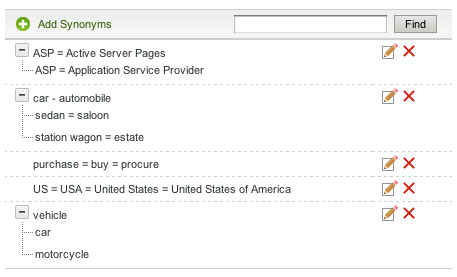

# Info Woordenboeken{#about-dictionaries}

U kunt woordenboeken gebruiken om een verzameling woordenboeken en de bijbehorende synoniemen en woordafbrekingen te beheren.

## Woordenboeken {#concept_B8028B71EC8144669614C64578EDB034} gebruiken

Synoniemen zijn woorden met dezelfde of vergelijkbare betekenis, zoals broek, spijkerbroeken, broeken en punaises, of die woorden kopen, kopen, verwerven en bestellen.

Hyponiemen zijn synoniemen in één richting en bieden een oplossing wanneer synoniemen niet geschikt zijn. Een zoekterm voor een apparel Retail-site is bijvoorbeeld &#39;broek&#39;. Echter, jeans worden niet weergegeven in de zoekresultaten. In dat geval kunt u een hyponiem gebruiken om jeans aan een broek te koppelen, maar om een zoekopdracht naar jeans toe te staan om alleen jeans te retourneren. Gebruik woordafbrekingen om ook een overeenkomst te bieden voor producten die worden gestopt of voor concurrentievoorwaarden. Deze strategie zorgt voor minimale gevolgen voor andere zoekresultaten. Als het product &quot;S2000&quot; bijvoorbeeld wordt stopgezet en de &quot;S3000&quot; de opvolger is, gebruikt u een hyponiem in plaats van een synoniem om ervoor te zorgen dat de zoekresultaten voor &quot;S3000&quot; geen overbodige &quot;S2000&quot;-resultaten bevatten.

Met synoniemen en woordafbrekingen kunnen klanten relevante zoekresultaten vinden wanneer ze niet-exacte overeenkomende termen invoeren die niet op de webpagina&#39;s voorkomen. Als bijvoorbeeld het woord &quot;broek&quot; op de hele website wordt gebruikt, kunt u een synoniem maken dat &quot;broek&quot; en &quot;broek&quot; aan elkaar bindt. Wanneer klanten op hun beurt zoeken naar &#39;broek&#39;, worden de zoekresultaten geretourneerd die verwant zijn aan een broek.

Synoniemen en woordafbrekingen worden gegroepeerd als domeinwoordenboeken. Dit zijn speciale woordenboeken die u maakt voor een bepaald thema of een bepaald doel.

Op de pagina Menu Woordenboek staan alle domeinwoordenboeken die door uw account zijn gedefinieerd. Vanuit deze hoofdpagina kunt u domeinwoordenboeken een andere naam geven, bewerken, verwijderen of in- en uitschakelen.

## Synoniemen en hyponiem {#section_B459CCB850974F4FB16A14E489BBBEC0}

De volgende afbeelding is een voorbeeld van een groep termen met zowel synoniem- als hyponiem-relaties.

Zes belangrijke synoniem verhoudingen worden uitdrukkelijk bepaald. Elke termijn wordt gescheiden door gelijke tekens (=).

* &quot;Auto&quot; is een synoniem van auto.
* &quot;Sedan&quot; is een synoniem van saloon.
* &quot;Station wagon&quot; is een synoniem van boedel.
* &quot;ASP&quot;is een synoniem van de Actieve Pagina&#39;s van de Server en Leverancier van de Dienst van de Toepassing.
* &quot;Aankoop&quot;, &quot;Aankoop&quot; en &quot;Aankoop&quot; zijn synoniemen van elkaar.
* &quot;US&quot;, &quot;USA&quot; en &quot;United States of America&quot; zijn synoniemen van elkaar.

Rijen die één woord bevatten, zijn normale synoniemen. Rijen met uitbreidbare bomen vormen hyponiem-relaties. In het voorbeeld definieert de tweede boom sedan, saloon, stationwagon en landgoed als hyponiem van auto en auto. Auto&#39;s en auto&#39;s daarentegen zijn hypernymmen van de rest van de termen in de boom.

De derde boom definieert auto en motorfiets als hyponymen van het voertuig.

U kunt meer dan één acroniem en/of uitbreiding van meerdere woorden in elk synoniem, zoals die in het &quot;Amerikaanse&quot;synoniem hierboven wordt gezien omvatten. Wanneer een woord of acroniem verschillende betekenissen heeft, creeer een synoniem voor elke betekenis, zoals in het &quot;ASP&quot;voorbeeld hierboven. Door veelvoudige synoniemen toe te voegen zorgt u ervoor dat een onderzoek naar &quot;Dienstverlener van de Toepassing&quot;, bijvoorbeeld, onderzoeksresultaten voor &quot;Actieve Pagina&#39;s van de Server&quot;niet terugkeert.

Hyponiem wordt niet vergroot met andere afbreekstreepjes. Hyponiemen breiden hoogstens één niveau uit met hun synoniemen. Een zoekopdracht naar &quot;voertuig&quot; geeft bijvoorbeeld resultaten voor &quot;auto&quot; en &quot;auto&quot;, maar geeft geen resultaten voor &quot;sedan&quot; en &quot;stationwagen&quot;.

## Informatie over het zoeken naar termen in woordenboeken {#section_28E7F80CE68D4481BBF4F51EED237C67}

U kunt zoeken naar woordafbrekingen en synoniemen in alle woordenboeken die u toevoegt. Deze functie is handig als u een specifieke term wilt bewerken of verwijderen die in meerdere woordenboeken kan voorkomen. Elk woordenboek met overeenkomende resultaten wordt weergegeven met de bijbehorende woordensets. Als de vraag meer dan 1000 reeksen, of bomen terugkeert, slechts worden eerste 1000 voorgesteld.

Zie [Zoeken in woordenboeken](../c-about-linguistics-menu/c-about-dictionaries.md#task_8D2BACC6F9B4487FA82367CBEDEE306F).

Zie [Een woordenboek bewerken](../c-about-linguistics-menu/c-about-dictionaries.md#task_7B349B2D385048D7A06E754FAB75316A).

## Informatie over het configureren van een woordenboek als een stamboek {#section_B859E2E957674F558AC6F8D05A0ED190}

Stemming, die de capaciteit is om op de wortel van een woord te zoeken dat veelvoudige eindings kan hebben, kan op één van drie wijzen werken: Domeinwoordenboeken, Standaard alternatief Word Forms en Geen.

Zie [Woorden en taal](../c-about-linguistics-menu/c-about-words-and-language.md#concept_CEB4B9576F3C4E2EB87B352EEC738D79).

In de volgende informatie wordt ervan uitgegaan dat voor uw account **[!UICONTROL Alternative Word Forms]** is ingesteld op **[!UICONTROL Domain Dictionaries]**, zodat u specifieke domeinwoordenboeken kunt configureren als bron van stammen.

U kunt elk domeinwoordenboek veranderen in een &#39;stamwoordenboek&#39;. De synoniemen en afbreekstreepjes blijven toenemen, zoals verwacht, maar met bijkomende bijwerkingen. Met alle termen die in een ander woordenboek voorkomen, of zelfs zelf, voegt het de groep woorden met die synoniemen of hyponiemen samen. Je kan dit zien als een ander niveau van woorduitbreiding.

Zonder stammen moeten synoniemen en woordafbrekingen uitgebreid en compleet zijn en moeten alle relevante woorden als lid worden vermeld.

Hieronder ziet u een voorbeeld van synoniemen en geen stammen:

* Synoniemen: jog = actief
* Bij een query voor &quot;jog&quot; worden documenten met de woorden &quot;running&quot; en &quot;jog&quot; opgehaald.
* Een query voor &#39;running&#39; geeft dezelfde documenten als &#39;jog&#39;.
* Webpagina&#39;s zonder &quot;jog&quot; en &quot;running&quot;, maar met andere tekstformulieren zoals &quot;run&quot; en &quot;run&quot; ontbreken in het queryresultaat.

In dit voorbeeld wordt een querywoord alleen uitgevouwen als het lid is van een specifiek synoniem of woordafbreking.

Hieronder ziet u een voorbeeld van synoniemen en stammen:

* Synoniemen: jog = actief
* Synoniem item uit een stamwoordenboek: running = looppas = looppas
* Een query voor &quot;jog&quot; of &quot;running&quot; retourneert alle webpagina&#39;s met de woorden &quot;run&quot;, &quot;running&quot;, &quot;run&quot; en &quot;jog&quot;.
* Een vraag voor &quot;looppas&quot;en &quot;looppas&quot;keert het zelfde, of gelijkaardige, resultaten terug.

In dit voorbeeld kan een synoniem uit een stamwoordenboek zijn groep equivalente woorden samenvoegen met een ander synoniem of woordenboek in een ander woordenboek dat minstens één term gemeenschappelijk heeft.

Het aanwijzen van te veel woordenboeken met te veel woorden kan prestatievertakkingen hebben. U moet domeinwoordenboeken met mate toewijzen als stamwoordenboeken. Het stoppen kan tot onverwachte woorduitbreidingen tijdens onderzoekstijd ook leiden en het proces van het zuiveren en het vinden van woorduitbreidingen compliceren.

Zie [Een woordenboek configureren als een stamwoordenboek](../c-about-linguistics-menu/c-about-dictionaries.md#task_541E8453A12F4A8E89CF6F595469F074).

## Een nieuw woordenboek {#task_F31AC6723E894C4F91D12AB2A4CEE9FB} toevoegen

U kunt een nieuw woordenboek met synoniemen en woordafbreking toevoegen om uw klanten te helpen relevante onderzoeksresultaten vinden. Deze functie is vooral handig wanneer klanten niet-exacte overeenkomende termen invoeren die mogelijk niet op uw webpagina&#39;s voorkomen.

Zie ook [Een nieuwe bedrijfsregel toevoegen](../c-about-rules-menu/c-about-business-rules.md#task_BD3B31ED48BB4B1B8F1DCD3BFA2528E7).

**Een nieuw woordenboek toevoegen**

1. Klik in het productmenu op **[!UICONTROL Linguistics]** > **[!UICONTROL Dictionaries]**.
1. Klik op **[!UICONTROL Dictionary Menu]** op de pagina.**[!UICONTROL Add New Dictionary]**
1. Voer op de pagina **[!UICONTROL Dictionary]** in het veld **[!UICONTROL Name]** de naam van het nieuwe woordenboek in.
1. Klik op **[!UICONTROL Add Synonyms]**.
1. Voer in het dialoogvenster **[!UICONTROL Add Terms]** een van de volgende handelingen uit:

   * Als u synoniemen wilt toevoegen, voert u twee of meer termen in het hoofdtekstveld in, waarbij elk woord of elke woordgroep wordt gescheiden met een gelijkteken (=). Bijvoorbeeld: broek = broek = stapels.
   * Als u woordafbrekingen wilt toevoegen, voert u een hyperterm in het hoofdtekstveld in. Klik **[!UICONTROL Add Hyponym]**, en ga dan een hyponiem in dat op de hyperlink betrekking heeft die u inging. Zo kunnen &quot;sedan&quot;, &quot;saloon&quot;, &quot;stationwagen&quot; en &quot;nalatenschap&quot; lettertypen zijn van &quot;auto&quot; en &quot;auto&quot; (beide hypernymen), zoals hieronder wordt weergegeven.

      

      Hyponiem-items kunnen ook synoniemen zijn, zoals &quot;sedan&quot; en &quot;saloon&quot;.

1. Klik op **[!UICONTROL Save]**.
1. Voer een van de volgende handelingen uit:

   * Herhaal stap 4-6 om meer synoniemen en woordafbrekingen toe te voegen.
   * Ga door met de volgende stap.

1. Als u de resultaten van uw wijzigingen wilt bekijken, klikt u op **[!UICONTROL regenerate your staged site index]** om de gefaseerde website-index opnieuw samen te stellen.

   Zie [Een volledige index van een actieve of gefaseerde website uitvoeren...](../c-about-index-menu/c-about-full-index.md#task_F7FE04D8A1654A7787FCCA31B45EB42D).

   Zie [Een incrementele index van een actieve of gefaseerde website uitvoeren...](../c-about-index-menu/c-about-incremental-index.md#task_9BFB6157F3884B2FAECB7E0E9CA318CB).
1. (Optioneel) Klik in het productmenu op **[!UICONTROL Linguistics]** > **[!UICONTROL Dictionaries]** en voer een van de volgende handelingen uit:

   * Klik **[!UICONTROL History]** om het even welke veranderingen terug te keren die u hebt aangebracht.

      Zie [De optie Historie gebruiken](../t-using-the-history-option.md#task_70DD3F87A67242BBBD2CB27156F43002).

   * Klik op **[!UICONTROL Live]**.

      Zie [Live-instellingen weergeven](../c-about-staging.md#task_401A0EBDB5DB4D4CA933CBA7BECDC10F).

   * Klik op **[!UICONTROL Push Live]**.

      Zie [Werkgebiedinstellingen leegmaken live](../c-about-staging.md#task_44306783B4C0408AAA58B471DAF2D9A4).

## Een woordenboek {#task_EC282EA0846942F6913918EA8218220B} in- of uitschakelen

De relaties van elk woord worden gegenereerd op het moment dat u uw website indexeert. Voordat u de volgende indexeringsbewerking uitvoert, kunt u elk woordenboek dat u hebt toegevoegd, in- of uitschakelen.

**Een woordenboek in- of uitschakelen**

1. Klik in het productmenu op **[!UICONTROL Linguistics]** > **[!UICONTROL Dictionaries]**.
1. Voer op de pagina **[!UICONTROL Dictionary Menu]** onder de kolom **[!UICONTROL Enabled]** van de tabel een van de volgende handelingen uit:

   * Schakel het selectievakje in van een woordenboek dat u wilt inschakelen en dat u wilt indexeren.
   * Schakel het selectievakje uit van een woordenboek dat u wilt uitschakelen en dat u niet wilt indexeren.

1. Klik op **[!UICONTROL Save Changes]**.
1. Als u de resultaten van uw wijzigingen wilt bekijken, klikt u op **[!UICONTROL regenerate your staged site index]** om de gefaseerde website-index opnieuw samen te stellen.

   Zie [Een volledige index van een actieve of gefaseerde website uitvoeren...](../c-about-index-menu/c-about-full-index.md#task_F7FE04D8A1654A7787FCCA31B45EB42D).

   Zie [Een incrementele index van een actieve of gefaseerde website uitvoeren...](../c-about-index-menu/c-about-incremental-index.md#task_9BFB6157F3884B2FAECB7E0E9CA318CB).
1. (Optioneel) Klik in het productmenu op **[!UICONTROL Linguistics]** > **[!UICONTROL Dictionaries]** en voer een van de volgende handelingen uit:

   * Klik **[!UICONTROL History]** om het even welke veranderingen terug te keren die u hebt aangebracht.

      Zie [De optie Historie gebruiken](../t-using-the-history-option.md#task_70DD3F87A67242BBBD2CB27156F43002).

   * Klik op **[!UICONTROL Live]**.

      Zie [Live-instellingen weergeven](../c-about-staging.md#task_401A0EBDB5DB4D4CA933CBA7BECDC10F).

   * Klik op **[!UICONTROL Push Live]**.

      Zie [Werkgebiedinstellingen leegmaken live](../c-about-staging.md#task_44306783B4C0408AAA58B471DAF2D9A4).

## Een woordenboek {#task_7B349B2D385048D7A06E754FAB75316A} bewerken

U kunt synoniem- en woordgroepen die een specifiek woordenboek vormen, bewerken of verwijderen.

<!-- 

t_editing_a_dictionary.xml

 -->

U kunt **[!UICONTROL Find]** ook gebruiken om van specifieke synoniemen en woordafbrekingen de plaats te bepalen die u over al uw woordenboeken wilt uitgeven of schrappen.

**Een woordenboek bewerken**

1. Klik in het productmenu op **[!UICONTROL Linguistics]** > **[!UICONTROL Dictionaries]**.
1. Voer een van de volgende handelingen uit:

   * Klik op de pagina [!DNL Dictionary Menu] in de tabel op de naam van één woordenboek met hyperlinks waarvan u de termen wilt bewerken of verwijderen.
   * Typ op de pagina [!DNL Dictionary Menu] in het tekstveld **[!UICONTROL Find]** een term die u wilt opzoeken in alle woordenboeken en klik vervolgens op **[!UICONTROL Find]**.

      Gebruik op de pagina [!DNL Find in Dictionaries] de bijbehorende vervolgkeuzelijsten om de gewenste verfijningsopties in te stellen.

      <table> 
      <thead> 
        <tr> 
        <th colname="col1" class="entry"> 
Option 
 </th> 
        <th colname="col2" class="entry"> 
Beschrijving 
 </th> 
        </tr> 
      </thead>
      <tbody> 
        <tr> 
        <td colname="col1"> 
Zoeken 
 </td> 
        <td colname="col2"> 
Hiermee kunt u de term invoeren die u voor alle woordenboeken wilt zoeken. 
 </td> 
        </tr> 
        <tr> 
        <td colname="col1"> 
Vervolgkeuzelijst afstemmen 
 </td> 
        <td colname="col2"> 
Hiermee kunt u de volgende vier typen overeenkomsten selecteren: 
        <ul id="ul_D656F159677946938050115F610EEF4B"> 
        <li id="li_2D6B302E021A4CE7A47F028812633EDC">  Exacte overeenkomst   
De vraag moet een nauwkeurige gelijke met een hyponiem of een synoniem hebben. 
 </li> 
        <li id="li_30AD5976E43041E98190F4757E821092">  Bevat tekst   
De query heeft alleen een overeenkomende subtekenreeks nodig. een overeenkomst binnen een hyponiem of synoniem. 
 </li> 
        <li id="li_9BF911EFB54345BB82679BDE51DDF8AF">  Begint met   
De vraag wordt slechts aangepast tegen het begin van elk hyponiem en synoniem. 
 </li> 
        <li id="li_CB791C7F5B5A4496B329ED505E7D97BC">  Woord afstemmen   
De query wordt vergeleken met elk woord van een synoniem of hyponiem, maar het woord moet exact overeenkomen. 
 </li> 
        </ul> 
 </td> 
        </tr> 
        <tr> 
        <td colname="col1"> 
Vervolgkeuzelijst Woordenboek inschakelen/Uitgeschakeld 
 </td> 
        <td colname="col2"> 
Hiermee kunt u een van de volgende opties selecteren: 
        <ul id="ul_EBBD3F3A2D854952A35CBDDBECB40958"> 
        <li id="li_7F5654C284BE485EAC9B000A663C6C60">  Ingeschakelde en Uitgeschakelde woordenboeken   
Zoek naar de gespecificeerde termijn in zowel toegelaten als gehandicapte woordenboeken. 
 </li> 
        <li id="li_4A83EECF38044287A923EC0AAF639079">  Alleen ingeschakelde woordenboeken   
Het doorzoeken van ingeschakelde woordenboeken is alleen nuttig voor foutopsporing in de huidige index. 
 </li> 
        </ul> 
 
Zie <a href="../c-about-linguistics-menu/c-about-dictionaries.md#task_EC282EA0846942F6913918EA8218220B" type="task" format="dita" scope="local"> Een woordenboek in- of uitschakelen </a>. 
 </td> 
        </tr> 
        <tr> 
        <td colname="col1"> 
Vervolgkeuzelijst met stadia/live 
 </td> 
        <td colname="col2"> 
Hiermee kunt u een van de volgende opties selecteren: 
        <ul id="ul_BD0733A30E6B470E942B21F499A4373B"> 
        <li id="li_F9A8C39C22EA4FBF86536F5924ED973C">  Werkgebiedwoordenboeken/Live-woordenboeken   
Hiermee zoekt u naar de opgegeven term in actieve en gefaseerde woordenboeken. Het zoekt echter alleen naar de gefaseerde versie van het woordenboek als dit bestaat. Als de gefaseerde versie niet bestaat, zoekt het de levende versie van het woordenboek. 
 </li> 
        <li id="li_DB0944DB18564269AA10676BDFDB0460">  Live woordenboeken   
Alleen in de live woordenboeken zoeken naar de opgegeven term. 
 </li> 
        </ul> 
 </td> 
        </tr> 
      </tbody> 
      </table>

1. Voer in de tabel een van de volgende handelingen uit:

   * Klik  die met de termijn wordt geassocieerd die u wilt bijwerken. Wijzig in het dialoogvenster **[!UICONTROL Edit Terms]** de gewenste termen. Wanneer u klaar bent, klikt u op **[!UICONTROL Save]**.

   * Klik  die met de termijn wordt geassocieerd die u wilt verwijderen. Klik in het dialoogvenster **[!UICONTROL Delete Terms]** op **[!UICONTROL Delete]**. Zorg ervoor dat u de juiste term verwijdert. er is geen dialoogvenster voor bevestiging van verwijderen.

1. Als u de resultaten van uw wijzigingen wilt bekijken, klikt u op **[!UICONTROL regenerate your staged site index]** om de gefaseerde website-index opnieuw samen te stellen.

   Zie [Een volledige index van een actieve of gefaseerde website uitvoeren...](../c-about-index-menu/c-about-full-index.md#task_F7FE04D8A1654A7787FCCA31B45EB42D).

   Zie [Een incrementele index van een actieve of gefaseerde website uitvoeren...](../c-about-index-menu/c-about-incremental-index.md#task_9BFB6157F3884B2FAECB7E0E9CA318CB).
1. (Optioneel) Klik in het productmenu op **[!UICONTROL Linguistics]** > **[!UICONTROL Dictionaries]** en voer een van de volgende handelingen uit:

   * Klik **[!UICONTROL History]** om het even welke veranderingen terug te keren die u hebt aangebracht.

      Zie [De optie Historie gebruiken](../t-using-the-history-option.md#task_70DD3F87A67242BBBD2CB27156F43002).

   * Klik op **[!UICONTROL Live]**.

      Zie [Live-instellingen weergeven](../c-about-staging.md#task_401A0EBDB5DB4D4CA933CBA7BECDC10F).

   * Klik op **[!UICONTROL Push Live]**.

      Zie [Werkgebiedinstellingen leegmaken live](../c-about-staging.md#task_44306783B4C0408AAA58B471DAF2D9A4).

## De naam van een woordenboek {#task_7F1F372B337B4853BFA2A60AD267B092} wijzigen

U kunt de naam wijzigen van een woordenboek dat u hebt toegevoegd.

<!-- 

t_renaming_a_dictionary.xml

 -->

Als u de optie **[!UICONTROL Alternate Word Forms]** instelt op **[!UICONTROL Domain Dictionaries]** in **[!UICONTROL Words & Language]**, wordt de optie **[!UICONTROL Configure]** gebruikt in plaats van **[!UICONTROL Rename]**.

Zie [Woorden en taal](../c-about-linguistics-menu/c-about-words-and-language.md#concept_CEB4B9576F3C4E2EB87B352EEC738D79).

**De naam van een woordenboek wijzigen**

1. Klik in het productmenu op **[!UICONTROL Linguistics]** > **[!UICONTROL Dictionaries]**.
1. Voer op de pagina **[!UICONTROL Dictionary Menu]** onder de kolom **[!UICONTROL Actions]** van de tabel een van de volgende handelingen uit:

   * Klik op **[!UICONTROL Rename]** voor het bijbehorende woordenboek waarvan u de naam wilt wijzigen.

      In het dialoogvenster **[!UICONTROL Rename Dictionary]**. Voer in het veld **[!UICONTROL Name]** de nieuwe naam van het woordenboek in.

      Klik op **[!UICONTROL Rename File]**.

   * Klik op **[!UICONTROL Configure]** voor het bijbehorende woordenboek waarvan u de naam wilt wijzigen.

      In het dialoogvenster **[!UICONTROL Configure Dictionary]**. Voer in het veld **[!UICONTROL Name]** de nieuwe naam van het woordenboek in.

      Klik op **[!UICONTROL Save Configuration]**.

1. (Optioneel) Voer een van de volgende handelingen uit:

   * Klik **[!UICONTROL History]** om het even welke veranderingen terug te keren die u hebt aangebracht.

      Zie [De optie Historie gebruiken](../t-using-the-history-option.md#task_70DD3F87A67242BBBD2CB27156F43002).

   * Klik op **[!UICONTROL Live]**.

      Zie [Live-instellingen weergeven](../c-about-staging.md#task_401A0EBDB5DB4D4CA933CBA7BECDC10F).

   * Klik op **[!UICONTROL Push Live]**.

      Zie [Werkgebiedinstellingen leegmaken live](../c-about-staging.md#task_44306783B4C0408AAA58B471DAF2D9A4).

## Een woordenboek configureren als een stamwoordenboek {#task_541E8453A12F4A8E89CF6F595469F074}

U kunt een woordenboek instellen op de geavanceerde stammodus om te profiteren van het stammen van woorden in zoekopdrachten.

<!-- 

t_configuring_a_dictionary_as_a_stemming_dictionary.xml

 -->

Een dergelijke modus retourneert webpagina&#39;s die overeenkomen met de varianten van wat uw klanten zoeken.

Zie [Informatie over woordenboeken](../c-about-linguistics-menu/c-about-dictionaries.md#concept_B8028B71EC8144669614C64578EDB034).

Zie [Woorden en taal](../c-about-linguistics-menu/c-about-words-and-language.md#concept_CEB4B9576F3C4E2EB87B352EEC738D79).

**Een woordenboek configureren als stamboek**

1. Klik in het productmenu op **[!UICONTROL Linguistics]** > **[!UICONTROL Words & Language]**.
1. Selecteer **[!UICONTROL Domain Dictionaries]** op de pagina [!DNL Words & Languages] in de vervolgkeuzelijst **[!UICONTROL Alternate Words Forms]**.

   Elk domeinwoordenboek dat is ingesteld als een stamwoordenboek (zie stap 7 hieronder) wordt gebruikt als bron van alternatieve woordformulieren.

1. Klik op **[!UICONTROL Save Changes]**.
1. Klik in het productmenu op **[!UICONTROL Linguistics]** > **[!UICONTROL Dictionaries]**.
1. Klik op de pagina [!DNL Dictionaries Menu] onder de kolom **[!UICONTROL Actions]** in de tabel op **[!UICONTROL Configure]** voor een bijbehorend woordenboek dat u wilt instellen als stamwoordenboek.
1. Selecteer **[!UICONTROL Yes]** in de vervolgkeuzelijst in het dialoogvenster **[!UICONTROL Configure Dictionary]**.**[!UICONTROL Advanced Stemming Mode]**
1. Klik op **[!UICONTROL Save Configuration]**.
1. Klik **[!UICONTROL regenerate your staged site index]** om uw gefaseerde website-index opnieuw op te bouwen.

   Zie [Een volledige index van een actieve of gefaseerde website uitvoeren...](../c-about-index-menu/c-about-full-index.md#task_F7FE04D8A1654A7787FCCA31B45EB42D).

   Zie [Een incrementele index van een actieve of gefaseerde website uitvoeren...](../c-about-index-menu/c-about-incremental-index.md#task_9BFB6157F3884B2FAECB7E0E9CA318CB).
1. (Optioneel) Klik in het productmenu op **[!UICONTROL Linguistics]** > **[!UICONTROL Dictionaries]** en voer een van de volgende handelingen uit:

   * Klik **[!UICONTROL History]** om het even welke veranderingen terug te keren die u hebt aangebracht.

      Zie [De optie Historie gebruiken](../t-using-the-history-option.md#task_70DD3F87A67242BBBD2CB27156F43002).

   * Klik op **[!UICONTROL Live]**.

      Zie [Live-instellingen weergeven](../c-about-staging.md#task_401A0EBDB5DB4D4CA933CBA7BECDC10F).

   * Klik op **[!UICONTROL Push Live]**.

      Zie [Werkgebiedinstellingen leegmaken live](../c-about-staging.md#task_44306783B4C0408AAA58B471DAF2D9A4).

## Zoeken in woordenboeken {#task_8D2BACC6F9B4487FA82367CBEDEE306F}

U kunt zoeken naar woordafbreekstreepjes en synoniemen in alle woordenboeken die aan de plaatsonderzoek/handel worden toegevoegd.

<!-- 

t_searching_across_dictionaries.xml

 -->

Deze functie is handig als u een specifieke term wilt bewerken of verwijderen die in meerdere woordenboeken kan voorkomen. Elk woordenboek met overeenkomende resultaten wordt weergegeven met de bijbehorende woordensets. Als de vraag meer dan 1000 reeksen, of bomen terugkeert, slechts worden eerste 1000 voorgesteld.

Zie [Een woordenboek bewerken](../c-about-linguistics-menu/c-about-dictionaries.md#task_7B349B2D385048D7A06E754FAB75316A).

**Zoeken in woordenboeken**

1. Klik in het productmenu op **[!UICONTROL Linguistics]** > **[!UICONTROL Dictionaries]**.
1. Typ op de pagina [!DNL Dictionary Menu] in het tekstveld **[!UICONTROL Find]** een term die u wilt opzoeken in alle woordenboeken en klik vervolgens op **[!UICONTROL Find]**.
1. Gebruik op de pagina [!DNL Find in Dictionaries] de bijbehorende vervolgkeuzelijsten om de gewenste verfijningsopties in te stellen.

   Zie [Een woordenboek bewerken](../c-about-linguistics-menu/c-about-dictionaries.md#task_7B349B2D385048D7A06E754FAB75316A).
1. (Optioneel) Gebruik de vervolgkeuzelijst **[!UICONTROL Show]** om het maximumaantal resultaten op te geven dat u per pagina wilt weergeven.

## Een woordenboek {#task_DBAAEE624BC14D2590444B0B7869ECCA} verwijderen

U kunt woordenboeken verwijderen die u niet meer nodig hebt of gebruikt.

<!-- 

t_deleting_a_dictionary.xml

 -->

Als u een woordenboek verwijdert dat live is, wordt het gefaseerd verwijderd. Als u een woordenboek verwijdert dat nog niet is bijgewerkt, wordt het onmiddellijk verwijderd.

Zorg ervoor dat u een woordenboek verwijdert waarvan u weet dat het langer nodig is. er is geen geschiedeniseigenschap beschikbaar om de schrapping terug te keren.

**Een woordenboek verwijderen**

1. Klik in het productmenu op **[!UICONTROL Linguistics]** > **[!UICONTROL Dictionaries]**.
1. Klik op de pagina [!DNL Dictionary Menu] onder de kolom **[!UICONTROL Actions]** van de tabel op **[!UICONTROL Delete]** voor het bijbehorende woordenboek dat u wilt verwijderen.
1. In het dialoogvenster **[!UICONTROL Delete Dictionary]**. Klik **[!UICONTROL Yes]** om de schrapping te bevestigen.
1. (Optioneel) Als u een live woordenboek hebt verwijderd, voert u een van de volgende handelingen uit:

   * Klik op **[!UICONTROL Live]**.

      Zie [Live-instellingen weergeven](../c-about-staging.md#task_401A0EBDB5DB4D4CA933CBA7BECDC10F).

   * Klik op **[!UICONTROL Push Live]**.

      Zie [Werkgebiedinstellingen leegmaken live](../c-about-staging.md#task_44306783B4C0408AAA58B471DAF2D9A4).

