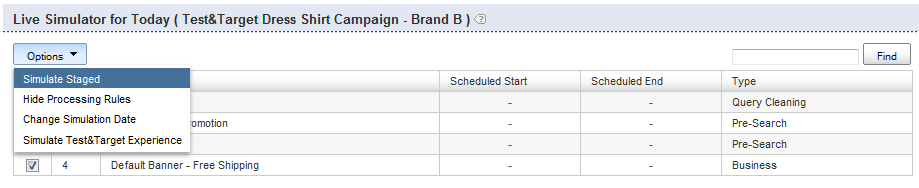

# Informatie over bedrijfsregels{#about-business-rules}

U kunt de BedrijfsRegels gebruiken om uw onderzoek te ruilen.

## Zakelijke regels gebruiken {#concept_2A93D76216754D3D8412CDEA00BD26BD}

U kunt bijvoorbeeld configureren wanneer banners worden weergegeven of welke resultaten worden weergegeven en in welke volgorde. U kunt de positie van een punt in uw facet ook vormen, en welke malplaatje voor een bepaalde onderzoek wordt gebruikt. de regels worden uitgevoerd in de volgorde waarin zij zijn vastgesteld; hoger het de ordeaantal van een regel, later het in het proces in werking stelt, die vroegere regels drijven. U kunt de regels slepen en neerzetten om de volgorde te wijzigen, of u kunt de regels opnieuw ordenen door een nieuw nummer in te voeren in het tekstvak voor de regelvolgorde.

Elke bedrijfsregel bestaat uit triggers en acties.

De trigger bepaalt wanneer de regel wordt uitgevoerd. Bijvoorbeeld, wanneer de vraagtermijn &quot;mens&quot;is of wanneer de resultaten meestal hiaten zijn. De trigger bestaat uit meerdere voorwaarden die allemaal moeten zijn, of een van beide moeten true zijn om de algemene trigger true te laten zijn. U kunt de prioriteit opgeven door de triggeroperator te wijzigen.

De actie bepaalt wat gebeurt wanneer aan de trekkervoorwaarde wordt voldaan. Stel bijvoorbeeld de banner in om een bepaald resultaat weer te geven of te verplaatsen naar positie 1. De lijst van regels toont summiere informatie over de regel. U kunt op een regelnaam klikken om deze te openen en aanvullende informatie weer te geven.

De lijst van regels toont een lijst van al uw bedrijfsregels. Standaard worden in de tabel de laatste tien regels weergegeven die zijn toegevoegd, in aflopende volgorde. U kunt op de kolomkoppen in de tabel klikken om de regels in oplopende of aflopende volgorde te sorteren.

De bedrijfsregels kunnen één van drie staten hebben: Goedgekeurd, opgeschort of WIP (Werk in uitvoering)

<table> 
 <thead> 
  <tr> 
   <th colname="col1" class="entry"> 
Staat van de bedrijfsregel 
 </th> 
   <th colname="col2" class="entry"> 
Beschrijving 
 </th> 
  </tr> 
 </thead>
 <tbody> 
  <tr> 
   <td colname="col1"> 
Goedgekeurd 
 </td> 
   <td colname="col2"> 
Goedgekeurde bedrijfsregels worden uitgevoerd in uw live omgeving en in uw gefaseerde omgeving. U keurt een bedrijfsregel in de Geavanceerde Bouwer van de Regel goed. 
 </td> 
  </tr> 
  <tr> 
   <td colname="col1"> 
Onderbroken 
 </td> 
   <td colname="col2"> 
Opgeschorte bedrijfsregels worden nooit uitgevoerd in uw gefaseerde omgeving of uw live omgeving. 
 </td> 
  </tr> 
  <tr> 
   <td colname="col1"> 
WIP 
 </td> 
   <td colname="col2"> 
WIP (Werk in uitvoering) zijn bedrijfsregels die niet zijn goedgekeurd of opgeschort. Dat wil zeggen dat u er misschien nog aan werkt of dat u ze eerst wilt testen voordat u ze goedkeurt. De bedrijfsregels in een staat van WIP lopen slechts in uw gefaseerde milieu. 
 </td> 
  </tr> 
 </tbody> 
</table>

U keurt bedrijfsregels goed en duwt hen levend zodat zij in uw levende milieu lopen. Op dit moment kunt u alleen *alle* regels live duwen. Nochtans, kunt u de status van een regel veranderen om controle te hebben over welke regels lopen en niet in uw levende milieu lopen.

Standaard worden regels uitgevoerd wanneer aan de bijbehorende triggers wordt voldaan. Nochtans, kunt u naar keuze een regel plannen om voor een specifieke datum en tijdwaaier te lopen.

Ook, door gebrek, lopen de regels wanneer hun vennoot trekkers voor alle opslag worden voldaan. Als u wilt dat de regel alleen van toepassing is op bepaalde winkels, kunt u het deelvenster Opslag gebruiken om een of meer winkels te selecteren waarop de regel wordt toegepast.

## Een nieuwe bedrijfsregel toevoegen {#task_BD3B31ED48BB4B1B8F1DCD3BFA2528E7}

U kunt bedrijfsregels gebruiken [!DNL Visual Rule Builder] of [!DNL Advanced Rule Builder] toevoegen die de het onderzoekservaring van uw klant aanpassen.

**Om een nieuwe bedrijfsregel toe te voegen**

De volgende stappen veronderstellen u de Visuele Bouwer van de Regel gebruikt.

1. Voer een van de volgende handelingen uit:

   * Klik in het menu Product op **[!UICONTROL Rules]** > **[!UICONTROL Business Rules]**. Klik op de [!DNL Business Rules] pagina **[!UICONTROL Add New Rule]**.

   * Klik in het menu Product op **[!UICONTROL Simulator]**. Klik op de **[!UICONTROL Simulator for Today]** pagina rechts van **[!UICONTROL Add New Rule]** het **[!UICONTROL Options]** vervolgkeuzemenu.

      Als de **[!UICONTROL Add New Rule]** optie niet zichtbaar is op de pagina, klikt u in de **[!UICONTROL Options]** vervolgkeuzelijst op **[!UICONTROL Simulate Staged]**.

      

1. Typ in het **[!UICONTROL Name]** tekstveld de nieuwe naam van de bedrijfsregel.

   Klik **[!UICONTROL Save Rule]** nog niet.
1. (Optioneel) Als u een groot aantal bedrijfsregels beheert, kunt u bedrijfsregels labelen met specifieke labels. Voer in het **[!UICONTROL Tags]** veld een of meer labellabels in, gebruik een komma, tab of Enter als scheidingsteken.

   Gebruik op de [!DNL Business Rules] pagina de **[!UICONTROL Filter by tag]** functie om te filteren op regels die overeenkomen met een bepaald label. 1. Stel op de [!DNL Business Rule Builder] pagina de triggers en handelingen in die u wilt gebruiken.

   **Triggeropties**

   Triggers zijn de voorwaarden waaraan een bedrijfsregel moet voldoen om te kunnen worden uitgevoerd. Wanneer een bedrijfsregel veelvoudige trekkers heeft, kunt u vormen hoe de trekkers antwoorden gebruikend één van de volgende drie methodes:

   * Een reactie waarbij alle triggers true moeten zijn (de standaardinstelling), zoals in het volgende voorbeeld:

      `if a AND b AND c then ...`

   * Een reactie waarbij een van de triggers true moet zijn, zoals in het volgende voorbeeld:

      `if a OR b OR c then ...`

   * Een reactie waarbij een aangepaste combinatie van triggers wordt opgegeven. Met andere woorden, u combineert afzonderlijke triggers of &quot;voorwaarden&quot; met `AND` operatoren en `OR` operatoren.

      U kunt de evaluatieprioriteit ook wijzigen door combinaties van haakjes links en rechts toe te voegen, zoals in het volgende voorbeeld:

      `if (a OR b) AND c then ...`

      >[!NOTE]
      >
      >Als u `AND` operatoren combineert met `OR` operatoren in een aangepaste set bedrijfsregels, moet u ervoor zorgen dat u ronde haakjes opgeeft om ervoor te zorgen dat de triggers in de juiste volgorde worden geëvalueerd.

      Deze specifieke functie om een combinatie triggers aan te passen, is niet standaard ingeschakeld. Neem contact op met Technische ondersteuning om deze functie te activeren voor gebruik.
   <table> 
      <thead> 
      <tr> 
      <th colname="col1" class="entry"> 
Triggers, optie 
 </th> 
      <th colname="col2" class="entry"> 
Beschrijving 
 </th> 
      </tr> 
    </thead>
    <tbody> 
      <tr> 
      <td colname="col1"> 
Trefwoordovereenkomsten 
 </td> 
      <td colname="col2"> 
De trekker is waar wanneer de onderzoekstermijn het bepaalde case-sensitive sleutelwoord aanpast. De trigger is true voor zowel het trefwoord als alle synoniemen ervan, zoals gedefinieerd in het Linguistics-woordenboek. 
 </td> 
      </tr> 
      <tr> 
      <td colname="col1"> 
 Zoekopdrachten komen overeen 
 </td> 
      <td colname="col2"> 
 De trigger is waar wanneer alle zoekparameters overeenkomen. 
 </td> 
      </tr> 
      <tr> 
      <td colname="col1"> 
 Resultaatgroep is dominant 
 </td> 
      <td colname="col2"> 
 De trigger is waar wanneer de groep resultaten die door de opgegeven zoekopdracht wordt gedefinieerd, de resultatenset domineert. 
 
Standaard wordt de dominantie ingesteld op 50%. Deze instelling is een handelsvoorkeur die u kunt instellen. 
 
 
        <!--See <xref href="t_Configuring_Merchandising_preferences.xml#task_7AC7B9F5D9F44E10AB5BC0B8CB31C37A" type="task" format="dita" scope="local">Configuring Merchandising preferences</xref>. --> 
 
Deze trigger kan alleen worden ingesteld op true als de hele groep aanwezig is binnen de resultaatset. De resultaatgroep is dynamisch. Ze kunnen na indexbewerkingen wijzigen, afhankelijk van de resultaten die overeenkomen met de oorspronkelijke zoekcriteria. 
 </td> 
      </tr> 
      <tr> 
      <td colname="col1"> 
Resultaatgroep is aanwezig 
 </td> 
      <td colname="col2"> 
 De trigger is waar wanneer de groep resultaten die door de opgegeven zoekopdracht wordt gedefinieerd, aanwezig is in de resultatenset. De gehele groep moet aanwezig zijn binnen de resultaatset om aan deze trigger te voldoen (de resultaten kunnen op elke pagina worden weergegeven). De groep resultaten is dynamisch en kan na indexbewerkingen veranderen, afhankelijk van de resultaten die overeenkomen met de oorspronkelijke zoekcriteria. 
 </td> 
      </tr> 
      <tr> 
      <td colname="col1"> 
 Resultaat aanwezig 
 </td> 
      <td colname="col2"> 
 De trigger is waar wanneer het individuele resultaat wordt gevonden binnen de resultaatset. Het resultaat kan overal in de resultaatreeks zijn, het moet niet op de pagina zijn de gebruiker momenteel bekijkt. 
 </td> 
      </tr> 
    </tbody> 
    </table>

   **Handelingsopties**

   Wanneer de trekkers van een bedrijfsregel worden voldaan aan, worden de acties die met de regel worden geassocieerd uitgevoerd. Terwijl de Visuele Bouwer van de Regel u de volgende acties laat tot stand brengen, kunt u Geavanceerde Bouwer van de Regel gebruiken om extra soorten acties tot stand te brengen.

   Voor de acties Facet-item verwijderen, Facet-item onthullen, Facet verwijderen, Facet verwijderen en Facet-item één facet in de volgende tabel is een facet vereist. De interface voor het kiezen van een facet is afhankelijk van de configuratie van uw account. Een normale account gebruikt bijvoorbeeld een vervolgkeuzelijst voor het kiezen van facetten. Als uw account echter bepaalde facetten heeft, wordt een automatisch aanvullen tekstvak weergegeven waarin u de naam van een facet kunt invoeren. De functie voor automatisch aanvullen stelt facetten in een vervolgkeuzelijst voor terwijl u de naam van het facet typt. De suggesties omvatten momenteel gedefinieerde facetten. Als uw account een sleufkaart heeft, worden ook bepaalde aspecten voorgesteld.

   <table> 
    <thead> 
      <tr> 
      <th colname="col1" class="entry"> 
Handelingen, optie 
 </th> 
      <th colname="col2" class="entry"> 
Beschrijving 
 </th> 
      </tr> 
    </thead>
    <tbody> 
      <tr> 
      <td colname="col1"> 
Push Group 
 </td> 
      <td colname="col2"> 
 Hiermee wordt de groep met zoekresultaten, zoals gedefinieerd door de opgegeven zoekcriteria, op een specifieke positie geplaatst. 
 
Als u een groep met zoekresultaten duwt, wordt de groep niet impliciet toegevoegd. 
 </td> 
      </tr> 
      <tr> 
      <td colname="col1"> 
Groep toevoegen 
 </td> 
      <td colname="col2"> 
 Voeg de groep zoekresultaten toe zoals gedefinieerd door de opgegeven zoekcriteria. 
 </td> 
      </tr> 
      <tr> 
      <td colname="col1"> 
Groep verwijderen 
 </td> 
      <td colname="col2"> 
 Verwijder de groep met zoekresultaten die is gedefinieerd door de opgegeven zoekcriteria. 
 </td> 
      </tr> 
      <tr> 
      <td colname="col1"> 
Enkel schuiven 
 </td> 
      <td colname="col2"> 
 Hiermee plaatst u het afzonderlijke zoekresultaat op de geselecteerde positie. 
 </td> 
      </tr> 
      <tr> 
      <td colname="col1"> 
Enkel toevoegen 
 </td> 
      <td colname="col2"> 
 Hiermee voegt u een afzonderlijk zoekresultaat toe aan de geselecteerde positie. 
 </td> 
      </tr> 
      <tr> 
      <td colname="col1"> 
Enkel verwijderen 
 </td> 
      <td colname="col2"> 
 Hiermee verwijdert u een afzonderlijk zoekresultaat uit de set met zoekresultaten. 
 </td> 
      </tr> 
      <tr> 
      <td colname="col1"> 
Alle resultaten verwijderen 
 </td> 
      <td colname="col2"> 
Hiermee verwijdert u alle resultaten uit de set met zoekresultaten. 
 
 
        <!-- Bug #3331637 The option is meant to be used in conjunction with other rule actions in order to create "canned landing pages" where we want to create a page's content solely by rule actions, and need to completely discard the "natural" results of the search. Given that the other options don't have any kind of "here's how/why you might use this", I don't see much point in breaking that precedent here.--> 
 </td> 
      </tr> 
      <tr> 
      <td colname="col1"> 
Andere banner selecteren 
 </td> 
      <td colname="col2"> 
 Wijzigt de banner in het geselecteerde bannergebied. 
 
Deze optie is beschikbaar wanneer u met de rechtermuisknop op een banner klikt in het weergavegebied van de webpagina. 
 </td> 
      </tr> 
      <tr> 
      <td colname="col1"> 
Banneropdrachten toevoegen 
 </td> 
      <td colname="col2"> 
Alleen van toepassing op dynamische media Classic-sjablonen van Adobe. 
 
Hiermee kunt u de standaardparameters wijzigen die in de bannersjabloon worden gebruikt. 
 
Zie de optietabel in <a scope="local" href="../c-about-design-menu/c-about-banners.md#task_AD1E0C00A9E04B1FA819EB93288786B3" type="reference" format="dita"> Een banner toevoegen met Adobe Dynamic Media Classic </a>. 
 
Zie Een banner ook <a href="../c-about-design-menu/c-about-banners.md#task_C3E782477FBF428ABEA220751781ACA9" type="task" format="dita" scope="local"> bewerken met Adobe Dynamic Media Classic </a>. 
 </td> 
      </tr> 
      <tr> 
      <td colname="col1"> 
banner verwijderen 
 </td> 
      <td colname="col2"> 
 Hiermee verwijdert u de banner uit het geselecteerde bannergebied. geen banner wordt getoond tenzij een andere regel die een banner plaatst, deze regel met voeten treedt. 
 
Deze optie is beschikbaar wanneer u met de rechtermuisknop op een banner klikt in het weergavegebied van de webpagina. 
 </td> 
      </tr> 
      <tr> 
      <td colname="col1"> 
Item met facet duwen 
 </td> 
      <td colname="col2"> 
 Hiermee wordt een item binnen een facet naar de geselecteerde positie gespoeld. 
 </td> 
      </tr> 
      <tr> 
      <td colname="col1"> 
Zone verwijderen 
 </td> 
      <td colname="col2"> 
 Hiermee verwijdert u een zone uit de pagina met zoekresultaten. 
 
Zie ook de actie Remove Facet hieronder. 
 </td> 
      </tr> 
      <tr> 
      <td colname="col1"> 
Zone onthullen 
 </td> 
      <td colname="col2"> 
 Geeft een zone op de pagina met zoekresultaten weer. 
 
Zie ook de actie onthullen van Facet hieronder. 
 </td> 
      </tr> 
      <tr> 
      <td colname="col1"> 
Facet-item verwijderen 
 </td> 
      <td colname="col2"> 
 Hiermee wordt een facetitem uit een facet verwijderd. 
 </td> 
      </tr> 
      <tr> 
      <td colname="col1"> 
Facet-item onthullen 
 </td> 
      <td colname="col2"> 
 Geeft een specifiek facetitem weer. 
 </td> 
      </tr> 
      <tr> 
      <td colname="col1"> 
Facet onthullen 
 </td> 
      <td colname="col2"> 
 Geeft een specifiek facet aan. Deze actie heeft de voorkeur boven de actie Zone onthullen. 
 </td> 
      </tr> 
      <tr> 
      <td colname="col1"> 
Facet verwijderen 
 </td> 
      <td colname="col2"> 
 Hiermee verwijdert u een specifiek facet. Deze actie heeft de voorkeur boven de actie Zone verwijderen. 
 </td> 
      </tr> 
    </tbody> 
    </table>

   Afhankelijk van het deelvenster van de regelbouwer dat actief (gevouwen) is, kunt u ook het volgende doen om triggers en handelingen in te stellen.

   * Wanneer het **[!UICONTROL Triggers]** paneel wordt uitgevouwen - in het gebied van het presentatiesjabloon van de pagina van de Bouwer van de BedrijfsRegel, klik op om het even welk onderzoeksresultaat of onderzoeksfacet met de rechtermuisknop aan, en klik dan **[!UICONTROL Add "result present" trigger]**.

      Klik in het deelvenster Triggers op de X links van een trigger om deze uit de lijst met triggers te verwijderen.

   * Wanneer het **[!UICONTROL Actions]** deelvenster wordt uitgevouwen - Klik in het gedeelte Presentatiesjabloon van de pagina Business Rule Builder met de rechtermuisknop op een zoekresultaat. Klik **[!UICONTROL Add Result]**, **[!UICONTROL Remove Result]**, **[!UICONTROL Push to bottom]** of **[!UICONTROL Push to #`<n>`]** (waar `<n>` een cijfer is).

1. (Optioneel) Voer een van de volgende handelingen uit in een deelvenster van Business Rule Builder ( [!DNL Triggers], [!DNL Actions]of [!DNL Schedule]):

   * Klik in het gedeelte Presentatiesjabloon van het paginagebied Business Rule Builder met de rechtermuisknop op een banner en klik vervolgens op **[!UICONTROL Select different banner]**. Klik op de **[!UICONTROL Pick Banner]** pagina **[!UICONTROL Pick this banner]** onder de bannerminiatuur om deze toe te voegen aan uw presentatiesjabloon. U kunt alleen banners selecteren die qua grootte en gebied overeenkomen met de originele banner in de presentatiesjabloon.

      De actie banner toevoegen wordt toegevoegd aan het [!DNL Actions] deelvenster.

   * Klik in het gedeelte van de presentatiesjabloon van de [!DNL Business Rule Builder] pagina met de rechtermuisknop op een Adobe Dynamic Media Classic-sjabloonbanner waarvan u de parameters wilt wijzigen en klik op **[!UICONTROL Add banner commands]**. Stel in het [!DNL Change Parameters] dialoogvenster de gewenste parameteropties in.

      Zie de optietabel in Een banner [toevoegen met Adobe Dynamic Media Classic](../c-about-design-menu/c-about-banners.md#task_AD1E0C00A9E04B1FA819EB93288786B3).

      Klik op **[!UICONTROL Save]**.

      De parameterwijzigingen worden toegevoegd aan het [!DNL Actions] deelvenster.

      Zie ook Een banner [bewerken met Adobe Dynamic Media Classic](../c-about-design-menu/c-about-banners.md#task_C3E782477FBF428ABEA220751781ACA9).

   * Klik in het gedeelte Presentatiesjabloon van de pagina Business Rule Builder met de rechtermuisknop op een banner die u van de pagina wilt verwijderen en klik vervolgens op **[!UICONTROL Remove banner]**. De actie banner verwijderen wordt toegevoegd aan het deelvenster Handelingen.

1. (Optioneel) Voer in het **[!UICONTROL Schedule]** deelvenster een van de volgende handelingen uit:

   * Klik **[!UICONTROL Run Indefinitely]** om de regel in werking te stellen wanneer zijn bijbehorende trekkers worden voldaan. Dit is de standaardinstelling.
   * Klik **[!UICONTROL Fixed Schedule]**, en specificeer dan de begindatum en de tijd, en de einddatum en tijd voor de regel om te lopen wanneer zijn bijbehorende trekker wordt voldaan.

1. Klik op **[!UICONTROL Save Rule]**.
1. (Optioneel) Voer op de [!DNL Business Rules] pagina een van de volgende handelingen uit:

   * Klik **[!UICONTROL History]** om de aangebrachte wijzigingen terug te draaien.

      Zie De optie [Historie](../t-using-the-history-option.md#task_70DD3F87A67242BBBD2CB27156F43002)gebruiken.

   * Klik op **[!UICONTROL Live]**.

      Zie Live-instellingen [weergeven](../c-about-staging.md#task_401A0EBDB5DB4D4CA933CBA7BECDC10F).

   * Klik op **[!UICONTROL Push Live]**.

      Zie [Werkgebiedinstellingen live](../c-about-staging.md#task_44306783B4C0408AAA58B471DAF2D9A4)spoelen.

## Een bedrijfsregel bewerken {#task_375CFA75D1D94D9E92A35DE1228E5087}

U kunt de Visuele Bouwer van de Regel of Geavanceerde Bouwer van de Regel gebruiken om bedrijfsregels uit te geven die u hebt toegevoegd.

**Een nieuwe bedrijfsregel bewerken**

1. Klik in het menu Product op **[!UICONTROL Rules]** > **[!UICONTROL Business Rules]**.
1. Voer op de [!DNL Business Rules] pagina een van de volgende handelingen uit:

   * Klik onder de [!DNL Name] kolom op de naam van een bedrijfsregel die u wilt wijzigen.

      De bedrijfsregel wordt geopend in de standaardinterface die in **[!UICONTROL Settings]** > **[!UICONTROL My Profile]** > **[!UICONTROL My Preferences]** wordt gespecificeerd.

   * Klik in de vervolgkeuzelijst naast de naam van een bedrijfsregel die u wilt bewerken op **[!UICONTROL Edit in advanced mode]** of **[!UICONTROL Edit in visual mode]**.

1. Typ in het [!DNL Name] tekstveld de nieuwe naam van de bedrijfsregel.

   Klik **[!UICONTROL Save Rule]** nog niet. 1. Stel op de [!DNL Business Rule Builder] pagina de triggers en handelingen in die u wilt gebruiken.

   Zie de lijst van opties onder het [Toevoegen van een nieuwe bedrijfsregel](../c-about-rules-menu/c-about-business-rules.md#task_BD3B31ED48BB4B1B8F1DCD3BFA2528E7).
1. (Optioneel) Voer in elk **[!UICONTROL Business Rule Builder]** deelvenster ( [!DNL Triggers], [!DNL Actions]of [!DNL Schedule], een van de volgende handelingen uit:

   * Klik in het gedeelte Presentatiesjabloon van de [!DNL Business Rule Builder] pagina met de rechtermuisknop op een banner en klik vervolgens op **[!UICONTROL Select different banner]**. Klik in het [!DNL Pick Banner page]venster op **[!UICONTROL Pick this banner]** onder de bannerminiatuur om deze toe te voegen aan uw presentatiesjabloon. U kunt alleen banners selecteren die qua grootte en gebied overeenkomen met de originele banner in de presentatiesjabloon.

      De actie banner toevoegen wordt toegevoegd aan het [!DNL Actions] deelvenster.

   * Klik in het gedeelte van de presentatiesjabloon van de [!DNL Business Rule Builder] pagina met de rechtermuisknop op een Adobe Dynamic Media Classic-sjabloonbanner waarvan u de parameters wilt wijzigen en klik op **[!UICONTROL Add banner commands]**. Stel in het [!DNL Change Parameters] dialoogvenster de gewenste parameteropties in.

      Zie de optietabel in Een banner [toevoegen met Adobe Dynamic Media Classic](../c-about-design-menu/c-about-banners.md#task_AD1E0C00A9E04B1FA819EB93288786B3).

      Klik op **[!UICONTROL Save]**.

      De parameterwijzigingen worden toegevoegd aan het [!DNL Actions] deelvenster.

      Zie ook Een banner [bewerken met Adobe Dynamic Media Classic](../c-about-design-menu/c-about-banners.md#task_C3E782477FBF428ABEA220751781ACA9).

   * Klik in het sjabloongebied van de presentatie van de [!DNL Business Rule Builder] pagina met de rechtermuisknop op een banner die u van de pagina wilt verwijderen en klik vervolgens op **[!UICONTROL Remove banner]**. De actie banner verwijderen wordt toegevoegd aan het [!DNL Actions] deelvenster.

1. (Optioneel) Voer in het [!DNL Schedule] deelvenster een van de volgende handelingen uit:

   * Klik **[!UICONTROL Run Indefinitely]** om de regel in werking te stellen wanneer zijn bijbehorende trekkers worden voldaan. Dit is de standaardinstelling.
   * Klik **[!UICONTROL Fixed Schedule]**, en specificeer dan de begindatum en de tijd, en de einddatum en tijd voor de regel om te lopen wanneer zijn bijbehorende trekker worden ontmoet.

1. Klik op **[!UICONTROL Save Rule]**.

   De [!DNL Business Rule Builder] pagina wordt gesloten en u keert terug naar de **[!UICONTROL Business Rule]** pagina. Uw regels worden weergegeven in de tabel. Klik op de **[!UICONTROL Modified]** kolomkop om de regels te sorteren op bewerkingsdatum. 1. (Optioneel) Voer een van de volgende handelingen uit:

   * Klik **[!UICONTROL History]** om de aangebrachte wijzigingen terug te draaien.

      Zie De optie [Historie](../t-using-the-history-option.md#task_70DD3F87A67242BBBD2CB27156F43002)gebruiken.

   * Klik op **[!UICONTROL Live]**.

      Zie Live-instellingen [weergeven](../c-about-staging.md#task_401A0EBDB5DB4D4CA933CBA7BECDC10F).

   * Klik op **[!UICONTROL Push Live]**.

      Zie [Werkgebiedinstellingen live](../c-about-staging.md#task_44306783B4C0408AAA58B471DAF2D9A4)spoelen.

## Een bedrijfsregel kopiëren {#task_89F1879C71A54EE9B7454439302C03EC}

U kunt een bestaande bedrijfsregel kopiëren als basis voor een nieuwe bedrijfsregel te gebruiken die u wilt creëren.

**Een bedrijfsregel kopiëren**

1. Klik in het menu Product op **[!UICONTROL Rules]** > **[!UICONTROL Business Rules]**.
1. Klik op de **[!UICONTROL Business Rules]** pagina in de vervolgkeuzelijst naast de naam van een bedrijfsregel die u wilt kopiëren **[!UICONTROL Copy rule]**.
1. Bewerk de gekopieerde bedrijfsregel op de gebruikelijke manier.

   Zie Een [bedrijfsregel](../c-about-rules-menu/c-about-business-rules.md#task_375CFA75D1D94D9E92A35DE1228E5087)bewerken.

## Bedrijfsvoorschriften goedkeuren {#task_BD569D18BF664272B8692294C162E2C1}

U kunt bedrijfsregels activeren die een status van WIP (Werk in uitvoering) of geschorst hebben.

**Bedrijfsregels goedkeuren**

1. Klik in het menu Product op **[!UICONTROL Rule]** > **[!UICONTROL Business Rules]**.
1. Voor de [!DNL Business Rules] pagina, die de kopbal van de statuskolom in de [!DNL Status] kolom van de lijst van bedrijfsregels gebruikt, sorteer de regels die een status van **[!UICONTROL WIP]** of **[!UICONTROL suspended]**. hebben

   Gebruik de kolomkop van het selectievakje aan de linkerkant van de tabel om alle regels te controleren die momenteel op de pagina worden weergegeven of om alleen die regels te controleren die de status **[!UICONTROL WIP]** of **[!UICONTROL suspended]** hebben. 1. Klik op de menubalk boven aan de pagina **[!UICONTROL Approve]**.
1. Klik in het **[!UICONTROL Confirm Action]** dialoogvenster op **[!UICONTROL OK]**.
1. (Optioneel) Voer een van de volgende handelingen uit:

   * Klik **[!UICONTROL History]** om de aangebrachte wijzigingen terug te draaien.

      Zie De optie [Historie](../t-using-the-history-option.md#task_70DD3F87A67242BBBD2CB27156F43002)gebruiken.

   * Klik op **[!UICONTROL Live]**.

      Zie Live-instellingen [weergeven](../c-about-staging.md#task_401A0EBDB5DB4D4CA933CBA7BECDC10F).

   * Klik op **[!UICONTROL Push Live]**.

      Zie [Werkgebiedinstellingen live](../c-about-staging.md#task_44306783B4C0408AAA58B471DAF2D9A4)spoelen.

## Opschorting van bedrijfsregels {#task_364E1FFB905141C08E306C8F1794A20E}

U kunt bedrijfsregels opschorten die of een status van WIP (Werk in uitvoering) of goedgekeurd hebben.

Wanneer u een regel hebt opgeschort, geeft u in de gebruikersinterface aan dat u deze tijdelijk inactief hebt gemaakt en dat u alle werkzaamheden aan deze regel voor een andere tijd uitstelt. U kunt een onderbroken regel echter nog steeds bewerken.

**Bedrijfsvoorschriften opschorten**

1. Klik in het menu Product op **[!UICONTROL Rule]** > **[!UICONTROL Business Rules]**.
1. Voor de [!DNL Business Rules] pagina, die de status in de kolom van de Status van de lijst van bedrijfsregels, in de uiterst linkerkolom van de lijst gebruikt, controleer de regels die een status van **[!UICONTROL WIP]**, of **[!UICONTROL approved]** hebben.
1. Klik op de menubalk boven aan de pagina **[!UICONTROL Suspend]**.
1. Klik in het **[!UICONTROL Confirm Action]** dialoogvenster op **[!UICONTROL OK]**.
1. (Optioneel) Voer een van de volgende handelingen uit:

   * Klik **[!UICONTROL History]** om de aangebrachte wijzigingen terug te draaien.

      Zie De optie [Historie](../t-using-the-history-option.md#task_70DD3F87A67242BBBD2CB27156F43002)gebruiken.

   * Klik op **[!UICONTROL Live]**.

      Zie Live-instellingen [weergeven](../c-about-staging.md#task_401A0EBDB5DB4D4CA933CBA7BECDC10F).

   * Klik op **[!UICONTROL Push Live]**.

      Zie [Werkgebiedinstellingen live](../c-about-staging.md#task_44306783B4C0408AAA58B471DAF2D9A4)spoelen.

## Bedrijfsregels hervatten {#task_E67D678C765B436EA2A3D6ADD7A49ABA}

U kunt bedrijfsregels hervatten om een geschorste regel opnieuw te activeren. Nadat u de bedrijfsregel hervat, wordt zijn status geplaatst aan WIP (Werk lopend).

**Om bedrijfsregels te hervatten**

1. Klik in het menu Product op **[!UICONTROL Rule]** > **[!UICONTROL Business Rules]**.
1. Op de [!DNL Business Rules] pagina, gebruikend de status in de kolom van de Status van de lijst van bedrijfsregels, in de uiterst linkerkolom van de lijst, controleer de regels die een status van **[!UICONTROL suspended]** hebben.
1. Klik op de menubalk boven aan de pagina **[!UICONTROL Resume]**.
1. Klik in het [!DNL Confirm Action] dialoogvenster op **[!UICONTROL OK]**.
1. (Optioneel) Voer een van de volgende handelingen uit:

   * Klik **[!UICONTROL History]** om de aangebrachte wijzigingen terug te draaien.

      Zie De optie [Historie](../t-using-the-history-option.md#task_70DD3F87A67242BBBD2CB27156F43002)gebruiken.

   * Klik op **[!UICONTROL Live]**.

      Zie Live-instellingen [weergeven](../c-about-staging.md#task_401A0EBDB5DB4D4CA933CBA7BECDC10F).

   * Klik op **[!UICONTROL Push Live]**.

      Zie [Werkgebiedinstellingen live](../c-about-staging.md#task_44306783B4C0408AAA58B471DAF2D9A4)spoelen.

## De volgorde wijzigen waarin bedrijfsregels worden uitgevoerd {#task_FE3B1C17307F49B49050C2EC5A063991}

U kunt bedrijfsregels opnieuw ordenen om de volgorde te wijzigen waarin ze worden uitgevoerd op presentatiesjablonen.

De bedrijfsregels worden uitgevoerd in de volgorde waarin ze zijn gedefinieerd; hoger het de ordeaantal van een regel, later het in het proces in werking stelt, die vroegere regels drijven. U wijzigt de volgorde van de regels door een nieuw nummer in te voeren in de kolom Volgorde van de tabel op de [!DNL Business Rules] pagina. U kunt slepen-en-neerzetten op regels ook gebruiken om hun runtime orde te veranderen.

**Om de orde te veranderen die de bedrijfsregels lopen**

1. Klik in het menu Product op **[!UICONTROL Rule]** > **[!UICONTROL Business Rules]**.
1. Voer op de [!DNL Business Rules] pagina in de tabel een van de volgende handelingen uit:

   * Klik op de **[!UICONTROL Order]** kolomkop om de regels in oplopende of aflopende volgorde te sorteren.
   * In de **[!UICONTROL Order]** kolom, op het tekstgebied links van een naam van de bedrijfsregel, typ het ordeaantal dat u de regel wilt in werking stellen.
   * Sleep een tabelrij naar de positie waar u de lijn wilt uitvoeren. Alle volgordenummers worden bijgewerkt om de nieuwe volgorde weer te geven waarin de regels worden uitgevoerd.

1. Klik op **[!UICONTROL Save Changes]**.

   Uw bedrijfsregels worden nu uitgevoerd in de volgorde die u hebt opgegeven. De uitzondering is als er een redirect bedrijfsregel wordt gespecificeerd. Als en wanneer de het omleiden bedrijfsregel wordt teweeggebracht of geraakt, houdt de verwerking van de bedrijfsregel op om voor omleiding toe te staan.
1. (Optioneel) Voer een van de volgende handelingen uit:

   * Klik **[!UICONTROL History]** om de aangebrachte wijzigingen terug te draaien.

      Zie De optie [Historie](../t-using-the-history-option.md#task_70DD3F87A67242BBBD2CB27156F43002)gebruiken.

   * Klik op **[!UICONTROL Live]**.

      Zie Live-instellingen [weergeven](../c-about-staging.md#task_401A0EBDB5DB4D4CA933CBA7BECDC10F).

   * Klik op **[!UICONTROL Push Live]**.

      Zie [Werkgebiedinstellingen live](../c-about-staging.md#task_44306783B4C0408AAA58B471DAF2D9A4)spoelen.

## Verwijderen van bedrijfsregels {#task_AE37B42412044541BCC6D46CF8793DFF}

U kunt bedrijfsregels schrappen de waarvan status WIP, geschorst of goedgekeurd is, door het Bulk drop-down menu van Acties te gebruiken.

**Bedrijfsregels verwijderen**

1. Klik in het menu Product op **[!UICONTROL Rules]** > **[!UICONTROL Business Rules]**.
1. Voer op de [!DNL Business Rules] pagina een van de volgende handelingen uit:

   * Gebruik de kolomkop van het selectievakje om alle regels te controleren die momenteel op de pagina worden weergegeven.
   * Controle slechts die bedrijfsregels die u wilt schrappen, die op de status in de kolom van de Status van de lijst worden gebaseerd.

1. Klik in de [!DNL Bulk Actions] vervolgkeuzelijst op **[!UICONTROL Delete]**.
1. Klik in het [!DNL Confirm Action] dialoogvenster op **[!UICONTROL OK]**.
1. (Optioneel) Voer een van de volgende handelingen uit:

   * Klik **[!UICONTROL History]** om de aangebrachte wijzigingen terug te draaien.

      Zie De optie [Historie](../t-using-the-history-option.md#task_70DD3F87A67242BBBD2CB27156F43002)gebruiken.

   * Klik op **[!UICONTROL Live]**.

      Zie Live-instellingen [weergeven](../c-about-staging.md#task_401A0EBDB5DB4D4CA933CBA7BECDC10F).

   * Klik op **[!UICONTROL Push Live]**.

      Zie [Werkgebiedinstellingen live](../c-about-staging.md#task_44306783B4C0408AAA58B471DAF2D9A4)spoelen.
