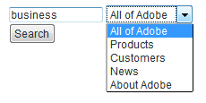
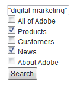
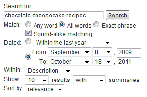

# Formulieren zoeken{#search-forms}

## Verzamelingen gebruiken in zoekformulieren {#reference_5A079AEEEFB84457892EF0870D0605C3}

Met verzamelingen kunnen uw klanten specifieke gebieden van uw website doorzoeken. Afhankelijk van of u een drop-down lijst of een lijst van controledozen uitvoert, kunt u uw klanten één enkele inzameling of veelvoudige inzamelingen laten zoeken.

Zie ook [Informatie over verzamelingen](../c-about-settings-menu/c-about-searching-menu.md#concept_62E42ACE53D54EEE9273433B86259127).

In het volgende voorbeeld worden vier verschillende verzamelingsnamen en de bijbehorende gebieden van de website weergegeven die in deze namen worden opgenomen:

<table> 
 <thead> 
  <tr> 
   <th colname="col1" class="entry"> <p>Naam van verzameling </p> </th> 
   <th colname="col2" class="entry"> <p> </p> </th> 
  </tr> 
 </thead>
 <tbody> 
  <tr> 
   <td colname="col1"> <p>Producten </p> </td> 
   <td colname="col2"> <p> 
     <ul id="ul_7AE70789C0914EBFBCCC7695C6F53B9E"> 
      <li id="li_72525BAA34E2442D86152F2FD8CA83D5"> https://www.mycompany.com/products.htm </li> 
      <li id="li_5CA4152239124BDBB251E6C94B15D45B"> https://www.mycompany.com/publish/ </li> 
      <li id="li_6E266736B3494696A3AFD841C4AFEC57"> https://www.mycompany.com/search/ </li> 
     </ul> </p> </td> 
  </tr> 
  <tr> 
   <td colname="col1"> <p>Klanten </p> </td> 
   <td colname="col2"> <p>https://www.mycompany.com/customers/ </p> </td> 
  </tr> 
  <tr> 
   <td colname="col1"> <p>Nieuws </p> </td> 
   <td colname="col2"> <p>https://www.mycompany.com/news/ </p> </td> 
  </tr> 
  <tr> 
   <td colname="col1"> <p>Info over Adobe </p> </td> 
   <td colname="col2"> <p>https://www.mycompany.com/company/ </p> </td> 
  </tr> 
 </tbody> 
</table>

Met de vervolgkeuzelijst interface van het zoekformulier kunnen gebruikers één verzameling selecteren en ziet er als volgt uit:



Het vervolgkeuzelijstzoekformulier wordt gegenereerd met de volgende HTML-code:

```
<select name="sp_k"> 
<option value="">All of Adobe</option> 
<option value="Products">Products</option> 
<option value="Customers">Customers</option> 
<option value="News">News</option> 
<option value="About Adobe">About Adobe</option> 
</select>
```

U kunt ook een groep selectievakjes gebruiken in het zoekformulier, zodat bezoekers meerdere verzamelingen kunnen selecteren:



Het zoekformulier voor het selectievakje wordt gegenereerd met de volgende HTML-code:

```
<input type="checkbox" name="sp_k" value="">All of Adobe<br> 
<input type="checkbox" name="sp_k" value="Products">Products<br> 
<input type="checkbox" name="sp_k" value="Customers">Customers<br> 
<input type="checkbox" name="sp_k" value="News">News<br> 
<input type="checkbox" name="sp_k" value="About Adobe">About Adobe<br>
```

## Zoekresultaten {#section_BBDD5B44E2B349BC88D937F44583D350}

Met de tag `<search-input-collections>` van de zoeksjabloon wordt het vak met de verzamelingslijst in de zoekresultaten gegenereerd en wordt automatisch de verzameling geselecteerd die is opgegeven in de zoekopdracht. Als u in plaats daarvan selectievakjes wilt genereren, gebruikt u de tag `<search-input>` in plaats van de tag `<input>` als volgt:

```
<search-input type="checkbox" name="sp_k" value="">All of Adobe<br> 
<search-input type="checkbox" name="sp_k" value="Products">Products<br> 
<search-input type="checkbox" name="sp_k" value="Customers">Customers<br> 
<search-input type="checkbox" name="sp_k" value="News">News<br> 
<search-input type="checkbox" name="sp_k" value="About Adobe">About Adobe<br>
```

De tag `<search-input>` geeft een tag `<input>` en bevat het kenmerk `checked` als de verzameling is opgegeven in de zoekopdracht.

## Frames gebruiken met formulieren {#reference_82CDDDA1E37042E4849EBF7EA05407C5}

U kunt uw framesets configureren om te werken met zoeken/verkopen van sites.

Raadpleeg de volgende URL voor meer informatie over HTML-frames en het HTML-framesetelement:

[https://www.w3schools.com/html/html_frames.asp](https://www.w3schools.com/html/html_frames.asp)

Als uw site frames gebruikt, kunt u een doelframe opgeven voor koppelingen naar zoekresultaten. Het standaarddoel is _self, waarmee koppelingen in het huidige frame of browservenster worden geopend. In plaats daarvan kunt u specifieke doelen voor de site of de browser opgeven:

* Met _top (gereserveerd voor browser) worden de resultaten geopend in het huidige browservenster en worden alle huidige frames vervangen.
* Resultaten _blank (gereserveerd voor browser) worden geopend in een nieuw browservenster.
* Resultaten _parent (gereserveerd voor browser) worden geopend in het bovenliggende frame van het huidige frame.
* frame2 (sitespecifieke) resultaten worden geopend in een frame met de naam &quot;frame2&quot;. U kunt de naam van elk frame opgeven als een waarde (bijvoorbeeld hoofd of inhoud).

Als uw site geen frames gebruikt, wilt u waarschijnlijk de standaarddoelnaam niet wijzigen.

Als u een sjabloon met aangepaste zoekresultaten voor uw website maakt, kunt u de opgegeven instelling overschrijven met het kenmerk `target` van de tag `<search-link>`.

Het configureren van framesets verloopt als volgt:

<table> 
 <thead> 
  <tr> 
   <th colname="col1" class="entry"> <p>Processtap </p> </th> 
   <th colname="col02" class="entry"> <p>Procesbeschrijving </p> </th> 
   <th colname="col2" class="entry"> <p>Koppeling </p> </th> 
  </tr> 
 </thead>
 <tbody> 
  <tr> 
   <td colname="col1"> <p>3 </p> </td> 
   <td colname="col02"> <p>Voeg het formulier toe aan het gewenste frame op uw webpagina. </p> </td> 
   <td colname="col2"> <p> <a href="#section_BAA8A502BB2243F8B5FF9783CDF2BFFD" type="section" format="dita" scope="local"> De code van het zoekformulier toevoegen aan een frame in uw...  </a> </p> </td> 
  </tr> 
  <tr> 
   <td colname="col1"> <p>2 </p> </td> 
   <td colname="col02"> <p>Stel het doelframe in voor de pagina met zoekresultaten. </p> </td> 
   <td colname="col2"> <p> <a scope="local" href="#section_532CACB90888467093D95EACB64FDFA1" type="section" format="dita"> Het doelframe instellen voor de pagina met zoekresultaten  </a> </p> </td> 
  </tr> 
  <tr> 
   <td colname="col1"> <p>3 </p> </td> 
   <td colname="col02"> <p>Stel het doel in voor koppelingen die op de pagina met zoekresultaten worden gemaakt. </p> </td> 
   <td colname="col2"> <p> <a scope="local" href="#section_523248C5AC424D878321C21A23A5CD66" type="section" format="dita"> Het doel instellen voor koppelingen die zijn gemaakt op basis van de zoekresultaten...  </a> </p> </td> 
  </tr> 
  <tr> 
   <td colname="col1"> <p>4 </p> </td> 
   <td colname="col02"> <p>Bewerk de pagina's van het navigatieframe om te voorkomen dat deze worden geïndexeerd. </p> </td> 
   <td colname="col2"> <p> <a scope="local" href="#section_C62E5F0EE1294D5EBD97E123E54433FC" type="section" format="dita"> De pagina's van navigatieframes bewerken om te voorkomen dat deze worden bewerkt...  </a> </p> </td> 
  </tr> 
  <tr> 
   <td colname="col1"> <p>5 </p> </td> 
   <td colname="col02"> <p>Test het zoekformulier. </p> </td> 
   <td colname="col2"> <p> <a scope="local" href="#section_43D8D4A7BF524DC480DFE5442F6A2E3C" type="section" format="dita"> Het zoekformulier testen  </a> </p> </td> 
  </tr> 
 </tbody> 
</table>

## De code van het zoekformulier toevoegen aan een frame op uw webpagina {#section_BAA8A502BB2243F8B5FF9783CDF2BFFD}

1. Klik in het productmenu op **[!UICONTROL Design]** > **[!UICONTROL Auto-Complete]** > **[!UICONTROL Form Source]**.

   De HTML-zoekformuliercode ziet er ongeveer als volgt uit:

   ```
   <!-- Adobe Target HTML for [your customer name] --> 
   <form method="get" action="https://search.atomz.com/search/"> 
   <input size=15 name="sp_q"><br> 
   <input type=submit value="Search"> 
   <input type=hidden name="sp_a" value="[your account number]"> 
   </form>
   ```

1. Selecteer op de pagina [!DNL Standard Form Source] de HTML-code van het zoekformulier die in het tekstveld wordt weergegeven en kopieer deze.
1. Plak de code van het zoekformulier in het gewenste frame in de frameset.

   In het onderstaande voorbeeld wordt de code van het zoekformulier in het navigatieframe geplakt: het smalle verticale frame aan de linkerkant van het scherm.

   

## Doelframe instellen voor pagina {#section_532CACB90888467093D95EACB64FDFA1} met zoekresultaten

Als u de code van het zoekformulier net als hierboven in het verticale navigatieframe hebt geplaatst, kunt u de zoekresultaten in het grotere hoofdframe weergeven. In dit voorbeeld roept u het hoofdframe &#39;body&#39; op en stelt u dit in als het doelframe.


1. Als u het doelframe voor de resultatenpagina wilt opgeven, voegt u een doel en een waarde toe aan het formulier door de volgende regel in de code voor het zoekformulier te wijzigen:

   `<form method="get" action="https://search.atomz.com/search/">`

   aan het volgende:

   `<form target="body" method="get" action="https://search.atomz.com/search/">`

   Zorg ervoor dat u aanhalingstekens plaatst rond de doelwaarde van het formulier.

Wanneer een klant uw website zoekt, worden de zoekresultaten weergegeven in het hoofdframe van de webpagina.

## Doel instellen voor koppelingen die worden gemaakt op de pagina {#section_523248C5AC424D878321C21A23A5CD66} met zoekresultaten

U kunt het doelframe instellen door de sjabloon rechtstreeks te bewerken.

Als uw zoekresultaten in het &quot;body&quot;-kader worden weergegeven, wilt u waarschijnlijk ook de koppelingen openen in het &quot;body&quot;-kader. Omdat dit hetzelfde frame is, is de doelwaarde `"_self"` de standaardinstelling. U hoeft geen wijzigingen aan te brengen.

U kunt het doelframe ook instellen voor resultatenkoppelingen. Hieronder volgen enkele voorbeelden van wat u kunt doen:

* Geef verschillende frames op voor de zoekresultaten en de koppelingen naar deze resultaten, zodat de zoekresultaten in hun eigen frame actief blijven terwijl elk aangeklikt resultaat in een apart frame wordt geopend.
* Geef op dat de zoekresultaten worden geopend in een nieuw, leeg venster, zodat het oude venster actief blijft met de oorspronkelijke inhoud. Zo blijven de zoekresultaten behouden.

De doelnaam kan de naam zijn van een frame dat in de HTML is opgegeven of een van de volgende HTML-standaardwaarden:

* `target="_blank"` Open koppelingen in een nieuw, leeg, naamloos venster.

* `target="_self"` Standaard. Open koppelingen in hetzelfde venster als de zoekresultaten. In dit geval het oorspronkelijke venster met zoekresultaten. Gebruik deze optie om een globaal toegewezen basisdoel met voeten te treden.

* `target="_parent"` Open koppelingen in de bovenliggende frameset van de koppelingspagina. Als het document geen bovenliggend element heeft, werkt dit standaard als `"_self"`.

* `target="_top"` Open koppelingen in het volledige venster. Als het document al bovenaan staat, werkt dit standaard als `"_self"`. Gebruik deze optie om een willekeurig diep kader te nesten.

Als u bijvoorbeeld het doeldoelframe `_blank` wilt instellen, kunt u de sjabloon op de volgende manier bewerken:

1. Klik in het productmenu op **[!UICONTROL Design]** > **[!UICONTROL Templates]**.

1. Klik op de pagina [!DNL Staged Templates] in de tabel op de naam van de sjabloon met het doelframe.
1. Zoek de tag `<search-link>`. De standaardtag `<search-link>` moet er ongeveer als volgt uitzien:

   `<search-link><search-title length=100></search-link>`

1. Voeg het framedoel toe aan de tag `<search-link>`. In het bovenstaande voorbeeld voert u `target="_blank"` in. Zorg ervoor dat u het onderstrepingsteken en de aanhalingstekens rond de doelwaarde opneemt.

   De tag `<search-link>` ziet er nu als volgt uit:

   `<search-link target="_blank"><search-title length=100></search-link>`

Wanneer een bezoeker van de site een koppeling met zoekresultaten kiest, wordt de gekoppelde pagina nu in een nieuw, leeg venster geopend.

## De pagina&#39;s van navigatieframes bewerken om te voorkomen dat deze worden geïndexeerd {#section_C62E5F0EE1294D5EBD97E123E54433FC}

Meestal wilt u niet dat navigatieframes worden geïndexeerd met de zoekresultaten. Voor deze functionaliteit kunt u de metatag `noindex` aan deze pagina&#39;s toevoegen.

1. Open de HTML-paginabron voor uw navigatieframe.
1. Voeg de volgende metatag binnen de `<head>` sectie van uw HTML toe:

   `<meta name="robots" content="noindex">`

   Bijvoorbeeld:

   ```
   <html> 
   <head> 
   <title>This page is a frameset that I do not want indexed</title> 
   <meta http-equiv="Content-Type" content="text/html; charset=iso-8859-1"> 
   <meta name="robots" content="noindex"> 
   </head>
   ```

## Het zoekformulier testen {#section_43D8D4A7BF524DC480DFE5442F6A2E3C}

1. Ga naar uw website en navigeer naar een formulier.
1. Voer in het zoekveld een aantal zoektermen in en klik op **[!UICONTROL Search]**.

   Het volgende is waar:

   * De pagina met zoekresultaten wordt weergegeven in het opgegeven doelframe.
   * De verbindingen van uw onderzoeksresultaten zijn in het gespecificeerde doelkader.
   * De resultaten van het navigatieframe worden niet weergegeven.

   Neem contact op met de Klantenondersteuning als u problemen ondervindt met frames nadat u het zoekformulier hebt getest.

## Voorbeeld van geavanceerd zoekformulier {#reference_82E1051918744EBA88A01E9E6AE42C4A}

U kunt de geavanceerde formuliercode aan uw ontwerp- en inhoudsbehoeften aanpassen of extra zoekparameters toevoegen of verwijderen.

Uw homepage is een goede plaats om een geavanceerd onderzoeksformulier op te nemen omdat vele klanten van plan zijn om onderzoekscapaciteit daar te vinden. U kunt ook een HTML-pagina maken die het zoekformulier en andere nuttige informatie bevat en vervolgens via uw website een koppeling naar die pagina maken.

Als u veilige inhoud indexeert, kunt u de onderzoeksresultaten hebben die van de veilige servers van het Web van het Onderzoek worden gediend. Wijzig de URL in het actiekenmerk van het zoekformulier in: action=&quot;https://search.atomz.com/search/&quot; om dit te doen.

>[!NOTE]
>
>Sommige HTML-editors kunnen HTML-code niet plakken vanuit andere toepassingen. Als de HTML-code als tekst op uw webpagina wordt weergegeven, kopieert en plakt u de zoekcode in een eenvoudige teksteditor, zoals Kladblok in Windows of Eenvoudige tekst op de Mac, en kopieert en plakt u de code vervolgens opnieuw vanuit de eenvoudige teksteditor naar uw HTML-editor.

Zoekparameters worden gebruikt in code voor geavanceerde zoekformulieren om keuzerondjes, selectievakjes en keuzelijsten te maken waarmee klanten afzonderlijke zoekopdrachten kunnen aanpassen. Klanten kunnen bijvoorbeeld het aantal weergegeven zoekresultaten of een datumbereik opgeven, of overzichten met zoekresultaten worden weergegeven via opties die op de geavanceerde zoekformulieren worden weergegeven.

Met het volgende voorbeeld van het geavanceerde zoekformulier, ziet u in de rest van dit onderwerp hoe elke optie op het formulier wordt gemaakt met behulp van zoekparameters.



U kunt de volledige geavanceerde HTML-code van het bovenstaande voorbeeld bekijken.

Zie [Geavanceerde HTML-code voor zoekformulieren](#reference_9AAD4A46B68D4D48865508982CB86DB9).

Zie [Automatisch aanvullen van CSS](../c-about-auto-complete.md#task_EECE35DEB6C94F4A8A5B42B4DED76D96) configureren.

Zie [De HTML-code van het zoekformulier kopiëren naar..](../c-about-auto-complete.md#task_A3A01EA800F24C0AA33902387E0362C7).

<table> 
 <thead> 
  <tr> 
   <th colname="col2" class="entry"> <p>Locatie op formulier </p> </th> 
   <th colname="col1" class="entry"> <p>Parameter </p> </th> 
   <th colname="col3" class="entry"> <p>HTML-code </p> </th> 
   <th colname="col4" class="entry"> <p>Beschrijving </p> </th> 
  </tr> 
 </thead>
 <tbody> 
  <tr> 
   <td colname="col2"> <p>Geavanceerde opties voor zoekformulieren inschakelen (verborgen veld) </p> </td> 
   <td colname="col1"> <p> <span class="codeph"> sp_advanced  </span> </p> </td> 
   <td colname="col3"> <p> <span class="syntax html codeph"> &lt;input type="hidden" name="sp_advanced" value="1"&gt; </span> </p> </td> 
   <td colname="col4"> <p>Geavanceerde zoekopties in- of uitschakelen. U kunt bijvoorbeeld een standaardzoekformulier op uw homepage plaatsen met een koppeling naar een tweede pagina die een geavanceerd formulier bevat. In dit geval plaatst u een kopie van het standaardformulier in <span class="codeph"> &lt;search-if-not-advanced&gt;...&lt;/search-if-not-advanced&gt; </span> sjabloontags. </p> <p>Een klant die een zoekopdracht uitvoert vanuit het standaardformulier, ziet een standaardzoekformulier wanneer de zoekresultaten worden weergegeven. Op het geavanceerde scherm van het onderzoeksvorm, omvat u <span class="codeph"> &lt;input type=hidden name="sp_advanced" value=1&gt; </span> markering met de andere geavanceerde vormopties. </p> <p>U voegt ook een kopie van het geavanceerde zoekformulier toe in het &lt;search-if-advanced&gt;... &lt;/search-if-advanced&gt; sjabloontags. Een klant die een zoekopdracht uitvoert vanuit uw geavanceerde zoekformulier, ziet een geavanceerd zoekformulier wanneer de zoekresultaten worden weergegeven. </p> </td> 
  </tr> 
  <tr> 
   <td colname="col2"> <p> Alle, alle of woordgroepen </p> </td> 
   <td colname="col1"> <p> <span class="codeph"> sp_p  </span> </p> <p> </p> </td> 
   <td colname="col3"> <p> <code class="syntax html"> &lt;!--&nbsp;Allow&nbsp;"any,"&nbsp;"all,"&nbsp;or&nbsp;"phrase"&nbsp;--&gt; 
      &lt;input&nbsp;type=radio&nbsp;name="sp_p"&nbsp;value="any"&gt;Any&nbsp;word 
      &lt;input&nbsp;type=radio&nbsp;name="sp_p"&nbsp;value="all"&nbsp;checked&gt;All&nbsp;words 
      &lt;input&nbsp;type=radio&nbsp;name="sp_p"&nbsp;value="phrase"&gt;Exact&nbsp;phrase </code> </p> </td> 
   <td colname="col4"> <p>Uw klant toestaan op te geven dat een document alleen met 'elk woord', 'alle woorden' of 'de exacte woordgroep' kan overeenkomen. Wanneer de <span class="codeph"> sp_p </span> parameter wordt gespecificeerd, te hoeven de klanten niet "+", of "-", of allebei in de onderzoeksvraag te gebruiken. </p> <p> Als de <span class="codeph"> sp_p </span> parameter wordt weggelaten, of als het aan "" of "om het even welk wordt geplaatst,"dan kunnen de klanten nog "+"en "-"specifiers gebruiken. Als de <span class="codeph"> sp_p </span> parameter aan "all"of "uitdrukking wordt geplaatst,"dan gespecificeerd "+" en "-" worden genegeerd. </p> <p>Meer informatie over het gebruik van "+" en "-" in een zoekopdracht. </p> <p>Zie <a href="../c-about-settings-menu/c-about-searching-menu.md#concept_207105CF26B1448F8A3D223787C56AB8" type="concept" format="dita" scope="local"> Informatie over zoekopdrachten </a>. </p> </td> 
  </tr> 
  <tr> 
   <td colname="col2"> <p> Overeenkomende geluiden </p> </td> 
   <td colname="col1"> <p> <span class="codeph"> sp_w  </span> </p> <p>en </p> <p> <span class="codeph"> sp_w_control  </span> </p> <p> </p> </td> 
   <td colname="col3"> <p> <code class="syntax html"> &lt;!--&nbsp;Checkbox&nbsp;enables&nbsp;sound-alike&nbsp;matching&nbsp;--&gt; 
      &lt;input&nbsp;type=hidden&nbsp;name="sp_w_control"&nbsp;value=1&gt; 
      &lt;input&nbsp;type=checkbox&nbsp;name="sp_w"&nbsp;value="alike"&gt;&nbsp;Sound-alike&nbsp;matching </code> </p> </td> 
   <td colname="col4"> <p>Klanten kunnen afstemming van geluid in- of uitschakelen. Bij overeenkomsten op dezelfde manier kunnen onjuist gespelde zoekopdrachten overeenkomen met woorden die in uw documenten "op dezelfde manier" klinken. </p> <p>Wanneer de <span class="codeph"> sp_w_control </span> parameter aan 1 wordt geplaatst en <span class="codeph"> sp_w </span> parameter aan "gelijk wordt geplaatst,"wordt de geproduceerde controledoos geselecteerd, toelatend geluid-gelijke aanpassing door gebrek. </p> <p>Als de <span class="codeph"> sp_w </span> parameter aan "" wordt geplaatst, wordt de controledoos niet geselecteerd. </p> <p>Als u geluid-gelijke aanpassing tijdens uw meest recente het indexeren verrichting niet toeliet, dan is geluid-gelijke aanpassing niet mogelijk en <span class="codeph"> sp_w </span> wordt parameter genegeerd. Als u overeenkomende geluiden wilt inschakelen, klikt u in het productmenu op <span class="uicontrol"> Taalkenmerken </span> &gt; <span class="uicontrol"> Woorden en taal </span> &gt; <span class="uicontrol"> Geluidsovereenkomsten </span>. </p> <p>U kunt de parameters <span class="codeph"> sp_w </span> en <span class="codeph"> sp_w_control </span> parameters op de volgende manier ook toewijzen: </p> <p> <code class="syntax html"> &lt;!--&nbsp;Checkbox&nbsp;disables&nbsp;sound-alike&nbsp;matching&nbsp;--&gt; 
      &lt;input&nbsp;type=hidden&nbsp;name="sp_w_control"&nbsp;value=0&gt; 
      &lt;input&nbsp;type=checkbox&nbsp;name="sp_w"&nbsp;value="exact"&gt; 
      No&nbsp;sound-alike&nbsp;matching </code> </p> <p>In dit geval, wanneer <span class="codeph"> sp_w_control </span> parameter aan 0 wordt geplaatst en <span class="codeph"> sp_w </span> parameter aan "nauwkeurig wordt geplaatst,"geluid-gelijke is gehandicapt door gebrek. Als de <span class="codeph"> sp_w </span> parameter aan ""wordt geplaatst dan wordt de geluid-gelijke aanpassing toegelaten. </p> </td> 
  </tr> 
  <tr> 
   <td colname="col2"> <p>Datumbereik afstemmen </p> </td> 
   <td colname="col1"> <p> <span class="codeph"> sp_d  </span> </p> <p> </p> </td> 
   <td colname="col3"> <p> <code class="syntax html"> &lt;!--Specifies&nbsp;type&nbsp;of&nbsp;date&nbsp;range&nbsp;searching&nbsp;to&nbsp;perform.--&gt; 
      &lt;input&nbsp;type=radio&nbsp;name="sp_d"&nbsp;value="custom"&nbsp;checked&gt; 
      &lt;input&nbsp;type=radio&nbsp;name="sp_d"&nbsp;value="specific"&gt; </code> </p> </td> 
   <td colname="col4"> <p>Met de parameter <span class="codeph"> sp_d </span> wordt een aangepast gegevensbereik opgegeven dat overeenkomt met de prestaties of een specifiek datumbereik dat overeenkomt met de prestaties. </p> <p>Voor het standaard geavanceerde onderzoeksformulier, wordt deze optie voorgesteld als een radioknoopgroep met een drop-down lijst van "douane"datumwaaiers zoals geproduceerd met een <span class="codeph"> sp_date_range </span> parameter. Het omvat ook en een groep "specifieke" begin- en einddatums die worden gegenereerd met <span class="codeph"> sp_start_day </span>, <span class="codeph"> sp_start_month </span>, <span class="codeph"> sp_start_year </span>, <span class="codeph"> sp_end_day </span>, <span class="codeph"> sp_end_month </span> en a10/&gt; sp_end_year </span> parameters.<span class="codeph"> </span></p> <p>Een "aangepast" datumbereik is een benoemde datumreeks die moet worden doorzocht. Bijvoorbeeld 'Anytime', 'Today', 'Within the last year', enzovoort. </p> <p>Een "specifiek" datumbereik bestaat uit een startdatum en een einddatum. Bijvoorbeeld van "8 september 2009 tot 18 oktober 2011". </p> </td> 
  </tr> 
  <tr> 
   <td colname="col2"> <p>Datumbereik dat overeenkomt: aangepast datumbereik </p> </td> 
   <td colname="col1"> <p> <span class="codeph"> sp_date_range  </span> </p> <p> </p> </td> 
   <td colname="col3"> <p> <code class="syntax html"> &lt;!--Selection&nbsp;list&nbsp;for&nbsp;custom&nbsp;date&nbsp;range.--&gt; 
      &lt;select&nbsp;name="sp_date_range"&nbsp;size=1&gt; 
      &lt;option&nbsp;value=-1&nbsp;selected&gt;Anytime&lt;/option&gt; 
      &lt;option&nbsp;value=7&gt;Within&nbsp;the&nbsp;last&nbsp;week&lt;/option&gt; 
      &lt;option&nbsp;value=14&gt;Within&nbsp;the&nbsp;last&nbsp;2&nbsp;weeks&lt;/option&gt; 
      &lt;option&nbsp;value=30&gt;Within&nbsp;the&nbsp;last&nbsp;30&nbsp;days&lt;/option&gt; 
      &lt;option&nbsp;value=60&gt;Within&nbsp;the&nbsp;last&nbsp;60&nbsp;days&lt;/option&gt; 
      &lt;option&nbsp;value=90&gt;Within&nbsp;the&nbsp;last&nbsp;90&nbsp;days&lt;/option&gt; 
      &lt;option&nbsp;value=180&gt;Within&nbsp;the&nbsp;last&nbsp;180&nbsp;days&lt;/option&gt; 
      &lt;option&nbsp;value=365&gt;Within&nbsp;the&nbsp;last&nbsp;year&lt;/option&gt; 
      &lt;option&nbsp;value=730&gt;Within&nbsp;the&nbsp;last&nbsp;two&nbsp;years&lt;/option&gt; 
      &lt;/select&gt; </code> </p> </td> 
   <td colname="col4"> <p>De <span class="codeph"> sp_date_range </span> parameter wordt gebruikt om een "douane"datumwaaier tot stand te brengen. Bijvoorbeeld 'Anytime', 'Today', 'Within the last year' enzovoort. </p> <p>Waarden groter dan of gelijk aan nul geven het aantal dagen aan dat moet worden doorzocht vóór vandaag. De waarde 0 geeft bijvoorbeeld "Vandaag" aan, de waarde "1" geeft "Vandaag en gisteren" aan, de waarde "30" geeft "Binnen de laatste 30 dagen" aan, enzovoort. Waarden kleiner dan nul geven als volgt een aangepast bereik op: </p> <p> 
     <ul id="ul_E65DDE33883F441F9730F315E485AD98"> 
      <li id="li_83E9466AB9D7438A8544001F6B007186"> <p>-1 = "Altijd,"het zelfde als het specificeren van geen datumwaaier. </p> </li> 
      <li id="li_38AB8D97179A47F9B860A96EA09119BB"> <p>-2 = "Deze week,"die van zondag tot Zaterdag van de huidige week zoekt. </p> </li> 
      <li id="li_F4C3A8658428418A8A06FBAAB4733C68"> <p>-3 = "Vorige week", waarmee wordt gezocht van zondag tot zaterdag van de week vóór de huidige week. </p> </li> 
      <li id="li_DF2D0B043A4E4DE9BE8D82E69A76E793"> <p>-4 = "Deze maand,"die data binnen de huidige maand zoekt. </p> </li> 
      <li id="li_76BC4C2CED574E2A81448158828BFF1B"> <p>-5 = "Vorige maand,"die data binnen de maand vóór de huidige maand zoekt. </p> </li> 
      <li id="li_17FF849384FB46D58AF6FF1D3BC408C8"> <p>-6 = "Dit jaar,"dat data binnen het huidige jaar zoekt. </p> </li> 
      <li id="li_E2B8B4DFF3914BBDB86D0EB77F52B305"> <p>-7 = "Vorig jaar", dat data zoekt in het jaar voor het lopende jaar. </p> </li> 
     </ul> </p> </td> 
  </tr> 
  <tr> 
   <td colname="col2"> <p>Datumbereik dat overeenkomt: begindatums </p> </td> 
   <td colname="col1"> <p> <span class="codeph"> sp_start_day, sp_start_month, sp_start_year  </span> </p> <p> </p> </td> 
   <td colname="col3"> </td> 
   <td colname="col4"> <p>Dit drievoud van numerieke waarden geeft de begindatum aan van een bepaald datumbereik dat moet worden doorzocht. Zorg ervoor dat u alle drie waarden opgeeft omdat een gedeeltelijk opgegeven datum wordt genegeerd. </p> <p>U kunt alleen de begindatum, alleen de einddatum of zowel de begindatum als de einddatum opgeven. Als alleen de begindatum is opgegeven, bevat de zoekopdracht overeenkomende documenten die op of na de begindatum zijn gedateerd. Als alleen de einddatum wordt opgegeven, bevat de zoekopdracht overeenkomende documenten op of vóór de einddatum. Als zowel de begindatum als de einddatum zijn opgegeven, bevat de zoekopdracht overeenkomende documenten van de begindatum tot de einddatum. </p> <p>Alle datums worden doorzocht ten opzichte van Greenwich Mean Time. </p> </td> 
  </tr> 
  <tr> 
   <td colname="col2"> <p> Datumbereik dat overeenkomt: einddatum </p> </td> 
   <td colname="col1"> <p> <span class="codeph"> sp_end_day, sp_end_month, sp_end_year  </span> </p> <p> </p> </td> 
   <td colname="col3"> </td> 
   <td colname="col4"> <p>Dit drievoud van numerieke waarden geeft de einddatum aan van het specifieke datumbereik dat moet worden doorzocht. Zorg ervoor dat u alle drie waarden opgeeft omdat een gedeeltelijk opgegeven datum wordt genegeerd. </p> <p>U kunt alleen de begindatum, alleen de einddatum of zowel de begin- als de einddatum opgeven. Als alleen de begindatum is opgegeven, bevat de zoekopdracht overeenkomende documenten die op of na de begindatum zijn gedateerd. Als alleen de einddatum wordt opgegeven, bevat de zoekopdracht overeenkomende documenten op of vóór de einddatum. Als zowel het begin als de einddatum worden gespecificeerd, omvat het onderzoek passende documenten van de begindatum tot de einddatum. </p> <p>Alle datums worden doorzocht ten opzichte van Greenwich Mean Time. </p> </td> 
  </tr> 
  <tr> 
   <td colname="col2"> <p>Binnen zoekveld </p> </td> 
   <td colname="col1"> <p> <span class="codeph"> sp_x  </span> </p> </td> 
   <td colname="col3"> <p> <code class="syntax html"> &lt;!--&nbsp;List&nbsp;box&nbsp;selects&nbsp;the&nbsp;search&nbsp;field&nbsp;--&gt; 
      Within&nbsp;&lt;select&nbsp;name="sp_x"&nbsp;size=1&gt; 
      &lt;option&nbsp;value="any"&nbsp;selected&gt;Anywhere&lt;/option&gt; 
      &lt;option&nbsp;value="title"&gt;Title&lt;/option&gt; 
      &lt;option&nbsp;value="desc"&gt;Description&lt;/option&gt; 
      &lt;option&nbsp;value="keys"&gt;Keywords&lt;/option&gt; 
      &lt;option&nbsp;value="body"&gt;Body&lt;/option&gt; 
      &lt;option&nbsp;value="alt"&gt;Alternate&nbsp;text&lt;/option&gt; 
      &lt;option&nbsp;value="url"&gt;URL&lt;/option&gt; 
      &lt;option&nbsp;value="target"&gt;Target&lt;/option&gt; 
      &lt;option&nbsp;value="date"&gt;Date&lt;/option&gt;* 
      &lt;/select&gt; </code> </p> </td> 
   <td colname="col4"> <p>Met de keuzelijst <span class="codeph"> sp_x </span> kunnen uw klanten het veld opgeven waarin naar de querytekenreeksen moet worden gezocht. </p> <p>Klanten kunnen kiezen uit alle velden, de titel, de documentbeschrijving, de trefwoorden van het document, de hoofdtekst, alternatieve tekst, de URL, de datum of doeltrefwoorden van het document. </p> <p>Wanneer de <span class="codeph"> sp_x </span> parameter wordt gebruikt, te hoeven de klanten niet "titel:,"desc:,"sleutels:,"lichaam:,"alt:,"url:,"en "target:"in de koorden van de onderzoeksvraag te specificeren. </p> <p>Als de <span class="codeph"> sp_x </span> parameter wordt weggelaten, of als het aan "" of "om het even welk wordt geplaatst,"dan kunnen de klanten nog de gebied specifier koorden gebruiken. Als de <span class="codeph"> sp_x </span> parameter aan een specifiek gebied wordt geplaatst, worden alle andere gebied specifier koorden genegeerd. </p> <p>Zie <a href="../c-about-settings-menu/c-about-searching-menu.md#concept_207105CF26B1448F8A3D223787C56AB8" type="concept" format="dita" scope="local"> Informatie over zoekopdrachten </a>. </p> </td> 
  </tr> 
  <tr> 
   <td colname="col2"> <p>Aantal resultaten weergeven </p> </td> 
   <td colname="col1"> <p> <span class="codeph"> sp_c  </span> </p> </td> 
   <td colname="col3"> <p> <code class="syntax html"> &lt;!--&nbsp;List&nbsp;box&nbsp;selects&nbsp;number&nbsp;of&nbsp;results&nbsp;to&nbsp;show&nbsp;per&nbsp;page&nbsp;--&gt; 
      Show&nbsp;&lt;select&nbsp;name="sp_c"&nbsp;size=1&gt; 
      &lt;option&nbsp;value=5&gt;5&lt;/option&gt; 
      &lt;option&nbsp;value=10&nbsp;selected&gt;10&lt;/option&gt; 
      &lt;option&nbsp;value=25&gt;25&lt;/option&gt; 
      &lt;option&nbsp;value=50&gt;50&lt;/option&gt; 
      &lt;option&nbsp;value=100&gt;100&lt;/option&gt; 
      &lt;/select&gt;&nbsp;results </code> </p> </td> 
   <td colname="col4"> <p>Klanten kunnen het aantal zoekresultaten kiezen dat op elke pagina met zoekresultaten wordt weergegeven. </p> <p>U kunt zo veel of zo weinig opties in het formulier hebben als u wilt. Controleer of de waarde "value=" overeenkomt met de weergegeven waarde. </p> </td> 
  </tr> 
  <tr> 
   <td colname="col2"> <p>Samenvattingen tonen of verbergen </p> </td> 
   <td colname="col1"> <p> <span class="codeph"> sp_m  </span> </p> </td> 
   <td colname="col3"> <p> <code class="syntax html"> &lt;!--&nbsp;Show&nbsp;or&nbsp;hide&nbsp;summaries&nbsp;in&nbsp;search&nbsp;results&nbsp;--&gt; 
      &lt;select&nbsp;name="sp_m"&nbsp;size=1&gt; 
      &lt;option&nbsp;value=1&nbsp;selected&gt;with&lt;/option&gt; 
      &lt;option&nbsp;value=0&gt;without&lt;/option&gt; 
      &lt;/select&gt;&nbsp;summaries&nbsp; </code> </p> </td> 
   <td colname="col4"> <p>Klanten kunnen kiezen of er overzichtstekst wordt weergegeven voor elke overeenkomst. </p> <p>Stel de waarde in op 1 als u samenvattingen wilt weergeven. Stel de waarde in op 0 als u samenvattingen wilt verbergen. U kunt de parameter ook gebruiken met een set keuzerondjes, zoals in het volgende voorbeeld: </p> <p> <code class="syntax html"> &lt;!--&nbsp;Show&nbsp;or&nbsp;hide&nbsp;summaries&nbsp;in&nbsp;search&nbsp;results&nbsp;--&gt; 
      &lt;input&nbsp;type=radio&nbsp;name="sp_m"&nbsp;value=1&nbsp;selected&gt;Show&nbsp;summaries 
      &lt;input&nbsp;type=radio&nbsp;name="sp_m"&nbsp;value=0&gt;Hide&nbsp;summaries </code> </p> </td> 
  </tr> 
  <tr> 
   <td colname="col2"> <p>Sorteren op resultaten </p> </td> 
   <td colname="col1"> <p> <span class="codeph"> sp_s  </span> </p> </td> 
   <td colname="col3"> <p> <code class="syntax html"> &lt;!--&nbsp;Sort&nbsp;results&nbsp;by&nbsp;relevance&nbsp;or&nbsp;by&nbsp;date&nbsp;--&gt; 
      Sort&nbsp;by&nbsp;&lt;select&nbsp;name="sp_s"&nbsp;size=1&gt; 
      &lt;option&nbsp;value=0&nbsp;selected&gt;relevance&lt;/option&gt; 
      &lt;option&nbsp;value=1&gt;date&lt;/option&gt; 
      &lt;/select&gt; </code> </p> </td> 
   <td colname="col4"> <p>Klanten kunnen kiezen of de resultaten in volgorde van relevantie of datum worden weergegeven. </p> <p>Wanneer de waarde is ingesteld op 1, worden de resultaten weergegeven van het laatst gewijzigde document naar het laatst gewijzigde document. Wanneer de waarde op 0 wordt ingesteld, worden de resultaten vermeld van de meest relevante voor de minst relevante. U kunt deze parameter ook gebruiken met keuzerondjes, zoals in het volgende voorbeeld: </p> <p> <code class="syntax html"> &lt;!--&nbsp;Sort&nbsp;results&nbsp;by&nbsp;relevance&nbsp;or&nbsp;by&nbsp;date&nbsp;--&gt; 
      &lt;input&nbsp;type=radio&nbsp;name="sp_s"&nbsp;value=0&nbsp;selected&gt;Sort&nbsp;by&nbsp;relevance 
      &lt;input&nbsp;type=radio&nbsp;name="sp_s"&nbsp;value=1&gt;Sort&nbsp;by&nbsp;date </code> </p> </td> 
  </tr> 
 </tbody> 
</table>

## Geavanceerde HTML-code voor zoekformulieren {#reference_9AAD4A46B68D4D48865508982CB86DB9}

De HTML-formuliercode die wordt gebruikt voor het maken van het geavanceerde zoekformulier dat boven aan het onderwerp van het geavanceerde zoekformulier in het voorbeeld wordt weergegeven.

Zie [Voorbeeld van een geavanceerd zoekformulier](#reference_82E1051918744EBA88A01E9E6AE42C4A).

Als u deze code gebruikt, vergeet dan niet de waarde `sp_a` van `sp99999999` te vervangen door uw werkelijke accountnummer.

Klik in het productmenu op **[!UICONTROL Settings]** > **[!UICONTROL Account Options]** > **[!UICONTROL Account Settings]** om uw accountnummer te zoeken.

```
<form method="get" action="https://search.atomz.com/search/"> 
<table cellspacing=0 cellpadding=0 border=0> 
<tr><td colspan=4> 
<b>Search For:</b><br> 
<input size=35 name="sp_q"> 
<!-- The "Search" button --> 
<input type=submit value="Search"> 
<input type=hidden name="sp_a" value="sp99999999"> 
<input type=hidden name="sp_f" value="ISO-8859-1"> 
</td></tr> 
<input type=hidden name="sp_advanced" value=1> 
<!-- Allow "any," "all," or "phrase" --> 
<tr><td valign=top> 
<b>Match: </b> 
</td><td colspan=4> 
<input type=radio name="sp_p" value="any">Any word 
<input type=radio name="sp_p" value="all" checked>All words 
<input type=radio name="sp_p" value="phrase">Exact phrase<br> 
<!-- Checkbox enables sound-alike matching --> 
<input type=hidden name="sp_w_control" value=1> 
<input type=checkbox name="sp_w" value="alike" checked> 
Sound-alike matching 
</td></tr> 
<!-- Date range criteria --> 
<tr><td><b>Dated:</b></td><td colspan=4> 
<input type=radio name="sp_d" value="custom" checked> 
<select name="sp_date_range" size=1> 
<option value=-1 selected>Anytime</option> 
<option value=7>Within the last week</option> 
<option value=14>Within the last 2 weeks</option> 
<option value=30>Within the last 30 days</option> 
<option value=60>Within the last 60 days</option> 
<option value=90>Within the last 90 days</option> 
<option value=180>Within the last 180 days</option> 
<option value=365>Within the last year</option> 
<option value=730>Within the last two years</option> 
</select> 
</td></tr> 
<tr><td></td><td rowspan=2> 
<input type=radio name="sp_d" value=specific> 
</td><td align=right>From:</td><td> 
<select name="sp_start_month" size=1> 
<option value=0 selected></option> 
<option value=1>January</option> 
<option value=2>February</option> 
<option value=3>March</option> 
<option value=4>April</option> 
<option value=5>May</option> 
<option value=6>June</option> 
<option value=7>July</option> 
<option value=8>August</option> 
<option value=9>September</option> 
<option value=10>October</option> 
<option value=11>November</option> 
<option value=12>December</option> 
</select> 
<select name="sp_start_day" size=1> 
<option value=0 selected></option> 
<option value=1>1</option> 
<option value=2>2</option> 
<option value=3>3</option> 
<option value=4>4</option> 
<option value=5>5</option> 
<option value=6>6</option> 
<option value=7>7</option> 
<option value=8>8</option> 
<option value=9>9</option> 
<option value=10>10</option> 
<option value=11>11</option> 
<option value=12>12</option> 
<option value=13>13</option> 
<option value=14>14</option> 
<option value=15>15</option> 
<option value=16>16</option> 
<option value=17>17</option> 
<option value=18>18</option> 
<option value=19>19</option> 
<option value=20>20</option> 
<option value=21>21</option> 
<option value=22>22</option> 
<option value=23>23</option> 
<option value=24>24</option> 
<option value=25>25</option> 
<option value=26>26</option> 
<option value=27>27</option> 
<option value=28>28</option> 
<option value=29>29</option> 
<option value=30>30</option> 
<option value=31>31</option> 
</select> 
<!--comma-->, 
<input size=4 name="sp_start_year"> 
</td></tr> 
<tr><td></td> 
<td align=right>To:</td><td> 
<select name="sp_end_month" size=1> 
<option value=0 selected></option> 
<option value=1>January</option> 
<option value=2>February</option> 
<option value=3>March</option> 
<option value=4>April</option> 
<option value=5>May</option> 
<option value=6>June</option> 
<option value=7>July</option> 
<option value=8>August</option> 
<option value=9>September</option> 
<option value=10>October</option> 
<option value=11>November</option> 
<option value=12>December</option> 
</select> 
<select name="sp_end_day" size=1> 
<option value=0 selected></option> 
<option value=1>1</option> 
<option value=2>2</option> 
<option value=3>3</option> 
<option value=4>4</option> 
<option value=5>5</option> 
<option value=6>6</option> 
<option value=7>7</option> 
<option value=8>8</option> 
<option value=9>9</option> 
<option value=10>10</option> 
<option value=11>11</option> 
<option value=12>12</option> 
<option value=13>13</option> 
<option value=14>14</option> 
<option value=15>15</option> 
<option value=16>16</option> 
<option value=17>17</option> 
<option value=18>18</option> 
<option value=19>19</option> 
<option value=20>20</option> 
<option value=21>21</option> 
<option value=22>22</option> 
<option value=23>23</option> 
<option value=24>24</option> 
<option value=25>25</option> 
<option value=26>26</option> 
<option value=27>27</option> 
<option value=28>28</option> 
<option value=29>29</option> 
<option value=30>30</option> 
<option value=31>31</option> 
</select> 
<!--comma-->, 
<input size=4 name="sp_end_year"> 
</td></tr> 
<!-- List box selects the search field --> 
<tr><td valign=top> 
<b>Within: </b> 
</td><td colspan=4><select name="sp_x" size=1> 
<option value="any" selected>Anywhere</option> 
<option value="title">Title</option> 
<option value="desc">Description</option> 
<option value="keys">Keywords</option> 
<option value="body">Body</option> 
<option value="alt">Alternate text</option> 
<option value="url">URL</option> 
<option value="target">Target</option> 
</select> 
</td></tr> 
<!-- List box selects number of results to show per page --> 
<tr><td valign=top> 
<b>Show: </b> 
</td><td colspan=4><select name="sp_c" size=1> 
<option value=5>5</option> 
<option value=10 selected>10</option> 
<option value=25>25</option> 
<option value=50>50</option> 
<option value=100>100</option> 
</select> results  
<!-- Show or hide summaries in search results --> 
<select name="sp_m" size=1> 
<option value=1 selected>with</option> 
<option value=0>without</option> 
</select> summaries<br> 
</td></tr> 
<!-- Sort results by relevance or by date --> 
<tr><td valign=top> 
<b>Sort by: </b> 
</td><td colspan=4><select name="sp_s" size=1> 
<option value=0 selected>relevance</option> 
<option value=1>date</option> 
</select> 
</td></tr> 
</table> 
</form>
```

## Geavanceerde sjablooncode voor zoekformulieren {#reference_D762C22E754E462DBEECD88D2C3FA579}

U kunt de HTML-code van het geavanceerde zoekformulier aan de sjabloon toevoegen, zodat de standaardkeuze voor elke parameter hetzelfde is als de vorige zoekopdracht.

Met andere woorden, als een klant op het keuzerondje **[!UICONTROL Exact phrase]** klikt, kunt u ervoor zorgen dat het keuzerondje standaard is geselecteerd wanneer de zoekresultaten worden weergegeven.

Deze functionaliteit wordt verwezenlijkt door alle &quot;gecontroleerde&quot;of &quot;geselecteerde&quot;specifiers van de standaard markeringen van HTML te verwijderen, en dan de volgende markeringen van HTML te vervangen:

* `<input>`
* `<select>`
* `<option>`
* `</option>`
* `</select>`

met de volgende bijbehorende sjabloonlabels:

* `<search-input>`
* `<search-select>`
* `<search-option>`
* `</search-option>`
* `</search-select>`

Hiervoor gebruikt u de volgende code als de tag `<form>` in de zoeksjabloon.

```
<!-- Adobe Target results section.--> 
 
<!-- Show heading and logo graphic. --> 
<SEARCH-IF-RESULTS> 
<b>SEARCH RESULTS <SEARCH-LOWER> - <SEARCH-UPPER></b> 
of <SEARCH-TOTAL> total results for <b><SEARCH-QUERY></b><br> 
</SEARCH-IF-RESULTS> 
<SEARCH-IF-NOT-RESULTS> 
<b>SEARCH RESULTS</b> for <b><SEARCH-QUERY></b><br> 
</SEARCH-IF-NOT-RESULTS> 
<SEARCH-LOGO><br> 
 
<!-- Display Results. --> 
<SEARCH-RESULTS LENGTH=160> 
<p><b><SEARCH-LINK><SEARCH-TITLE LENGTH=160></SEARCH-LINK></b><br> 
<SEARCH-IF-SHOW-SUMMARIES> 
<SEARCH-IF-CONTEXT LENGTH=240><SEARCH-CONTEXT><br></SEARCH-IF-CONTEXT> 
<font size="-1"><SEARCH-URL LENGTH=60></font><br> 
</SEARCH-IF-SHOW-SUMMARIES> 
</SEARCH-RESULTS> 
 
<!-- If no results, show a message. --> 
<SEARCH-IF-NOT-RESULTS><p> 
Sorry, no matches were found containing <b><SEARCH-QUERY>.</b> 
</SEARCH-IF-NOT-RESULTS> 
<!-- Show By Relevance, By Date links, Show/Hide Summaries links. --> 
<SEARCH-IF-RESULTS><p> 
<SEARCH-IF-SORT-BY-DATE> 
<b><SEARCH-SORT-BY-SCORE COUNT=10>Sort By Relevance</SEARCH-SORT-BY-SCORE></b> 
</SEARCH-IF-SORT-BY-DATE> 
<SEARCH-IF-SORT-BY-SCORE> 
<b><SEARCH-SORT-BY-DATE COUNT=10>Sort By Date</SEARCH-SORT-BY-DATE></b> 
</SEARCH-IF-SORT-BY-SCORE> 
| <b> 
<SEARCH-IF-SHOW-SUMMARIES> 
<SEARCH-HIDE-SUMMARIES COUNT=20>Hide Summaries</SEARCH-HIDE-SUMMARIES> 
</SEARCH-IF-SHOW-SUMMARIES> 
<SEARCH-IF-HIDE-SUMMARIES> 
<SEARCH-SHOW-SUMMARIES COUNT=10>Show Summaries</SEARCH-SHOW-SUMMARIES> 
</SEARCH-IF-HIDE-SUMMARIES> 
</b><br> 
</SEARCH-IF-RESULTS> 
 
<!-- Display Prev & Next links. --> 
<SEARCH-IF-RESULTS> 
<SEARCH-IF-PREV-COUNT> 
<b><SEARCH-PREV>Prev <SEARCH-PREV-COUNT></SEARCH-PREV></b> 
<SEARCH-IF-NEXT-COUNT> | </SEARCH-IF-NEXT-COUNT> 
</SEARCH-IF-PREV-COUNT> 
<SEARCH-IF-NEXT-COUNT> 
<b><SEARCH-NEXT>Next <SEARCH-NEXT-COUNT></SEARCH-NEXT></b><br> 
</SEARCH-IF-NEXT-COUNT><p> 
</SEARCH-IF-RESULTS> 
 
<!-- Put up the next form. --> 
<form method="get" action="https://search.atomz.com/search/"> 
<SEARCH-IF-NOT-ADVANCED> 
<SEARCH-INPUT-ACCOUNT> 
<SEARCH-INPUT-GALLERY> 
<SEARCH-INPUT-QUERY SIZE=25> 
<SEARCH-INPUT type=hidden name=sp_p> 
<input type=submit value="New Search"> 
<SEARCH-IF-INPUT-COLLECTIONS> 
<br><SEARCH-INPUT-COLLECTIONS> 
</SEARCH-IF-INPUT-COLLECTIONS> 
</SEARCH-IF-NOT-ADVANCED> 
<SEARCH-IF-ADVANCED> 
<table cellspacing=0 cellpadding=0 border=0> 
<tr><td colspan=4> 
<b>Search For:</b><br> 
<SEARCH-INPUT-QUERY SIZE=35> 
 
<!-- The "Search" button --> 
<input type=submit value="New Search"> 
<SEARCH-INPUT-ACCOUNT> 
<SEARCH-INPUT-GALLERY> 
</td></tr> 
<SEARCH-IF-INPUT-COLLECTIONS> 
<!-- Collections --> 
<tr><td> 
<b>In: </b> 
</td><td colspan=4> 
<SEARCH-INPUT-COLLECTIONS> 
</td></tr> 
</SEARCH-IF-INPUT-COLLECTIONS> 
<input type=hidden name="sp_advanced" value=1> 
 
<!-- Allow "any," "all," or "phrase" --> 
<tr><td valign=top> 
<b>Match: </b> 
</td><td colspan=4> 
<SEARCH-INPUT type=radio name="sp_p" value="any">Any word 
<SEARCH-INPUT type=radio name="sp_p" value="all">All words 
<SEARCH-INPUT type=radio name="sp_p" value="phrase">Exact phrase<br> 
<!-- Checkbox enables sound-alike matching --> 
<input type=hidden name="sp_w_control" value=1> 
<SEARCH-INPUT type=checkbox name="sp_w" value="alike">Sound-alike matching 
</td></tr> 
 
<!-- Date range section --> 
<tr> 
<td><b>Dated:</b></td> 
<td colspan=3> 
<SEARCH-INPUT type=radio name="sp_d" value="custom"> 
<SEARCH-SELECT name="sp_date_range" size=1> 
<SEARCH-OPTION value=-1>Anytime</SEARCH-OPTION> 
<SEARCH-OPTION value=7>Within the last week</SEARCH-OPTION> 
<SEARCH-OPTION value=14>Within the last 2 weeks</SEARCH-OPTION> 
<SEARCH-OPTION value=30>Within the last 30 days</SEARCH-OPTION> 
<SEARCH-OPTION value=60>Within the last 60 days</SEARCH-OPTION> 
<SEARCH-OPTION value=90>Within the last 90 days</SEARCH-OPTION> 
<SEARCH-OPTION value=180>Within the last 180 days</SEARCH-OPTION> 
<SEARCH-OPTION value=365>Within the last year</SEARCH-OPTION> 
<SEARCH-OPTION value=730>Within the last two years</SEARCH-OPTION> 
</SEARCH-SELECT> 
</td></tr> 
<tr><td></td><td rowspan=2> 
<SEARCH-INPUT type=radio name="sp_d" value=specific></td> 
<td align=right>From:</td><td> 
<SEARCH-SELECT name="sp_start_month" size=1> 
<SEARCH-OPTION value=0></SEARCH-OPTION> 
<SEARCH-OPTION value=1>January</SEARCH-OPTION> 
<SEARCH-OPTION value=2>February</SEARCH-OPTION> 
<SEARCH-OPTION value=3>March</SEARCH-OPTION> 
<SEARCH-OPTION value=4>April</SEARCH-OPTION> 
<SEARCH-OPTION value=5>May</SEARCH-OPTION> 
<SEARCH-OPTION value=6>June</SEARCH-OPTION> 
<SEARCH-OPTION value=7>July</SEARCH-OPTION> 
<SEARCH-OPTION value=8>August</SEARCH-OPTION> 
<SEARCH-OPTION value=9>September</SEARCH-OPTION> 
<SEARCH-OPTION value=10>October</SEARCH-OPTION> 
<SEARCH-OPTION value=11>November</SEARCH-OPTION> 
<SEARCH-OPTION value=12>December</SEARCH-OPTION> 
</SEARCH-SELECT> 
<SEARCH-SELECT name="sp_start_day" size=1> 
<SEARCH-OPTION value=0></SEARCH-OPTION> 
<SEARCH-OPTION value=1>1</SEARCH-OPTION> 
<SEARCH-OPTION value=2>2</SEARCH-OPTION> 
<SEARCH-OPTION value=3>3</SEARCH-OPTION> 
<SEARCH-OPTION value=4>4</SEARCH-OPTION> 
<SEARCH-OPTION value=5>5</SEARCH-OPTION> 
<SEARCH-OPTION value=6>6</SEARCH-OPTION> 
<SEARCH-OPTION value=7>7</SEARCH-OPTION> 
<SEARCH-OPTION value=8>8</SEARCH-OPTION> 
<SEARCH-OPTION value=9>9</SEARCH-OPTION> 
<SEARCH-OPTION value=10>10</SEARCH-OPTION> 
<SEARCH-OPTION value=11>11</SEARCH-OPTION> 
<SEARCH-OPTION value=12>12</SEARCH-OPTION> 
<SEARCH-OPTION value=13>13</SEARCH-OPTION> 
<SEARCH-OPTION value=14>14</SEARCH-OPTION> 
<SEARCH-OPTION value=15>15</SEARCH-OPTION> 
<SEARCH-OPTION value=16>16</SEARCH-OPTION> 
<SEARCH-OPTION value=17>17</SEARCH-OPTION> 
<SEARCH-OPTION value=18>18</SEARCH-OPTION> 
<SEARCH-OPTION value=19>19</SEARCH-OPTION> 
<SEARCH-OPTION value=20>20</SEARCH-OPTION> 
<SEARCH-OPTION value=21>21</SEARCH-OPTION> 
<SEARCH-OPTION value=22>22</SEARCH-OPTION> 
<SEARCH-OPTION value=23>23</SEARCH-OPTION> 
<SEARCH-OPTION value=24>24</SEARCH-OPTION> 
<SEARCH-OPTION value=25>25</SEARCH-OPTION> 
<SEARCH-OPTION value=26>26</SEARCH-OPTION> 
<SEARCH-OPTION value=27>27</SEARCH-OPTION> 
<SEARCH-OPTION value=28>28</SEARCH-OPTION> 
<SEARCH-OPTION value=29>29</SEARCH-OPTION> 
<SEARCH-OPTION value=30>30</SEARCH-OPTION> 
<SEARCH-OPTION value=31>31</SEARCH-OPTION> 
</SEARCH-SELECT><!--comma-->, 
<SEARCH-INPUT size=4 name="sp_start_year"> 
</td></tr> 
<tr><td></td> 
<td align=right>To:</td><td> 
<SEARCH-SELECT name="sp_end_month" size=1> 
<SEARCH-OPTION value=0></SEARCH-OPTION> 
<SEARCH-OPTION value=1>January</SEARCH-OPTION> 
<SEARCH-OPTION value=2>February</SEARCH-OPTION> 
<SEARCH-OPTION value=3>March</SEARCH-OPTION> 
<SEARCH-OPTION value=4>April</SEARCH-OPTION> 
<SEARCH-OPTION value=5>May</SEARCH-OPTION> 
<SEARCH-OPTION value=6>June</SEARCH-OPTION> 
<SEARCH-OPTION value=7>July</SEARCH-OPTION> 
<SEARCH-OPTION value=8>August</SEARCH-OPTION> 
<SEARCH-OPTION value=9>September</SEARCH-OPTION> 
<SEARCH-OPTION value=10>October</SEARCH-OPTION> 
<SEARCH-OPTION value=11>November</SEARCH-OPTION> 
<SEARCH-OPTION value=12>December</SEARCH-OPTION> 
</SEARCH-SELECT> 
<SEARCH-SELECT name="sp_end_day" size=1> 
<SEARCH-OPTION value=0></SEARCH-OPTION> 
<SEARCH-OPTION value=1>1</SEARCH-OPTION> 
<SEARCH-OPTION value=2>2</SEARCH-OPTION> 
<SEARCH-OPTION value=3>3</SEARCH-OPTION> 
<SEARCH-OPTION value=4>4</SEARCH-OPTION> 
<SEARCH-OPTION value=5>5</SEARCH-OPTION> 
<SEARCH-OPTION value=6>6</SEARCH-OPTION> 
<SEARCH-OPTION value=7>7</SEARCH-OPTION> 
<SEARCH-OPTION value=8>8</SEARCH-OPTION> 
<SEARCH-OPTION value=9>9</SEARCH-OPTION> 
<SEARCH-OPTION value=10>10</SEARCH-OPTION> 
<SEARCH-OPTION value=11>11</SEARCH-OPTION> 
<SEARCH-OPTION value=12>12</SEARCH-OPTION> 
<SEARCH-OPTION value=13>13</SEARCH-OPTION> 
<SEARCH-OPTION value=14>14</SEARCH-OPTION> 
<SEARCH-OPTION value=15>15</SEARCH-OPTION> 
<SEARCH-OPTION value=16>16</SEARCH-OPTION> 
<SEARCH-OPTION value=17>17</SEARCH-OPTION> 
<SEARCH-OPTION value=18>18</SEARCH-OPTION> 
<SEARCH-OPTION value=19>19</SEARCH-OPTION> 
<SEARCH-OPTION value=20>20</SEARCH-OPTION> 
<SEARCH-OPTION value=21>21</SEARCH-OPTION> 
<SEARCH-OPTION value=22>22</SEARCH-OPTION> 
<SEARCH-OPTION value=23>23</SEARCH-OPTION> 
<SEARCH-OPTION value=24>24</SEARCH-OPTION> 
<SEARCH-OPTION value=25>25</SEARCH-OPTION> 
<SEARCH-OPTION value=26>26</SEARCH-OPTION> 
<SEARCH-OPTION value=27>27</SEARCH-OPTION> 
<SEARCH-OPTION value=28>28</SEARCH-OPTION> 
<SEARCH-OPTION value=29>29</SEARCH-OPTION> 
<SEARCH-OPTION value=30>30</SEARCH-OPTION> 
<SEARCH-OPTION value=31>31</SEARCH-OPTION> 
</SEARCH-SELECT><!--comma-->, 
<SEARCH-INPUT size=4 name="sp_end_year"> 
</td></tr> 
<!-- List box selects the search field --> 
<tr><td valign=top> 
<b>Within: </b> 
</td><td colspan=4><SEARCH-SELECT name="sp_x" size=1> 
<SEARCH-OPTION value="any">Anywhere</SEARCH-OPTION> 
<SEARCH-OPTION value="title">Title</SEARCH-OPTION> 
<SEARCH-OPTION value="desc">Description</SEARCH-OPTION> 
<SEARCH-OPTION value="keys">Keywords</SEARCH-OPTION> 
<SEARCH-OPTION value="body">Body</SEARCH-OPTION> 
<SEARCH-OPTION value="alt">Alternate text</SEARCH-OPTION> 
<SEARCH-OPTION value="url">URL</SEARCH-OPTION> 
<SEARCH-OPTION value="target">Target</SEARCH-OPTION> 
</SEARCH-SELECT></td></tr> 
<!-- List box selects number of results to show per page --> 
<tr><td valign=top> 
<b>Show:</b> 
</td><td colspan=4><SEARCH-SELECT name="sp_c" size=1> 
<SEARCH-OPTION value=5>5</SEARCH-OPTION> 
<SEARCH-OPTION value=10>10</SEARCH-OPTION> 
<SEARCH-OPTION value=25>25</SEARCH-OPTION> 
<SEARCH-OPTION value=50>50</SEARCH-OPTION> 
<SEARCH-OPTION value=100>100</SEARCH-OPTION> 
</SEARCH-SELECT> results  
<!-- Show or hide summaries in search results --> 
<SEARCH-SELECT name="sp_m" size=1> 
<SEARCH-OPTION value=1>with</SEARCH-OPTION> 
<SEARCH-OPTION value=0>without</SEARCH-OPTION> 
</SEARCH-SELECT> summaries<br></td></tr> 
<!-- Sort results by relevance or by date --> 
<tr><td valign=top> 
<b>Sort by: </b> 
</td><td colspan=4><SEARCH-SELECT name="sp_s" size=1> 
<SEARCH-OPTION value=0>relevance</SEARCH-OPTION> 
<SEARCH-OPTION value=1>date</SEARCH-OPTION> 
</SEARCH-SELECT></td></tr> 
</table> 
</SEARCH-IF-ADVANCED> 
</form>
```

